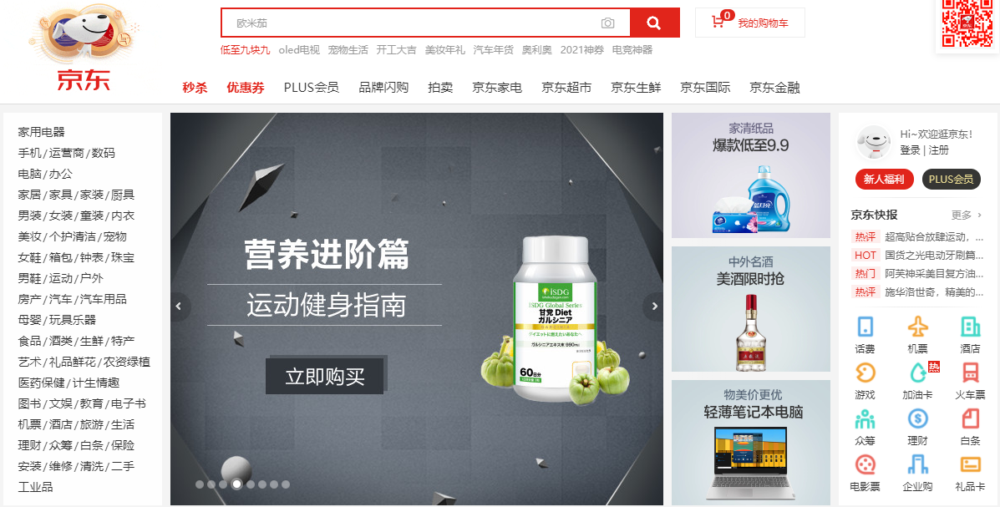
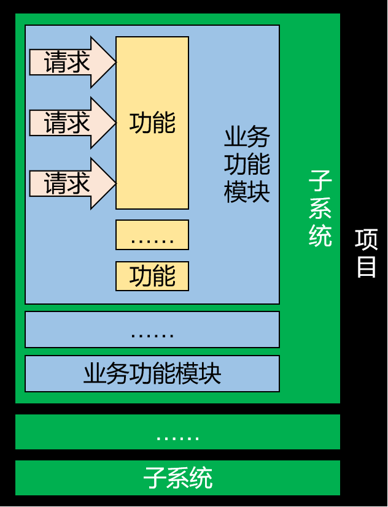
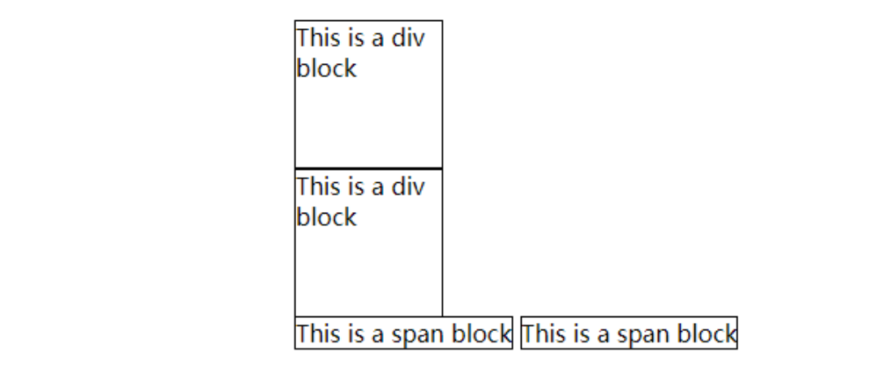
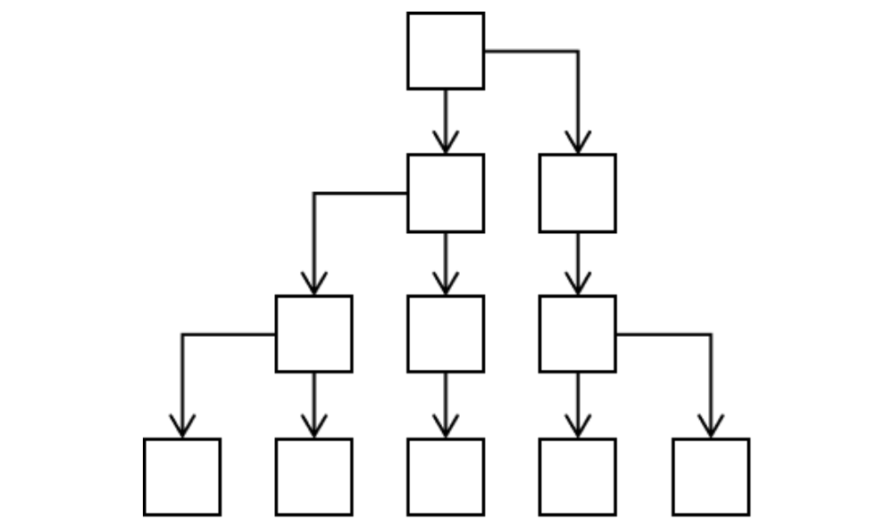
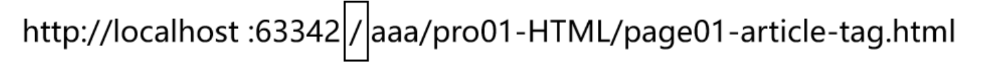
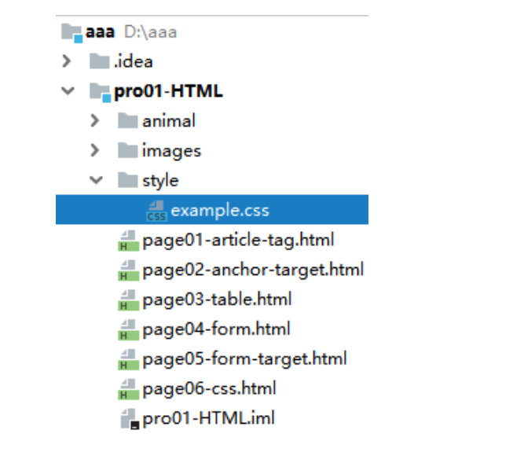
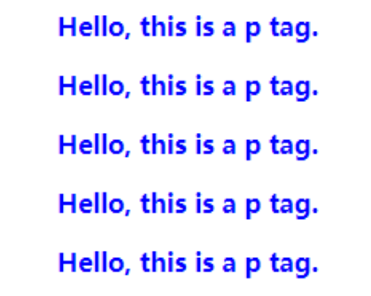
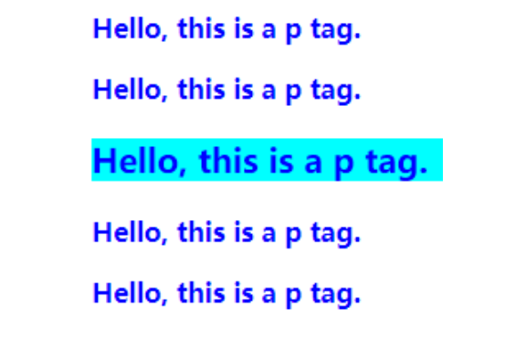

# day01 HTML&CSS

## 第一章 Web基本概念

### 1. 学习目标

* 掌握服务器和客户端的概念

* 了解常见的服务器分类和软件

* 掌握服务器应用程序和业务

* 掌握请求响应模型

* 了解架构的演进以及掌握单一架构体系

### 2. 内容讲解

#### 2.1 服务器和客户端的概念


##### 2.1.1 客户端的作用

与用户进行交互，用于接收用户的输入(操作)、展示服务器端的数据以及向服务器传递数据

##### 2.1.2 常见的客户端

* PC端网页



* 移动端


* Iot设备


### 

##### 2.2.3 服务器的作用

与客户端进行交互，接收客户端的数据、处理具体的业务逻辑、传递给客户端其需要的数据

##### 2.2.4 服务器的概念

“服务器”是一个非常宽泛的概念，**从硬件而言:**服务器是计算机的一种，它比普通计算机运行更快、负载更高、价格更贵。服务器在网络中为其它客户机（如PC机、智能手机、ATM等终端甚至是火车系统等大型设备）提供计算或者应用服务。**从软件而言:**服务器其实就是安装在计算机上的一个软件，根据其作用的不同又可以分为各种不同的服务器，例如应用服务器、数据库服务器、Redis服务器、DNS服务器、ftp服务器等等

**综上所述:**用我们自己的话来总结的话，服务器其实就是一台(或者一个集群)安装了服务器软件的高性能计算机

##### 2.2.5 常见的服务器硬件设备

* 刀片服务器


* 塔式服务器


* 机房


##### 2.2.6 常见的服务器操作系统

服务器是一台计算机，它必须安装操作系统之后才能够安装使用服务器软件

* Linux系统: 使用最多的服务器系统，安全稳定、性能强劲、开源免费（或少许费用）。


* Unix系统: 和硬件服务器捆绑销售，版权不公开，用法和Linux一样。


* Windows Server系统: 源代码不开放，费用高昂，漏洞较多，性能较差，运维成本高。

##### 2.2.7 常见的服务器软件

硬件服务器装好系统，就可以安装应用软件了，像我们熟知的Tomcat、MySQL、Redis、FastDFS、ElasticSearch等等都是服务器应用软件。它们分别提供自己特定的服务器功能。如果一台服务器上安装了Tomcat，我们会就会把这台服务器叫做Tomcat服务器；如果装了MySQL，就叫做MySQL服务器。很显然，开发过程中需要很多这样的服务器。

##### 2.2.8 虚拟机服务器

* VMWare虚拟机

通常来说VMWare用于开发人员在本地电脑上搭建一个模拟的服务器环境，或自己装一些东西测试，不是团队共同使用的正式环境。


* 弹性云服务器

使用弹性云服务器最大的好处就是弹性伸缩。什么是弹性伸缩呢？我现在的服务器是20G内存，因为访问量暴涨我需要把内存扩容到80G，要是物理的硬件服务器就需要买来新的内存条插入主板上的内存插槽。而弹性云服务器只需要改一下内存容量的参数就行了，非常方便。等访问量下降了，再把内存容量调回来就可以，不仅方便，而且可以精准的在访问高峰期提高服务器配置而不是一直维持高配，节约成本。


#### 2.2 服务器端应用程序

服务器端应用程序就是运行在应用服务器软件上，用于处理具体业务功能的一个应用程序，而我们学习JavaEE开发的目的就是编写服务器端应用程序。例如: 淘宝、滴滴、京东等等项目都是服务器端应用程序


#### 2.3 业务

业务就是服务器应用程序中的各个功能，例如商城里面的: 注册、登录、添加购物车、提交订单、结算订单等等都称之为业务

#### 2.4 请求和响应

##### 2.4.1 请求

请求是从客户端发送给服务器，主要用于将客户端的数据传递给服务器

##### 2.4.2 响应

响应是从服务器发送给客户端，主要用于将服务器的数据传递给客户端


#### 2.5 项目的逻辑构成

##### 2.5.1 请求响应对

请求响应对是构成项目的最基本的逻辑单元，一个项目是由非常非常多的请求响应对构成的

```
举例：点超链接跳转到注册页面
```

##### 2.5.2 功能:  一个功能包含多个请求响应对

```
举例：注册用户功能

请求1：点超链接跳转到注册页面
请求2：发送请求获取短信验证码
请求3：检查用户名是否可用
请求4：提交表单完成注册
```

##### 2.5.3 模块：一个模块包含很多功能

```
举例：用户信息管理模块
功能1：用户注册功能
功能2：用户登录功能
功能3：个人中心——账户安全功能
功能4：个人中心——账户绑定功能
功能5：个人中心——收货地址功能
功能6：个人中心——我的银行卡功能
```

##### 2.5.4 子系统

根据项目规模的不同，子系统这层逻辑概念可能有也可能没有。如果设置了子系统，那么子系统中也必然包含很多模块。其实庞大项目的子系统已经相当于一个项目了，甚至比小型项目整个都大。

```
举例：认证中心子系统

模块1：用户信息管理模块
模块2：权限管理模块
模块3：授权管理模块
模块4：权限检查模块
```

##### 2.5.5 项目

为了解决现实生活中的实际问题开发一个项目，这个项目就是为这个需求提供的一整套解决方案。

```
举例：电商项目

子系统1：认证中心子系统
子系统2：商品管理子系统
子系统3：购物车子系统
子系统4：仓储子系统
子系统5：物流子系统
子系统6：订单子系统
```



#### 2.6 架构

##### 2.6.1 架构的概念

**『架构』其实就是项目的『结构』**。只不过『结构』这个词太小了，不适合用来描述项目这么大的东西，所以换了另一个更大的词：架构。所以当我们聊一个项目的架构时，我们聊的是项目是由哪些部分组成的、每部分的作用、以及各个部分之间是怎么联系(通讯)、以及这些部分是怎么共同组成一个系统(项目)

##### 2.6.2 架构的演进过程

###### 2.6.2.1 单一应用架构（all  in one）

当网站流量很小时，只需一个应用，将所有功能都部署在一起，以减少部署节点和成本。此时，用于简化增删改查工作量的数据访问框架(ORM)是关键。我们现在的JavaWeb阶段、SSM阶段都是学习单一架构开发技术。


* 架构优点：

  架构简单，前期开发成本低、开发周期短，适合小型项目（OA、CRM、ERP 企业内部应用）。

* 架构缺点：

  全部功能集成在一个工程中

  （1）业务代码耦合度高，不易维护。

  （2）维护成本高，不易拓展

  （3）并发量大，不易解决

  （4）技术栈受限，只能使用一种语言开发。

###### 2.6.2.2 垂直架构

当访问量逐渐增大，单一应用增加机器带来的加速度越来越小，将应用拆成互不相干的几个应用，以提升效率。此时，用于加速前端页面开发的Web框架(MVC)是关键。


- 架构优点：

  （1）业务代码相对解耦

  （2）维护成本相对易于拓展（修改一个功能，可以直接修改一个项目，单独部署）

  （3）并发量大相对易于解决（搭建集群）

  （4）技术栈可扩展（不同的系统可以用不同的编程语言编写）。

- 架构缺点：

  功能集中在一个项目中，不利于开发、扩展、维护。粒度不够细

  代码之间存在数据、方法的冗余

###### 2.6.2.3 分布式架构

当垂直应用越来越多，应用之间交互不可避免，将核心业务抽取出来，作为独立的服务，逐渐形成稳定的服务中心，使前端应用能更快速的响应多变的市场需求。此时，用于提高业务复用及整合的分布式服务框架(RPC远程过程调用)是关键。


- 架构优点：

  （1）业务代码完全解耦，并可实现通用

  （2）维护成本易于拓展（修改一个功能，可以直接修改一个项目，单独部署）

  （3）并发量大易于解决（搭建集群）

  （4）技术栈完全扩展（不同的系统可以用不同的编程语言编写）。

- 架构缺点：

  缺少统一管理资源调度的框架

###### 2.6.2.4 流动计算架构（SOA）

服务越来越多，容量的评估，小服务资源的浪费等问题逐渐显现，此时需增加一个调度中心基于访问压力实时管理集群容量，提高集群利用率。此时，用于提高机器利用率的资源调度和治理中心(SOA)是关键。


资源调度和治理中心的框架：dubbo、spring cloud

- 架构优点：

  （1）业务代码完全解耦，并可实现通用

  （2）维护成本易于拓展（修改一个功能，可以直接修改一个项目，单独部署）

  （3）并发量大易于解决（搭建集群）

  （4）技术栈完全扩展（不同的系统可以用不同的编程语言编写）。

    ( 5 ) 框架实现了服务治理，不去担心集群的使用情况(失败会尝试其它服务....)

##### 2.6.3 单一架构中的技术体系

- 视图：用户的操作界面+数据的动态显示
  - 前端技术：HTML/CSS/JavaScript/vue
  - 异步交互：Ajax、Axios
  - 服务器端页面模板技术：Thymeleaf
- 控制层：处理请求+跳转页面
  - 服务器：Tomcat
  - 控制器：Servlet
  - 域对象：request、session、servletContext
  - 过滤器：Filter
  - 监听器：Listener
- 业务逻辑层：业务逻辑计算
- 持久化层：操作数据库、JDBC、连接池、DBUtils、MySQL


## 第二章 本阶段技术体系

### 1. 学习目标

* 了解本阶段技术体系，以及每部分技术在当前体系中的作用

* 了解书城项目的构成

### 2. 内容讲解

#### 2.1 本阶段技术体系

##### 2.1.1 客户端技术

HTML、CSS、JavaScript、Vue、Ajax、Axios

##### 2.1.2 服务器端技术

Tomcat、Servlet、Request、Response、Cookie、Session、Filter、Listener、Thymeleaf

##### 2.1.3 持久层技术(数据库技术)

MySql、JDBC、连接池、DBUtils


#### 2.2 书城项目简介


## 第三章 HTML

### 1. 学习目标

* 掌握HTML的简介和入门

* 掌握文本相关标签的使用

* 掌握超链接标签的使用

* 掌握div和span标签的使用

* 掌握图片标签的使用

* 掌握表格标签的使用

* 掌握表单标签的使用

### 2. 内容讲解

#### 2.1 HTML概念

HTML是<span style="color:blue;font-weight:bold;">H</span>yper <span style="color:blue;font-weight:bold;">T</span>ext <span style="color:blue;font-weight:bold;">M</span>arkup <span style="color:blue;font-weight:bold;">L</span>anguage的缩写。意思是<span style="color:blue;font-weight:bold;">『超文本标记语言』</span>。它的作用是搭建网页结构，在网页上展示内容

浏览器的兼容性问题

##### 2.1.1 超文本

HTML文件本质上是文本文件，而普通的文本文件只能显示字符。但是HTML技术则通过HTML标签把其他网页、图片、音频、视频等各种多媒体资源引入到当前网页中，让网页有了非常丰富的呈现方式，这就是超文本的含义——本身是文本，但是呈现出来的最终效果超越了文本。

##### 2.1.2 标记语言

说HTML是一种『标记语言』是因为它不是向Java这样的『编程语言』，因为它是由一系列『标签』组成的，没有常量、变量、流程控制、异常处理、IO等等这些功能。HTML很简单，每个标签都有它固定的含义和确定的页面显示效果。

标签是通过一组尖括号+标签名的方式来定义的：

```html
<p>HTML is a very popular fore-end technology.</p>
```

这个例子中使用了一个p标签来定义一个段落，&lt;p&gt;叫<span style="color:blue;font-weight:bold;">『开始标签』</span>，&lt;/p&gt;叫<span style="color:blue;font-weight:bold;">『结束标签』</span>。开始标签和结束标签一起构成了一个完整的标签。开始标签和结束标签之间的部分叫<span style="color:blue;font-weight:bold;">『文本标签体』</span>，也简称<span style="color:blue;font-weight:bold;">『标签体』</span>。

有的时候标签里还带有<span style="color:blue;font-weight:bold;">『属性』</span>：

```html
<a href="http://www.xxx.com">show detail</a>
```

href="http://www.xxx.com"就是属性，href是<span style="color:blue;font-weight:bold;">『属性名』</span>，"http://www.xxx.com"是<span style="color:blue;font-weight:bold;">『属性值』</span>。

还有一种标签是<span style="color:blue;font-weight:bold;">『单标签』</span>：

```html
<input type="text" name="username" />
```

#### 2.2 HTML的入门程序


#### 2.3 HTML的结构

1. **文档声明:** HTML文件中第一行的内容，用来告诉浏览器当前HTML文档的基本信息，其中最重要的就是当前HTML文档遵循的语法标准。这里我们只需要知道HTML有4和5这两个大的版本，HTML4版本的文档类型声明是：

   ```html
   <!DOCTYPE HTML PUBLIC "-//W3C//DTD HTML 4.01 Transitional//EN"
   "http://www.w3.org/TR/html4/loose.dtd">
   ```

   HTML5版本的文档类型声明是：

   ```html
   <!DOCTYPE html>
   ```

   现在主流的技术选型都是使用HTML5，之前的版本基本不用了。

2. **根标签:**html标签是整个文档的根标签，所有其他标签都必须放在html标签里面。

3. **头部:**head标签用于定义文档的头部，其他头部元素都放在head标签里。头部元素包括title标签、script标签、style标签、link标签、meta标签等等。

4. **主体:**body标签定义网页的主体内容，在浏览器窗口内显示的内容都定义到body标签内。

5. **注释:**HTML注释的写法是：

   ```html
   <!-- 注释内容 -->
   ```

   注释的内容不会显示到浏览器窗口内，是开发人员用来对代码内容进行解释说明。

#### 2.4 HTML语法规则

- 根标签有且只能有一个
- 无论是双标签还是单标签都必须正确关闭
- 标签可以嵌套但不能交叉嵌套
- 注释不能嵌套
- 属性必须有值，值必须加引号，单引号或双引号均可
- 标签名不区分大小写但建议使用小写

#### 2.5 使用idea创建StaticWeb工程


#### 2.6 HTML的各个标签的使用

##### 2.6.1 标题标签

**代码**

```html
<!DOCTYPE html>
<html lang="en">
<head>
    <meta charset="UTF-8">
    <title>Title</title>
</head>
<body>

    <h1>这是一级标题</h1>
    <h2>这是二级标题</h2>
    <h3>这是三级标题</h3>
    <h4>这是四级标题</h4>
    <h5>这是五级标题</h5>
    <h6>这是六级标题</h6>

</body>
</html>
```

**页面效果**


##### 2.6.2 段落标签

**代码**

```html
<p>There is clearly a need for CSS to be taken seriously by graphic artists. The Zen Garden aims to excite, inspire, and encourage participation. To begin, view some of the existing designs in the list. Clicking on any one will load the style sheet into this very page. The code remains the same, the only thing that has changed is the external .css file. Yes, really.</p>
```

**页面效果**


##### 2.6.3 换行标签

**代码**

```html
We would like to see as much CSS1 as possible. CSS2 should be limited to widely-supported elements only. The css Zen Garden is about functional, practical CSS and not the latest bleeding-edge tricks viewable by 2% of the browsing public. <br/>The only real requirement we have is that your CSS validates.
```


##### 2.6.4 无序列表标签

**代码**

```html
<ul>
    <li>Apple</li>
    <li>Banana</li>
    <li>Grape</li>
</ul>
```

**页面效果**


##### 2.6.5 超链接标签(重要)

**代码**

```html
<body>
    <!--
        超链接标签a的作用: 进行资源跳转
            href: 你要跳转到的资源的路径
            target: 新页面的打开方式
    -->
    <!--
        1. 跳转到本项目的资源: 使用相对路径
            相对路径: 以当前路径作为基准，如果资源跟我说同一个目录下的则直接写资源名就行了
                    如果在不同目录下，要找上一级目录，则使用../

                    . 当前目录
                    .. 上一级目录
        2. 跳转到其它服务器的资源: 此时就要使用完整的url访问路径
    -->
    <a href="../01_html的入门/start.html">跳转到start.html页面</a><br/>

    <!--
        target属性表示新页面的打开方式，我们目前只需要掌握两种取值:
            _self 表示新页面在当前页面打开
            _blank 表示新页面会新打开一个标签页
    -->
    <a href="https://www.baidu.com" target="_blank">跳转到百度</a>
</body>
```

点击后跳转到href属性指定的页面

##### 2.6.6 图片标签(重点)

**准备图片文件**


**代码**

```html
<!--
img标签是用于显示图片的，它有如下属性
1. src: 用于指定要显示的图片的路径，建议使用相对路径
项目中的图片一般存放在一个img的文件夹中
2. width: 图片的宽度
3. height: 图片的高度
-->

```

**页面效果**


##### 2.6.7 块标签(重点)

<span style="color:blue;font-weight:bold;">『块』</span>并不是为了显示文章内容的，而是为了方便结合CSS对页面进行布局。块有两种，div是前后有换行的块，span是前后没有换行的块。

把下面代码粘贴到HTML文件中查看他们的区别：

```html
<div style="border: 1px solid black;width: 100px;height: 100px;">This is a div block</div>
<div style="border: 1px solid black;width: 100px;height: 100px;">This is a div block</div>

<span style="border: 1px solid black;width: 100px;height: 100px;">This is a span block</span>
<span style="border: 1px solid black;width: 100px;height: 100px;">This is a span block</span>
```



##### 2.6.8 HTML实体(了解)

在HTML文件中，&lt;、&gt;等等这样的符号已经被赋予了特定含义，不会作为符号本身显示到页面上，此时如果我们想使用符号本身怎么办呢？那就是使用HTML实体来转义。


##### 2.6.9 小结

| 标签名称 | 功能                   |
| -------- | ---------------------- |
| h1~h6    | 1级标题~6级标题        |
| p        | 段落                   |
| a        | 超链接                 |
| br       | 换行                   |
| ul/li    | 无序列表               |
| img      | 图片                   |
| div      | 定义一个前后有换行的块 |
| span     | 定义一个前后无换行的块 |

#### 2.7 路径介绍

在我们整个Web开发技术体系中，『路径』是一个贯穿始终的重要概念。凡是需要获取另外一个资源的时候都需要用到路径。要想理解路径这个概念，我们首先要认识一个概念：『文件系统』。

##### 2.7.1 文件系统

我们写代码的时候通常都是在Windows系统来操作，而一个项目开发完成后想要让所有人都能够访问到就必须『部署』到服务器上，也叫『发布』。而服务器通常是Linux系统。

Windows系统和Linux系统的文件系统有很大差别，为了让我们编写的代码不会因为从Windows系统部署到了Linux系统而出现故障，实际开发时不允许使用<span style="color:blue;font-weight:bold;">物理路径</span>。

```
物理路径举例：
windows下的文件系统路径举例
D:\aaa\pro01-HTML\page01-article-tag.html


Linux下的文件系统路径举例
/usr/tomcat/webapps/pro01-HTML/page01-article-tag.html
```

幸运的是不管是Windows系统还是Linux系统环境下，目录结构都是<span style="color:blue;font-weight:bold;">树形结构</span>，编写路径的规则是一样的。



所以我们<span style="color:blue;font-weight:bold;">以项目的树形目录结构为依据</span>来编写路径就不用担心操作系统平台发生变化之后路径错误的问题了。有了这个大前提，我们具体编写路径时有两种具体写法：

- 相对路径
- 绝对路径（建议使用）

##### 2.7.2 相对路径

<span style="color:blue;font-weight:bold;">相对路径都是以<span style="color:red;font-weight:bold;">『当前位置』</span>为基准</span>来编写的。假设我们现在正在浏览a页面，想在a页面内通过超链接跳转到z页面。


那么按照相对路径的规则，我们现在所在的位置是a.html所在的b目录：


z.html并不在b目录下，所以我们要从b目录出发，向上走，进入b的父目录——c目录：


c目录还是不行，继续向上走，进入c的父目录——d目录：


在从d目录向下经过两级子目录——e目录、f目录才能找到z.html：


所以整个路径的写法是：

```html
<a href="../../../e/f/z.html">To z.html</a>
```

可以看到使用相对路径有可能会很繁琐，而且在后面我们结合了在服务器上运行的Java程序后，相对路径的基准是有可能发生变化的，所以<span style="color:blue;font-weight:bold;">不建议使用相对路径</span>。


##### 2.7.3 绝对路径

1. 通过IDEA服务器打开HTML文件


2. 服务器访问地址的组成


3. 绝对路径写法

绝对路径要求必须是以<span style="color:blue;font-weight:bold;">『正斜线』</span>开头。这个开头的正斜线在整个服务器访问地址中对应的位置如下图所示：



这里标注出的这个位置代表的是<span style="color:blue;font-weight:bold;">『服务器根目录』</span>，从这里开始我们就是在服务器的内部查找一个具体的Web应用。

所以我们编写绝对路径时就从这个位置开始，<span style="color:blue;font-weight:bold;">按照目录结构找到目标文件</span>即可。拿前面相对路径中的例子来说，我们想在a.html页面中通过超链接访问z.html。此时路径从正斜线开始，和a.html自身所在位置没有任何关系：


```html
<a href="/d/e/f/z.html">To z.html</a>
```

**具体例子:**


```html
<a href="/aaa/pro01-HTML/animal/cat/miao.html">Cat Page</a>
```

##### 2.7.4 小结

强烈建议使用绝对路径


#### 2.8 使用表格标签展示数据(重要)

##### 2.8.1 目标页面效果


##### 2.8.2 第一版代码

```html
<!-- 使用table标签定义表格 -->
<table>
    <!-- 使用tr标签定义表格的行 -->
    <tr>
        <!-- 使用th标签定义表头，表头有字体加粗效果 -->
        <th>姓名</th>
        <th>属性</th>
        <th>级别</th>
        <th>忍村</th>
    </tr>
    <tr>
        <!-- 使用td标签定义单元格 -->
        <td>漩涡鸣人</td>
        <td>风</td>
        <td>下忍</td>
        <td>木叶</td>
    </tr>
    <tr>
        <td>宇智波佐助</td>
        <td>雷&火</td>
        <td>下忍</td>
        <td>木叶</td>
    </tr>
    <tr>
        <td>我爱罗</td>
        <td>沙</td>
        <td>影</td>
        <td>砂隐村</td>
    </tr>
</table>
```

如果只有上面的代码，页面显示效果是：


没有表格边框。想要显示好看的表格边框可以把下面的style标签代码复制粘贴到head标签里,CSS还没讲，不必在意语法细节，整体照搬即可。

```html
<style type="text/css">
    table,th,td {
        border-collapse: collapse;
        border: 1px solid black;
        padding: 5px;
    }
</style>
```


我们发现，相较于目标效果而言，还未实现横纵向合并单元格

##### 2.8.3 合并单元格

###### 2.8.3.1 横向合并单元格(列合并)

使用colspan属性将两个横向相邻的单元格跨列合并：

```html
<tr>
    <td>宇智波佐助</td>
    <td>雷&火</td>
    <td colspan="2">下忍</td>
</tr>
```


注意: <span style="color:blue;font-weight:bold;">『被合并』</span>的单元格要删掉。

###### 2.8.3.2 纵向合并单元格(行合并)

使用rowspan属性将两个纵向相邻的单元格跨行合并：

```html
<tr>
    <td>宇智波佐助</td>
    <td rowspan="2">雷&火</td>
    <td colspan="2">下忍</td>
</tr>
<tr>
    <td>我爱罗</td>
    <td>影</td>
    <td>砂隐村</td>
</tr>
```


注意: <span style="color:blue;font-weight:bold;">『被合并』</span>的单元格要删掉。

#### 2.9 表单标签(最重要)

##### 2.9.1 表单标签的作用

在项目开发过程中，凡是需要用户填写的信息都需要用到表单。它的作用是接收用户的输入信息，并且将用户输入的信息提交给服务器

##### 2.9.2 form标签的介绍

在HTML中我们使用form标签来定义一个表单。而对于form标签来说有两个最重要的属性：action和method。

```html
<form action="/aaa/pro01-HTML/page05-form-target.html" method="post">
    
</form>
```

###### 2.9.2.1 action属性

用户在表单里填写的信息需要发送到服务器端，对于Java项目来说就是交给Java代码来处理。那么在页面上我们就必须正确填写服务器端的能够接收表单数据的地址。

这个地址要写在form标签的action属性中。但是现在暂时我们还没有服务器端环境，所以先借用一个HTML页面来当作服务器端地址使用。

###### 2.9.2.2 method属性

『method』这个单词的意思是『方式、方法』，在form标签中method属性用来定义提交表单的<span style="color:blue;font-weight:bold;">『请求方式』</span>。method属性只有两个可选值：get或post，没有极特殊情况的话使用post即可。

**什么是<span style="color:blue;font-weight:bold;">『请求方式』</span>？**

浏览器和服务器之间在互相通信时有大量的<span style="color:blue;font-weight:bold;">『数据』</span>需要传输。但是不论是浏览器还是服务器都有很多不同厂商提供的不同产品。

常见的浏览器有：

- Chrome
- Firefox
- Safari
- Opera
- Edge

常见的Java服务器有：

- Tomcat
- Weblogic
- WebSphere
- Glassfish
- Jetty

这么多不同厂商各自开发的应用程序怎么能保证它们彼此之间传输的<span style="color:blue;font-weight:bold;">『数据』</span>能够被对方正确理解呢？

很简单，我们给这些数据设定<span style="color:blue;font-weight:bold;">『格式』</span>，发送端按照格式发送数据，接收端按照格式解析数据，这样就能够实现数据的<span style="color:blue;font-weight:bold;">『跨平台传输』</span>了。

而这里定义的<span style="color:blue;font-weight:bold;">『数据格式』</span>就是应用程序之间的<span style="color:blue;font-weight:bold;">『通信协议』</span>。

在JavaSE阶段的网络编程章节我们接触过TCP/IP、UDP这样的协议，而我们现在使用的<span style="color:blue;font-weight:bold;">『HTTP协议』</span>的底层就是TCP/IP协议。

HTTP1.1中共定义了八种请求方式：

- GET
- POST
- PUT
- DELETE
- HEAD
- CONNECT
- OPTIONS
- TRACE

但是在HTML标签中，点击超链接是GET方式的请求，提交一个表单可以通过form标签的method属性指定GET或POST请求，其他请求方式无法通过HTML标签实现。除了GET、POST之外的其他请求方式暂时我们不需要涉及（到我们学习SpringMVC时会用到PUT和DELETE）。至于<span style="color:blue;font-weight:bold;">GET请求和POST请求的区别</span>我们会在讲HTTP协议的时候详细介绍，现在大家可以从表面现象来观察一下。


#### 2.10 表单项标签

表单中的每一项，包括: 文本框、密码框、单选框、多选框等等，都称之为表单项，一个表单中可以包含多个表单项

##### 2.10.1 name和value属性

在用户使用一个软件系统时，需要一次性提交很多数据是非常正常的现象。我们肯定不能要求用户一个数据一个数据的提交，而肯定是所有数据填好后一起提交。那就带来一个问题，服务器怎么从众多数据中识别出来收货人、所在地区、详细地址、手机号码……？

很简单，<span style="color:blue;font-weight:bold;">给每个数据都起一个『名字』</span>，发送数据时用<span style="color:blue;font-weight:bold;">『名字』</span>携带对应的数据，接收数据时通过<span style="color:blue;font-weight:bold;">『名字』</span>获取对应的数据。

在各个具体的表单标签中，我们通过<span style="color:blue;font-weight:bold;">『name属性』</span>来给数据起<span style="color:blue;font-weight:bold;">『名字』</span>，通过<span style="color:blue;font-weight:bold;">『value属性』</span>来保存要发送给服务器的<span style="color:blue;font-weight:bold;">『值』</span>。

但是名字和值之间既有可能是<span style="color:blue;font-weight:bold;">『一个名字对应一个值』</span>，也有可能是<span style="color:blue;font-weight:bold;">『一个名字对应多个值』</span>。

这么看来这样的关系很像我们Java中的Map，而事实上在服务器端就是使用Map类型来接收请求参数的。具体的是类型是：<span style="color:blue;font-weight:bold;">Map<String,String[]></span>。

name属性就是Map的键，value属性就是Map的值。

有了上面介绍的基础知识，下面我们就可以来看具体的表单项标签了。

##### 2.10.2 单行文本框

**代码**

```html
个性签名：<input type="text" name="signal"/><br/>
```

**显示效果**


##### 2.10.3 密码框

**代码**

```html
密码：<input type="password" name="secret"/><br/>
```

**显示效果**


##### 2.10.4 单选框

**代码**

```html
你最喜欢的季节是：
<input type="radio" name="season" value="spring" />春天
<input type="radio" name="season" value="summer" checked="checked" />夏天
<input type="radio" name="season" value="autumn" />秋天
<input type="radio" name="season" value="winter" />冬天

<br/><br/>

你最喜欢的动物是：
<input type="radio" name="animal" value="tiger" />路虎
<input type="radio" name="animal" value="horse" checked="checked" />宝马
<input type="radio" name="animal" value="cheetah" />捷豹
```

**显示效果**


**说明:**

- name属性相同的radio为一组，组内互斥
- 当用户选择了一个radio并提交表单，这个radio的name属性和value属性组成一个键值对发送给服务器
- 设置checked="checked"属性设置默认被选中的radio

##### 2.10.5 多选框

**代码**

```html
你最喜欢的球队是：
<input type="checkbox" name="team" value="Brazil"/>巴西
<input type="checkbox" name="team" value="German" checked="checked"/>德国
<input type="checkbox" name="team" value="France"/>法国
<input type="checkbox" name="team" value="China" checked="checked"/>中国
<input type="checkbox" name="team" value="Italian"/>意大利
```

**显示效果**


##### 2.10.6 下拉框

**代码**

```html
你喜欢的运动是：
<select name="interesting">
    <option value="swimming">游泳</option>
    <option value="running">跑步</option>
    <option value="shooting" selected="selected">射击</option>
    <option value="skating">溜冰</option>
</select>
```

**显示效果**


**说明:**

- 下拉列表用到了两种标签，其中select标签用来定义下拉列表，而option标签设置列表项。
- name属性在select标签中设置。
- value属性在option标签中设置。
- option标签的标签体是显示出来给用户看的，提交到服务器的是value属性的值。
- 通过在option标签中设置selected="selected"属性实现默认选中的效果。

##### 2.10.7 按钮

**代码**

```html
<button type="button">普通按钮</button>
<button type="reset">重置按钮</button>
<button type="submit">提交按钮</button>
```

**显示效果**


**说明:**

* 普通按钮: 点击后无效果，需要通过JavaScript绑定单击响应函数
* 重置按钮: 点击后将表单内的所有表单项都恢复为默认值  提交按钮  
* 提交按钮: 点击后提交表单

##### 2.10.8 隐藏域

**代码**

```html
<input type="hidden" name="userId" value="2233"/>
```

**说明:**

通过表单隐藏域设置的表单项不会显示到页面上，用户看不到。但是提交表单时会一起被提交。用来设置一些需要和表单一起提交但是不希望用户看到的数据，例如：用户id等等。

##### 2.10.9 多行文本框

**代码**

```html
自我介绍：<textarea name="desc"></textarea>
```

**显示效果**


**说明:**

textarea没有value属性，如果要设置默认值需要写在开始和结束标签之间。

## 第四章 CSS

### 1. 学习目标

简单了解CSS

### 2. 内容讲解

#### 2.1 CSS的作用

CSS是用于设置HTML页面标签的样式，用于美化HTML页面

#### 2.2 CSS的引入方式

##### 2.2.1 行内样式

也就是在要设置样式的标签中添加style属性，编写css样式; 行内样式仅对当前标签生效

```html
<!--给div设置边框-->
<div style="border: 1px solid black;width: 100px; height: 100px;">&nbsp;</div>
```

##### 2.2.2 内部样式

一般是在当前页面的head标签中添加style标签，在style标签中编写css样式代码; 内部样式仅对当前页面生效

```html
<head>
    <meta charset="UTF-8">
    <title>Title</title>
    <style type="text/css">
        .one {
            border: 1px solid black;
            width: 100px;
            height: 100px;
            background-color: lightgreen;
            margin-top: 5px;
        }
    </style>
</head>
<body>

    <div style="border: 1px solid black;width: 100px; height: 100px;">&nbsp;</div>

    <div class="one">&nbsp;</div>
    <div class="one">&nbsp;</div>
    <div class="one">&nbsp;</div>

</body>
```


##### 2.2.3 外部样式

1. 创建CSS文件

   

2. 编辑CSS文件

   ```css
   .two {
       border: 1px solid black;
       width: 100px;
       height: 100px;
       background-color: yellow;
       margin-top: 5px;
   }
   ```

3. 引入外部CSS文件

   在需要使用这个CSS文件的HTML页面的head标签内加入：

   ```html
   <link rel="stylesheet" type="text/css" href="/aaa/pro01-HTML/style/example.css" />
   ```

   于是下面HTML代码的显示效果是:

   ```html
   <div class="two">&nbsp;</div>
   <div class="two">&nbsp;</div>
   <div class="two">&nbsp;</div>
   ```

   

#### 2.3 CSS代码语法

- CSS样式由选择器和声明组成，而声明又由属性和值组成。
- 属性和值之间用冒号隔开。
- 多条声明之间用分号隔开。
- 使用/* ... */声明注释


#### 2.4 CSS选择器

##### 2.4.1 标签选择器

HTML代码

```html
<p>Hello, this is a p tag.</p>
<p>Hello, this is a p tag.</p>
<p>Hello, this is a p tag.</p>
<p>Hello, this is a p tag.</p>
<p>Hello, this is a p tag.</p>
```

CSS代码

```css
p {
    color: blue;
    font-weight: bold;
}
```

页面效果



##### 2.4.2 id选择器

HTML代码：

```html
    <p>Hello, this is a p tag.</p>
    <p>Hello, this is a p tag.</p>
    <p id="special">Hello, this is a p tag.</p>
    <p>Hello, this is a p tag.</p>
    <p>Hello, this is a p tag.</p>
```

CSS代码：

```css
#special {
    font-size: 20px;
    background-color: aqua;
}
```

显示效果



##### 2.4.3 类选择器

HTML代码：

```html
    <div class="one">&nbsp;</div>
    <div class="one">&nbsp;</div>
    <div class="one">&nbsp;</div>
```

CSS代码：

```css
        .one {
            border: 1px solid black;
            width: 100px;
            height: 100px;
            background-color: lightgreen;
            margin-top: 5px;
        }
```

显示效果

