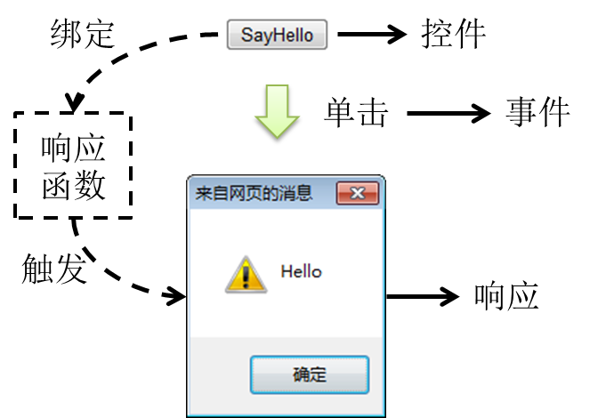

# day02 JavaScript&正则表达式

## 第一章 JavaScript

### 1. 学习目标

* 了解JavaScript的起源与特性
* 掌握JavaScript的基本语法
* 掌握JavaScript的DOM
* 掌握JavaScript的事件绑定

### 2. 内容讲解

#### 2.1 JavaScript的起源

在<span style="color:blue;font-weight:bold;">1995</span>年时，由<span style="color:blue;font-weight:bold;">Netscape</span>公司的<span style="color:blue;font-weight:bold;">Brendan Eich</span>，在网景导航者浏览器上首次设计实现而成。Netscape在最初将其脚本语言命名为LiveScript，因为Netscape与Sun合作，网景公司管理层希望蹭Java的热度，因此取名为JavaScript。

JavaScript总共分成三部分: ECMAScript(基本语法)、BOM(浏览器对象模型)、DOM(文档对象模型)

#### 2.2 JavaScript的特性

##### 2.2.1 脚本语言

JavaScript是一种解释型的脚本语言。不同于C、C++、Java等语言先编译后执行,	JavaScript不会产生编译出来的字节码文件，而是在程序的运行过程中对源文件逐行进行解释。

JavaScript由浏览器中的JavaScript引擎直接解释执行

##### 2.2.2 基于对象

JavaScript是一种基于对象的脚本语言，它不仅可以创建对象，也能使用现有的对象。但是面向对象的三大特性：『封装』、『继承』、『多态』中，JavaScript能够实现封装，可以模拟继承，不支持多态，所以它不是一门面向对象的编程语言。

##### 2.2.3 弱类型

JavaScript中也有明确的数据类型，但是声明一个变量后它可以接收任何类型的数据，并且会在程序执行过程中根据上下文自动转换类型。

##### 2.2.4 事件驱动

JavaScript是一种采用事件驱动的脚本语言，它不需要经过Web服务器就可以对用户的输入做出响应。

##### 2.2.5 跨平台性

JavaScript脚本语言不依赖于操作系统，仅需要浏览器的支持。因此一个JavaScript脚本在编写后可以带到任意机器上使用，前提是机器上的浏览器支持JavaScript脚本语言。目前JavaScript已被大多数的浏览器所支持。


#### 2.3 入门程序

**功能效果图**



**代码实现**

```html
<!DOCTYPE html>
<html lang="en">
<head>
    <meta charset="UTF-8">
    <title>JS的入门程序</title>
</head>
<body>
    <!-- 在HTML代码中定义一个按钮 -->
    <button type="button" id="helloBtn">SayHello</button>
    <!--
        目标: 点击按钮的时候弹出一个警告框
    -->
    <script type="text/javascript">
        //1. 通过js代码获取到按钮对象
        //document代表当前HTML文档
        var btn = document.getElementById("helloBtn");

        //2. 给获取到的btn对象绑定点击事件
        btn.onclick = function () {
            //弹出警告框
            alert("hello world")
        }
    </script>
</body>
</html>
```

#### 2.4 JavaScript的基本语法

##### 2.4.1 JavaScript的引入方式

###### 2.4.1.1 内部脚本方式

- JavaScript代码要写在script标签内
- script标签可以写在文档内的任意位置
- 为了能够方便查询或操作HTML标签（元素）script标签可以写在body标签内部的最下方

在我们的入门程序中使用的就是内部脚本方式引入的JavaScript

###### 2.4.1.2 外部脚本方式

在script标签内通过src属性指定外部xxx.js文件的路径即可。但是要注意以下两点：

- 引用外部JavaScript文件的script标签里面不能写JavaScript代码
- 先引入，再使用
- script标签不能写成单标签


引入方式如下：

```html
<!DOCTYPE html>
<html lang="en">
<head>
    <meta charset="UTF-8">
    <title>JS的引入方式</title>
    <!--
        建议在head中引入外部的js文件
    -->
    <script src="../js/outer.js"></script>
</head>
<body>

    <!--
        第一种引入方式: 内部引入方式，在HTML文档内部，通过script标签去编写js代码
    -->
    <!--
        第二种引入方式: 外部引入方式，在当前项目中创建一个js文件，然后在需要引入的HTML里面使用script标签引入
        一个script标签要么负责编写内部的js代码，要么负责引入外部的js文件
    -->
    <script type="text/javascript">
        alert("hello world")
    </script>
</body>
</html>
```

##### 2.4.2 声明和使用变量

###### 2.4.2.1 JavaScript数据类型

- 基本数据类型

  - 数值型number：JavaScript不区分整数、小数

  - 字符串string：JavaScript不区分字符、字符串；单引号、双引号意思一样。

  - 布尔型boolean：true、false

    在JavaScript中，其他类型和布尔类型的自动转换。

    true：非零的数值，非空字符串，非空对象

    false：零，空字符串，null，undefined 

    例如："false"放在if判断中

    ```javascript
    // "false"是一个非空字符串，直接放在if判断中会被当作『真』处理
    if("false"){
    	alert("true");
    }else{
    	alert("false");
    }
    ```

- 引用类型

  - 所有new出来的对象
  - 用[]声明的数组
  - 用{}声明的对象

###### 2.4.2.2 变量

- 关键字：var,其实ECMAScript6之后建议使用let

- 数据类型：JavaScript变量是弱类型的，可以接收任意类型的数据

- 标识符：严格区分大小写

- 变量使用规则

  - 如果使用了一个没有声明的变量，那么会在运行时报错

    Uncaught ReferenceError: b is not defined

  - 如果声明一个变量没有初始化，那么这个变量的值就是undefined

##### 2.4.3 函数(重点)

##### 2.4.3.1 内置函数

内置函数就是JavaScript中内置好的函数，我们可以直接使用

* 弹出警告框

```javascript
alert("警告框内容");
```

* 弹出确认框

```javascript
var result = confirm("确定要删除吗？");
if(result) {
    // 执行删除
}
```

用户点击『确定』返回true，点击『取消』返回false

```javascript
var result = confirm("老板，你真的不加个钟吗？");
if(result) {
	console.log("老板点了确定，表示要加钟");
}else{
	console.log("老板点了确定，表示不加钟");
}
```

* 在控制台打印日志

```javascript
console.log("日志内容");
```


##### 2.4.3.2 声明函数

声明函数就是使用者自己定义一个函数，它有两种写法:

写法1，函数声明：

```javascript
function sum(a, b) {
    return a+b;
}
```

写法2，函数表达式：

```javascript
var total = function(a,b) {
    return a+b;
};
```

写法2可以这样解读：声明一个函数，相当于创建了一个『函数对象』，将这个对象的『引用』赋值给变量total。如果不给这个对象赋值，我们可以将其作为匿名函数使用(在后续学习内容中会用到)


##### 2.4.3.3 调用函数

JavaScript中函数本身就是一种对象，函数名就是这个<span style="color:blue;font-weight:bold;">『对象』</span>的<span style="color:blue;font-weight:bold;">『引用』</span>。而调用函数的格式是：<span style="color:blue;font-weight:bold;">函数引用()</span>。

```javascript
function sum(a, b) {
    return a+b;
}

var result = sum(2, 3);
console.log("result="+result);
```

或：

```javascript
var total = function(a,b) {
    return a+b;
}

var totalResult = total(3,6);
console.log("totalResult="+totalResult);
```

##### 2.4.4 对象(重点)

JavaScript中没有『类』的概念，对于系统内置的对象可以直接创建使用。

###### 2.4.4.1 使用new关键字创建对象

```javascript
// 创建对象
var obj01 = new Object();

// 给对象设置属性和属性值
obj01.stuName = "tom";
obj01.stuAge = 20;
obj01.stuSubject = "java";

// 在控制台输出对象
console.log(obj01);
```

###### 2.4.4.2 使用{}创建对象(常用)

```javascript
// 创建对象
var obj02 = {
    "soldierName":"john",
    "soldierAge":35,
    "soldierWeapon":"gun"
};

// 在控制台输出对象
console.log(obj02);
```

###### 2.4.4.3 给对象设置函数属性

```javascript
// 创建对象
var obj01 = new Object();

// 给对象设置属性和属性值
obj01.stuName = "tom";
obj01.stuAge = 20;
obj01.stuSubject = "java";

obj01.study = function() {
	console.log(this.stuName + " is studying");
};

// 在控制台输出对象
console.log(obj01);
// 调用函数
obj01.study();
```

或者

```javascript
// 创建对象
var obj02 = {
	"soldierName":"john",
	"soldierAge":35,
	"soldierWeapon":"gun",
	"soldierShoot":function(){
		console.log(this.soldierName + " is using " + this.soldierWeapon);
	}
};

// 在控制台输出对象
console.log(obj02);
// 调用函数
obj02.soldierShoot();
```

###### 2.4.4.4 this关键字

this关键字只有两种情况：

- 在函数外面：this关键字指向window对象（代表当前浏览器窗口）
- 在函数里面：this关键字指向调用函数的对象

```javascript
// 直接打印this
console.log(this);

// 函数中的this
// 1.声明函数
function getName() {
	console.log(this.name);
}

// 2.创建对象
var obj01 = {
	"name":"tom",
	"getName":getName
};
var obj02 = {
	"name":"jerry",
	"getName":getName
};

// 3.调用函数
obj01.getName();
obj02.getName();
```

##### 2.4.5 数组(重点)

###### 2.4.5.1 创建数组和使用数组的方法

```javascript

//js声明数组的方式:
//1. var arr = new Array(长度),指定长度创建数组的话，实际上就表示往数组中添加了n个空元素
//我们创建数组的时候如果不指定长度，那么就不会忘数组中添加空元素
//js中的数组的长度是可变的,并且js的数组中可以存放任意数据
var arr1 = new Array()
//再往数组中添加元素
/*arr1[0] = "a"
        arr1[1] = "b"
        arr1[2] = "c"
        arr1[3] = "d"
        arr1[4] = "e"*/

/*arr1.push("a")
        arr1.push("b")
        arr1.push("c")
        arr1.push("d")
        arr1.push("e")
        console.log(arr1)*/

//2. var arr = new Array(数组里面的元素)
/*var arr2 = new Array("a","b","c","d","e")
        console.log(arr2)*/

//3. var arr = ["a","b","c","d","e"]
var arr3 = ["a","b","c",1,true]

//数组的一些内置方法:
//1. 数组反转 reverse(),将数组中的元素进行反转
//arr3.reverse()

//2. 将数组中的元素通过分隔符拼接成字符串  数组["a","b","c","d","e"]  ---->  "a#b#c#1#true"
var str = arr3.join("#");

//3. 将字符串切割成数组  "a#b#c#1#true" -----> ["a","b","c","d","e"]
//var arr4 = str.split("#");

//4. 根据数组的下标获取数组的元素
//console.log(arr3[2])

//5. 弹出数组的最后一个元素(该元素经过弹出之后，就不在数组中了)
/*var s = arr3.pop();
        console.log(s)
        console.log(arr3)*/

//6. 删除数组中指定下标的元素
//splice(start,deletCount) 表示从start下标开始删除，总共删除deleteCount个元素
arr3.splice(2,1)
console.log(arr3)
```

##### 2.4.6 JSON(最重点)

###### 2.4.6.1 JSON格式的用途

在开发中凡是涉及到<span style="color:blue;font-weight:bold;">『跨平台数据传输』</span>，JSON格式一定是首选。

```xml
<id>1001</id>
<username>admin</username>
<age>23</age>
<email>12345@qq.com</email>

{id:1001,username:"admin",age:23,email:"12346@qq.com"}
```


###### 2.4.6.2 JSON格式的说明

- JSON数据两端要么是<span style="color:blue;font-weight:bold;">{}</span>，要么是<span style="color:blue;font-weight:bold;">[]</span>
- <span style="color:blue;font-weight:bold;">{}</span>定义JSON对象
- <span style="color:blue;font-weight:bold;">[]</span>定义JSON数组
- JSON对象的格式是：

```json
{key:value,key:value,...,key:value}
```

- JOSN数组的格式是：

```json
[value,value,...,value]
```

- key的类型固定是字符串
- value的类型可以是：
  - 基本数据类型
  - 引用类型：JSON对象或JSON数组

正因为JSON格式中value部分还可以继续使用JSON对象或JSON数组，所以JSON格式是可以<span style="color:blue;font-weight:bold;">『多层嵌套』</span>的，所以JSON格式不论多么复杂的数据类型都可以表达。

```json
//json是一种数据格式，通常用于在客户端与服务器端之间进行数据传输
//具体的格式: {key:value,key:value...},通常情况下要求key必须有""
/*var person1 = {
            "name":"张三疯",
            "age":198,
            "address":"武当山"
        }*/

//json是由简直对构成的，键是string类型，值可以是任意类型(也包含json类型)
/*var person2 = {
            "name":"张三疯",
            "age":198,
            "wife":{
                "wifeName":"小花",
                "wifeAge":18,
                "wifeAddress":"武当山下的小村庄"
            },
            "address":"武当山"
        }*/

//json数组:[{key:value,key:value...},{...}，{...}]就是多个json构成的数组
var person3 = {
    "name":"张三疯",
    "age":198,
    "wife":{
        "wifeName":"小花",
        "wifeAge":18,
        "wifeAddress":"武当山下的小村庄",
        "sons":[
            {
                "sonName":"奥巴马",
                "sonAge":2
            },
            {
                "sonName":"奥拉夫",
                "sonAge":3
            }
        ]
    },
    "address":"武当山"
}
console.log(person2.wife.wifeName)
```

###### 2.4.6.3 JSON对象和JSON字符串互转

* JSON对象转JSON字符串

```javascript
var jsonObj = {"stuName":"tom","stuAge":20};
var jsonStr = JSON.stringify(jsonObj);

console.log(typeof jsonObj); // object
console.log(typeof jsonStr); // string
```

* JSON字符串转JSON对象

```javascript
jsonObj = JSON.parse(jsonStr);
console.log(jsonObj); // {stuName: "tom", stuAge: 20}
```

#### 2.5 JavaScript的DOM(最重点)

##### 2.5.1 DOM的概念

DOM是<span style="color:blue;font-weight:bold;">D</span>ocument <span style="color:blue;font-weight:bold;">O</span>bject  <span style="color:blue;font-weight:bold;">M</span>odel的缩写，意思是<span style="color:blue;font-weight:bold;">『文档对象模型』</span>——将HTML文档抽象成模型，再封装成对象方便用程序操作。

这是一种非常常用的编程思想：将现实世界的事物抽象成模型，这样就非常容易使用对象来量化的描述现实事物，从而把生活中的问题转化成一个程序问题，最终实现用应用软件协助解决现实问题。而在这其中<span style="color:blue;font-weight:bold;">『模型』</span>就是那个连通现实世界和代码世界的桥梁。

##### 2.5.2 DOM树的概念

浏览器把HTML文档从服务器上下载下来之后就开始按照<span style="color:blue;font-weight:bold;">『从上到下』</span>的顺序<span style="color:blue;font-weight:bold;">『读取HTML标签』</span>。每一个标签都会被封装成一个<span style="color:blue;font-weight:bold;">『对象』</span>。

而第一个读取到的肯定是根标签html，然后是它的子标签head，再然后是head标签里的子标签……所以从html标签开始，整个文档中的所有标签都会根据它们之间的<span style="color:blue;font-weight:bold;">『父子关系』</span>被放到一个<span style="color:blue;font-weight:bold;">『树形结构』</span>的对象中。


这个包含了所有标签对象的整个树形结构对象就是JavaScript中的一个<span style="color:blue;font-weight:bold;">可以直接使用的内置对象</span>：<span style="color:blue;font-weight:bold;">document</span>。

例如，下面的标签结构：


会被解析为：


##### 2.5.3 各个组成部分的类型

整个文档中的一切都可以看做Node。各个具体组成部分的具体类型可以看做Node类型的子类。

> 其实严格来说，JavaScript并不支持真正意义上的『继承』，这里我们借用Java中的『继承』概念，从逻辑上来帮助我们理解各个类型之间的关系。

| 组成部分         | 节点类型 | 具体类型 |
| ---------------- | -------- | -------- |
| 整个文档         | 文档节点 | Document |
| HTML标签         | 元素节点 | Element  |
| HTML标签内的文本 | 文本节点 | Text     |
| HTML标签内的属性 | 属性节点 | Attr     |
| 注释             | 注释节点 | Comment  |

##### 2.5.4 父子关系


##### 2.5.5 先辈后代关系


##### 2.5.6 DOM操作

由于实际开发时基本上都是使用JavaScript的各种框架来操作，而框架中的操作方式和我们现在看到的原生操作完全不同，所以下面罗列的API仅供参考，不做要求。

###### 2.5.6.1 在整个文档范围内查询元素节点

| 功能               | API                                     | 返回值           |
| ------------------ | --------------------------------------- | ---------------- |
| 根据id值查询       | document.getElementById(“id值”)         | 一个具体的元素节 |
| 根据标签名查询     | document.getElementsByTagName(“标签名”) | 元素节点数组     |
| 根据name属性值查询 | document.getElementsByName(“name值”)    | 元素节点数组     |
| 根据类名查询       | document.getElementsByClassName("类名") | 元素节点数组     |

###### 扩展内容(根据选择器查找标签)

| 功能                   | API                                 | 返回值   |
| ---------------------- | ----------------------------------- | -------- |
| 根据选择器查找一个标签 | document.querySelector("选择器")    | 标签对象 |
| 根据选择器查找多个标签 | document.querySelectorAll("选择器") | 标签数组 |

```html
<!DOCTYPE html>
<html lang="en">
<head>
    <meta charset="UTF-8">
    <title>DOM获取标签</title>
</head>
<body>
    <div id="d1" name="n1">第一个div</div>
    <div class="c1" name="n1">第二个div</div>
    <div class="c1">第三个div</div>

    <div id="d2">
        <div class="c1">第四个div</div>
        <div>第五个div</div>
    </div>
    <script>
        //使用DOM的相关API进行查找标签
        //1. 根据标签的id查找一个标签
        //document表示当前整个文档对象
        /*var element1 = document.getElementById("d1");
        console.log(element1)*/

        //2. 根据类名查找标签，查找到的是一个标签的数组
        /*var elementArr1 = document.getElementsByClassName("c1");
        console.log(elementArr1)*/

        //3. 根据标签名查找标签，查找到的是一个标签的数组
        /*var elementArr2 = document.getElementsByTagName("div");
        console.log(elementArr2)*/

        //4. 根据name属性的值查找标签
        /*var elementArr3 = document.getElementsByName("n1");
        console.log(elementArr3)*/

        //根据选择器查找标签:
        //什么是选择器: 用于描述要查找的标签的规则:
        //例如:1. 根据id查找 "#id值" 2. 根据类名查找 ".类名" 3. 根据标签名查找 "标签名" 4. 根据属性值查找 "[属性名='属性值']"
           // 5. 根据父子级关系查找 "父>子"  6. 根据后代关系查找 "先辈 后辈"  7. 根据兄弟关系查找 "前一个兄弟+后一个兄弟"


        //1.根据选择器查找单个标签:document.querySelector("选择器")
        //实现根据id查找
        /*var element1 = document.querySelector("#d1");
        console.log(element1)*/

        //查找id为d2的那个标签中的类名叫做c1的子标签
        /*var element2 = document.querySelector("#d2>.c1");
        console.log(element2)*/

        //查找id为d2的那个标签中的类名为c1的子标签的后面的那个兄弟divs
        var element3 = document.querySelector("#d2>.c1+div");
        console.log(element3)

        //2. 根据选择器查找多个标签:document.querySelectorAll("选择器")
        //实现根据类名查找
        /*var elementArr1 = document.querySelectorAll(".c1");
        console.log(elementArr1)*/

        //实现根据标签名查找
        /*var elementArr2 = document.querySelectorAll("div");
        console.log(elementArr2)*/

        //实现根据name属性查找
        /*var elementArr3 = document.querySelectorAll("[name='n1']");
        console.log(elementArr3)*/
    </script>
</body>
</html>
```

###### 2.5.6.2 在具体元素节点范围内查找子节点

| 功能               | API                                                        | 返回值         |
| ------------------ | ---------------------------------------------------------- | -------------- |
| 查找子标签         | element.children                                           | 返回子标签数组 |
| 查找第一个子标签   | element.firstElementChild<br />【W3C考虑换行，IE≤8不考虑】 | 标签对象       |
| 查找最后一个子标签 | element.lastElementChild<br />【W3C考虑换行，IE≤8不考虑】  | 节点对象       |

###### 2.5.6.3 查找指定元素节点的父节点

| 功能                     | API                   | 返回值   |
| ------------------------ | --------------------- | -------- |
| 查找指定元素节点的父标签 | element.parentElement | 标签对象 |

###### 2.5.6.4 查找指定元素节点的兄弟节点

| 功能               | API                            | 返回值   |
| ------------------ | ------------------------------ | -------- |
| 查找前一个兄弟标签 | element.previousElementSibling | 标签对象 |
| 查找后一个兄弟标签 | element.nextElementSibling     | 标签对象 |

###### 2.5.6.5 属性操作

| 需求       | 操作方式                   |
| ---------- | -------------------------- |
| 读取属性值 | 元素对象.属性名            |
| 修改属性值 | 元素对象.属性名=新的属性值 |

```html
<!DOCTYPE html>
<html lang="en">
<head>
    <meta charset="UTF-8">
    <title>DOM操作标签的属性</title>
</head>
<body>
    <a href="https://www.baidu.com">跳转到百度</a>

    <script>
        //目标: 获取a标签的href属性的值
        /*var href = document.querySelector("a").href;
        console.log(href)*/
        //目标: 修改a标签的href属性为https://www.taobao.com
        document.querySelector("a").href = "https://www.taobao.com"
    </script>
</body>
</html>
```

###### 2.5.6.6 标签体的操作

| 需求                         | 操作方式          |
| ---------------------------- | ----------------- |
| 获取或者设置标签体的文本内容 | element.innerText |
| 获取或者设置标签体的内容     | element.innerHTML |

```html
<!DOCTYPE html>
<html lang="en">
    <head>
        <meta charset="UTF-8">
        <title>操作标签的属性和文本</title>
    </head>
    <body>
        <input type="text" id="username" name="username" />
        <div id="d1">
            <h1>你好世界</h1>
        </div>
        <script>
            //目标: 获取id为username的输入框的value
            //1. 找到要操作的标签
            var ipt = document.getElementById("username");

            //2. 设置标签的value属性值
            ipt.value = "张三"

            //3. 获取标签的value属性的值
            var value = ipt.value;
            console.log(value)

            //获取id为d1的div中的文本内容
            //获取标签的文本: element.innerText,获取文本的时候会将左右两端的空格去掉
            var innerText = document.getElementById("d1").innerText;
            console.log(innerText)

            //获取标签体的内容: element.innerHTML,获取标签体的内容
            var innerHTML = document.getElementById("d1").innerHTML;
            console.log(innerHTML)

            //设置标签体的内容:建议使用innerHTML，如果是使用innerText的话它会将标签当做普通文本处理
            document.getElementById("d1").innerHTML = "<h1>hello world</h1>"
        </script>
    </body>
</html>
```

###### 2.5.6.7 DOM增删改操作

| API                                      | 功能                                       |
| ---------------------------------------- | ------------------------------------------ |
| document.createElement(“标签名”)         | 创建元素节点并返回，但不会自动添加到文档中 |
| element.appendChild(ele)                 | 将ele添加到element所有子节点后面           |
| parentEle.insertBefore(newEle,targetEle) | 将newEle插入到targetEle前面                |
| parentEle.replaceChild(newEle, oldEle)   | 用新节点替换原有的旧子节点                 |
| element.remove()                         | 删除某个标签                               |

```html
<!DOCTYPE html>
<html lang="en">
<head>
    <meta charset="UTF-8">
    <title>创建、添加和删除标签</title>
</head>
<body>
    <ul id="city">
        <li id="bj">北京</li>
        <li id="sh">上海</li>

        <li id="sz">深圳</li>
        <li id="gz">广州</li>

    </ul>
    <script>
        //目标1: 在ul城市列表的最后添加一个城市"武汉"  <li id="wh">武汉</li>
        //1. 创建一个li标签  <li></li>
        var liElement = document.createElement("li");
        //2. 给标签设置id属性为"wh" <li id="wh"></li>
        liElement.id = "wh"
        //3. 给标签设置标签体的内容 <li id="wh">武汉</li>
        liElement.innerHTML = "武汉"
        //4. 将标签添加到ul中
        //4.1 找到那个父标签
        var parentElement = document.querySelector("#city");

        //4.2 往父标签的最后添加子标签
        //parentElement.appendChild(liElement)

        //4.3 将武汉添加到深圳的前面
        //获取深圳那个标签
        var targetElement = document.querySelector("#sz");
        //parentElement.insertBefore(liElement,targetElement)

        //4.4 用武汉替换深圳
        parentElement.replaceChild(liElement,targetElement)

        //5. 删除上海这个标签
        document.querySelector("#sh").remove()
    </script>
</body>
</html>
```


#### 2.5.7 JavaScript的事件驱动(很重要)

##### 2.5.7.1 事件的概念

* HTML 事件是发生在 HTML 元素上的“事情”， 是浏览器或用户做的某些事情
* 事件通常与函数配合使用，这样就可以通过发生的事件来驱动函数执行。

##### 2.5.7.2 常见事件

| 属性        | 此事件发生在何时...                  |
| ----------- | ------------------------------------ |
| onclick     | 当用户点击某个对象时调用的事件句柄。 |
| ondblclick  | 当用户双击某个对象时调用的事件句柄。 |
| onchange    | 域的内容被改变。                     |
| onblur      | 元素失去焦点。                       |
| onfocus     | 元素获得焦点。                       |
| onload      | 一张页面或一幅图像完成加载。         |
| onsubmit    | 确认按钮被点击；表单被提交。         |
| onkeydown   | 某个键盘按键被按下。                 |
| onkeypress  | 某个键盘按键被按住。                 |
| onkeyup     | 某个键盘按键被松开。                 |
| onmousedown | 鼠标按钮被按下。                     |
| onmouseup   | 鼠标按键被松开。                     |
| onmouseout  | 鼠标从某元素移开。                   |
| omouseover  | 鼠标移到某元素之上。                 |
| onmousemove | 鼠标被移动。                         |

##### 2.5.7.3 事件绑定的方式

###### 2.5.7.3.1 普通函数方式

说白了设置标签的属性

```html
<标签 属性="js代码，调用函数"></标签>
```

###### 2.5.7.3.2 匿名函数方式

```html
<script>
    标签对象.事件属性 = function(){
        //执行一段代码
    }
</script>
```

##### 2.5.7.4 事件的使用介绍

+ 点击事件

  需求: 没点击一次按钮 弹出hello...

```js
<input type="button" value="按钮" onclick="fn1()">

    <input type="button" value="另一个按钮" id="btn">
        <script>
        //当点击的时候要调用的函数
        function fn1() {
        alert("我被点击了...")
    }

//给另外一个按钮，绑定点击事件:
//1.先根据id获取标签
let btn = document.getElementById("btn");
//2. 设置btn的onclick属性(绑定事件)
//绑定命名函数
//btn.onclick = fn1

//绑定匿名函数
btn.onclick = function () {
    console.log("点击了另外一个按钮")
}
</script>
```

+ 获得焦点(onfocus)和失去焦点(onblur)
+ 鼠标相关的, 鼠标在xx之上(onmouseover ), 鼠标按下(onmousedown),鼠标离开(onmouseout)
+ 键盘相关的, 键盘按下(onkeydown)  键盘抬起(onkeyup)
+ 内容改变(onchange)

```js
<!DOCTYPE html>
<html lang="en">
<head>
    <meta charset="UTF-8">
    <title>常用的事件演示</title>
</head>
<body>
    <input id="ipt" type="text" onblur="fn2()" onfocus="fn1()"
           onmouseover="fn3()" onmouseout="fn4()"
           onkeydown="fn5()" onkeyup="fn6()"
           onchange="fn7()"/>
    <script>
        //目标:当输入框获取焦点的时候，在控制台输出"我获取焦点了" onfocus
        //当输入框失去焦点的时候，在控制台输出"我失去焦点了"  onblur
        function fn1() {
            console.log("我获取焦点了")
        }

        function fn2() {
            console.log("我失去焦点了")
        }

        //目标: 当鼠标移入输入框的时候，在控制台输出"鼠标移入了"  onmouseover
        //当鼠标移出输入框的时候，在控制台输出"鼠标移出了"  onmouseout
        function fn3() {
            console.log("鼠标移入了")
        }

        function fn4() {
            console.log("鼠标移出了")
        }

        //当键盘按键按下时: 在控制台输出当前输入框的内容  onkeydown
        function fn5() {
            //输出当前输入框的内容,其实就是获取那个输入框的value属性
            //当按键按下时，你所按的那个字符还并未写到输入框中去
            console.log("当按键按下时:"+document.querySelector("#ipt").value)
        }
        //当键盘按键抬起的时候: 在控制台输出当前输入框的内容 onkeyup
        function fn6() {
            //当按键抬起是，你所按的那个字符才写到输入框中去
            console.log("当按键抬起时:"+document.querySelector("#ipt").value)
        }

        //当输入框的内容发生改变的时候，我们在控制台输出输入框中的内容  onchange
        function fn7() {
            console.log("改变后的内容为:"+document.querySelector("#ipt").value)
        }
    </script>
</body>
</html>
```

##### 2.5.7.5 综合案例

**需求**


**代码实现**

```html
<!DOCTYPE html>
<html lang="en">
    <head>
        <meta charset="UTF-8">
        <title>综合案例</title>
        <style>
            table,tr,td,th{
                border: 1px solid black;
                width: 500px;
                text-align: center;
                margin: auto;
            }

            div{
                text-align: center;
            }
        </style>
    </head>
    <body>
        <table cellspacing="0" id="tb">
            <tr>
                <th>序号</th>
                <th>用户名</th>
                <th>性别</th>
                <th>操作</th>
            </tr>
            <tr>
                <td>1</td>
                <td>张三</td>
                <td>男</td>
                <td>
                    <button onclick="deletePerson(this)">删除</button>
                </td>
            </tr>
            <tr>
                <td>2</td>
                <td>李四</td>
                <td>女</td>
                <td>
                    <button onclick="deletePerson(this)">删除</button>
                </td>
            </tr>
            <tr>
                <td>3</td>
                <td>王五</td>
                <td>男</td>
                <td>
                    <button onclick="deletePerson(this)">删除</button>
                </td>
            </tr>
        </table>
        <div>
            <form action="#">
                序号<input type="text" name="num" id="num"><br/>
                用户<input type="text" name="username" id="username"/><br/>
                性别<input type="text" name="gender" id="gender"/><br/>
                <input type="button" value="添加用户" onclick="addPerson()"/>
            </form>
        </div>
        <script>
            //目标1:点击删除按钮，删除当前行
            //给所有按钮绑定点击事件
            function deletePerson(obj) {
                //此时obj就是你点击的那个按钮
                //我们要删除的就是obj的爷爷
                obj.parentElement.parentElement.remove()
            }

            function addPerson() {
                //添加用户
                //1. 获取序号、用户名、性别
                var numElement = document.getElementById("num");
                var num = numElement.value;

                var usernameElement = document.getElementById("username");
                var username = usernameElement.value;

                var genderElement = document.getElementById("gender");
                var gender = genderElement.value;

                //2. 将获取到的序号、用户名、性别添加到td中，td放到tr中，tr添加到table中
                //2.1 创建一行  <tr></tr>
                var trElement = document.createElement("tr");
                //2.2 往tr中添加标签体内容
                trElement.innerHTML = "<td>"+num+"</td>\n" +
                    "            <td>"+username+"</td>\n" +
                    "            <td>"+gender+"</td>\n" +
                    "            <td>\n" +
                    "                <button onclick=\"deletePerson(this)\">删除</button>\n" +
                    "            </td>"
                //2.3 将tr添加到表格中
                var tb = document.getElementById("tb");
                tb.appendChild(trElement)

                //3. 清空序号、用户名、性别
                numElement.value = ""
                usernameElement.value = ""
                genderElement.value = ""
            }
        </script>
    </body>
</html>
```
