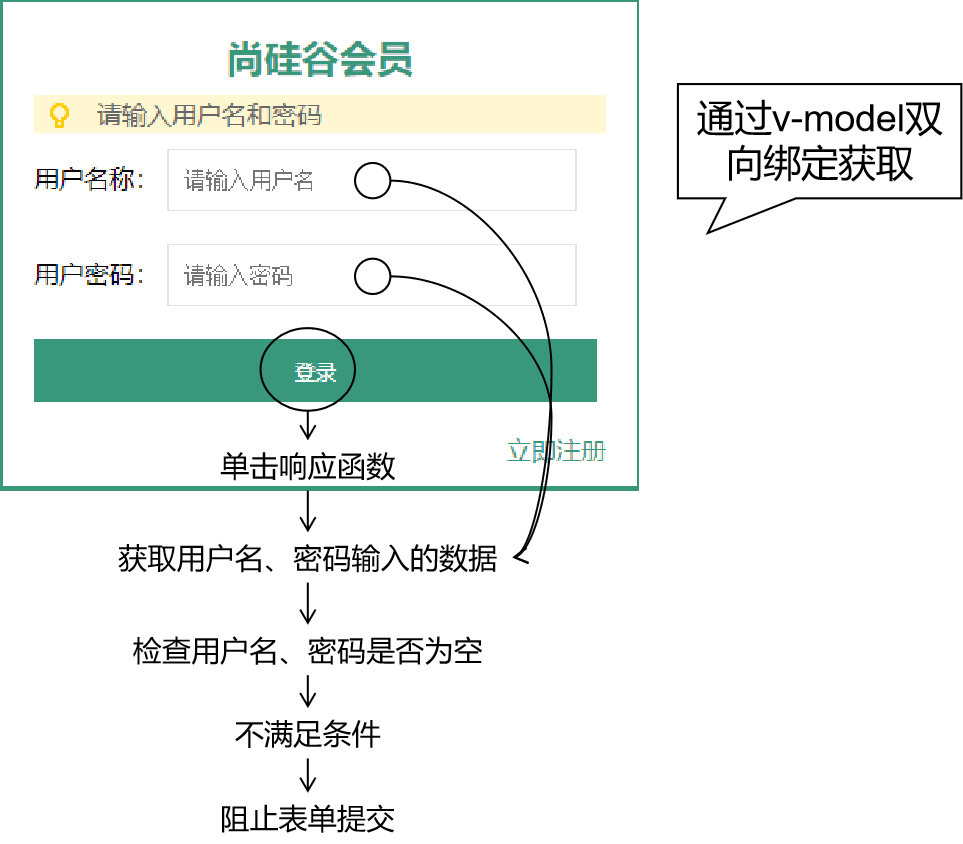

# day03 正则表达式&Vue&书城项目第一阶段

## 第一章 正则表达式

### 1. 学习目标

* 掌握正则表达式的作用
* 掌握正则表达式的语法
* 了解常见的正则表达式

### 2. 内容讲解

#### 2.1 正则表达式的概念

正则表达式是对字符串操作的一种逻辑公式，就是用事先定义好的一些特定字符、及这些特定字符的组合，组成一个“规则字符串”，这个“规则字符串”用来表达对字符串的一种过滤逻辑。用我们自己的话来说: **正则表达式用来校验字符串是否满足一定的规则的公式**

#### 2.2 正则表达式的用途

所以正则表达式有三个主要用途：

- 模式验证: 检测某个字符串是否符合规则，例如检测手机号、身份证号等等是否符合规范
- 匹配读取:  将目标字符串中满足规则的部分**读取**出来，例如将整段文本中的邮箱地址读取出来
- 匹配替换:  将目标字符串中满足规则的部分**替换**为其他字符串,例如将整段文本中的"hello"替换成"haha"

#### 2.3 正则表达式的语法

##### 2.3.1 创建正则表达式对象

* 对象形式：`var reg = new RegExp("正则表达式")`当正则表达式中有"/"那么就使用这种
* 直接量形式：`var reg = /正则表达式/`一般使用这种声明方式 

##### 2.3.2 正则表达式入门案例

###### 2.3.2.1 模式验证: 校验字符串中是否包含'o'字母

**注意**：这里是使用**正则表达式对象**来**调用**方法。

```javascript
//正则表达式的入门案例，目标：校验字符串中是否包含'o'字母
var str = "hello world"

//1. 创建一个正则表达式来描述规则
//模糊匹配规则
var reg1 = /o/
//精确匹配规则: 指定开始(^)和结尾($),就表示从开始一直到结尾的规则都指定了
var reg2 = /^o$/
//2. 使用创建的那个正则表达式，校验给定的字符串是否符合规则
console.log(reg1.test(str))
```

###### 2.3.2.2 匹配读取: 读取字符串中的所有'o'

```javascript
//目标:读取字符串中的所有'o'
var str = "hello world ooo"
//1. 编写一个正则表达式
//如果要读取到所有的o，则需要使用正则表达式中的全文匹配规则
//也就是在正则表达式的/后面添加g
var reg = /o/g

//2. 调用正则表达式的方法进行匹配读取
var arr = str.match(reg);
console.log(arr)
```

###### 2.3.2.3 匹配替换: 将字符串中的第一个'o'替换成'@'

```javascript
//匹配替换: 将字符串中的第一个'o'替换成'@'
var str = "hello world"

//1. 编写一个正则表达式
var reg = /o/g

//2. 调用字符串的replace方法进行匹配替换
var newStr = str.replace(reg,"@");
console.log(newStr)
```

##### 2.3.3 正则表达式的匹配模式

###### 2.3.3.1 全文查找

如果不使用g对正则表达式对象进行修饰，则使用正则表达式进行查找时，仅返回第一个匹配；使用g后，返回所有匹配。

```javascript
// 目标字符串
var targetStr = 'Hello World!';

// 没有使用全局匹配的正则表达式
var reg = /[A-Z]/;
// 获取全部匹配
var resultArr = targetStr.match(reg);
// 数组长度为1
console.log("resultArr.length="+resultArr.length);

// 遍历数组，发现只能得到'H'
for(var i = 0; i < resultArr.length; i++){
    console.log("resultArr["+i+"]="+resultArr[i]);
}
```

对比代码：

```javascript
// 目标字符串
var targetStr = 'Hello World!';

// 使用了全局匹配的正则表达式
var reg = /[A-Z]/g;
// 获取全部匹配
var resultArr = targetStr.match(reg);
// 数组长度为2
console.log("resultArr.length="+resultArr.length);

// 遍历数组，发现可以获取到“H”和“W”
for(var i = 0; i < resultArr.length; i++){
    console.log("resultArr["+i+"]="+resultArr[i]);
}
```

###### 2.3.3.2 忽略大小写

```javascript
//目标字符串
var targetStr = 'Hello WORLD!';

//没有使用忽略大小写的正则表达式
var reg = /o/g;
//获取全部匹配
var resultArr = targetStr.match(reg);
//数组长度为1
console.log("resultArr.length="+resultArr.length);
//遍历数组，仅得到'o'
for(var i = 0; i < resultArr.length; i++){
    console.log("resultArr["+i+"]="+resultArr[i]);
}
```

对比代码：

```javascript
//目标字符串
var targetStr = 'Hello WORLD!';

//使用了忽略大小写的正则表达式
var reg = /o/gi;
//获取全部匹配
var resultArr = targetStr.match(reg);
//数组长度为2
console.log("resultArr.length="+resultArr.length);
//遍历数组，得到'o'和'O'
for(var i = 0; i < resultArr.length; i++){
    console.log("resultArr["+i+"]="+resultArr[i]);
}
```

###### 2.3.3.3 多行查找

不使用多行查找模式，目标字符串中不管有没有换行符都会被当作一行。

```javascript
//目标字符串1
var targetStr01 = 'Hello\nWorld!';
//目标字符串2
var targetStr02 = 'Hello';

//匹配以'Hello'结尾的正则表达式，没有使用多行匹配
var reg = /Hello$/;
console.log(reg.test(targetStr01));//false

console.log(reg.test(targetStr02));//true
```

对比代码：

```javascript
//目标字符串1
var targetStr01 = 'Hello\nWorld!';
//目标字符串2
var targetStr02 = 'Hello';

//匹配以'Hello'结尾的正则表达式，使用了多行匹配
var reg = /Hello$/m;
console.log(reg.test(targetStr01));//true

console.log(reg.test(targetStr02));//true
```

##### 2.3.4 元字符

在正则表达式中被赋予特殊含义的字符，不能被直接当做普通字符使用。如果要匹配元字符本身，需要对元字符进行转义，转义的方式是在元字符前面加上“\”，例如：\^ 

###### 2.3.4.1 常用的元字符

| 代码 | 说明                                                         |
| ---- | ------------------------------------------------------------ |
| .    | 匹配除换行字符以外的任意字符。                               |
| \w   | 匹配字母或数字或下划线等价于[a-zA-Z0-9_]                     |
| \W   | 匹配任何非单词字符。等价于\[^A-Za-z0-9_]                     |
| \s   | 匹配任意的空白符，包括空格、制表符、换页符等等。等价于[\f\n\r\t\v]。 |
| \S   | 匹配任何非空白字符。等价于\[^\f\n\r\t\v]。                   |
| \d   | 匹配数字。等价于[0-9]。                                      |
| \D   | 匹配一个非数字字符。等价于\[^0-9]                            |
| \b   | 匹配单词的开始或结束                                         |
| ^    | 匹配字符串的开始，但在[]中使用表示取反                       |
| $    | 匹配字符串的结束                                             |

###### 2.3.4.2 例子一

```javascript
var str = 'one two three four';
// 匹配全部空格
var reg = /\s/g;
// 将空格替换为@
var newStr = str.replace(reg,'@'); // one@two@three@four
console.log("newStr="+newStr);
```

###### 2.3.4.3 例子二

```javascript
var str = '今年是2014年';
// 匹配至少一个数字
var reg = /\d+/g;
str = str.replace(reg,'abcd');
console.log('str='+str); // 今年是abcd年
```

###### 2.3.4.4 例子三

```javascript
var str01 = 'I love Java';
var str02 = 'Java love me';
// 匹配以Java开头
var reg = /^Java/g;
console.log('reg.test(str01)='+reg.test(str01)); // flase
console.log("<br />");
console.log('reg.test(str02)='+reg.test(str02)); // true
```

###### 2.3.4.5 例子四

```javascript
var str01 = 'I love Java';
var str02 = 'Java love me';
// 匹配以Java结尾
var reg = /Java$/g;
console.log('reg.test(str01)='+reg.test(str01)); // true
console.log("<br />");
console.log('reg.test(str02)='+reg.test(str02)); // flase
```

##### 2.3.5 字符集合

| 语法格式    | 示例                                                         | 说明                                               |
| ----------- | ------------------------------------------------------------ | -------------------------------------------------- |
| [字符列表]  | 正则表达式：[abc] 含义：目标字符串包含abc中的任何一个字符 目标字符串：plain 是否匹配：是 原因：plain中的“a”在列表“abc”中 | 目标字符串中任何一个字符出现在字符列表中就算匹配。 |
| [^字符列表] | [^abc] 含义：目标字符串包含abc以外的任何一个字符 目标字符串：plain 是否匹配：是 原因：plain中包含“p”、“l”、“i”、“n” | 匹配字符列表中未包含的任意字符。                   |
| [字符范围]  | 正则表达式：[a-z] 含义：所有小写英文字符组成的字符列表 正则表达式：[A-Z] 含义：所有大写英文字符组成的字符列表 | 匹配指定范围内的任意字符。                         |

```javascript
var str01 = 'Hello World';
var str02 = 'I am Tom';
//匹配abc中的任何一个
var reg = /[abc]/g;
console.log('reg.test(str01)='+reg.test(str01));//flase
console.log('reg.test(str02)='+reg.test(str02));//true
```

##### 2.3.6 出现次数

| 代码  | 说明             |
| ----- | ---------------- |
| *     | 出现零次或多次   |
| +     | 出现一次或多次   |
| ?     | 出现零次或一次   |
| {n}   | 出现n次          |
| {n,}  | 出现n次或比n多次 |
| {n,m} | 出现n到m次       |

```javascript
console.log("/[a]{3}/.test('aa')="+/[a]{3}/g.test('aa')); // flase
console.log("/[a]{3}/.test('aaa')="+/[a]{3}/g.test('aaa')); // true
console.log("/[a]{3}/.test('aaaa')="+/[a]{3}/g.test('aaaa')); // true
```

##### 2.3.7 在正则表达式中表达『或者』

使用符号：|

```javascript
// 目标字符串
var str01 = 'Hello World!';
var str02 = 'I love Java';
// 匹配'World'或'Java'
var reg = /World|Java/g;
console.log("str01.match(reg)[0]="+str01.match(reg)[0]);//World
console.log("str02.match(reg)[0]="+str02.match(reg)[0]);//Java
```

#### 2.4 常用正则表达式

| 需求     | 正则表达式                                            | 含义                                                         |
| -------- | ----------------------------------------------------- | ------------------------------------------------------------ |
| 用户名   | /^\[a-zA-Z\_][a-zA-Z_\-0-9]{5,9}$/                    | 只能以字母或者'_'开头，后面的内容可以是字母、数字、'\_'、'-'都行，整个字符串只能有6-10位 |
| 密码     | /^[a-zA-Z0-9_\-\@\#\&\*]{6,12}$/                      | 密码只能由字母、数字、'\_'、'-'、'@'、'#'、'\\'、'&'、'*'组成，总共是6-12位 |
| 前后空格 | /^\s+\|\s+$/g                                         | 匹配开头的空格或者结尾的空格                                 |
| 电子邮箱 | /^[a-zA-Z0-9_\.-]+@([a-zA-Z0-9-]+[\.]{1})+[a-zA-Z]+$/ | 多个字母、数字、'.'、'-'加上@多个数字、字母、'-'再加上'.'再加上多个字母 |

## 第二章 Vue

### 1. 学习目标

* 了解什么是框架
* 了解什么是Vue
* 掌握Vue的基本语法
* 了解Vue的生命周期

### 2. 内容讲解

#### 2.1 什么是框架

任何编程语言在最初的时候都是没有框架的，后来随着在实际开发过程中不断总结<span style="color:blue;font-weight:bold;">『经验』</span>，积累<span style="color:blue;font-weight:bold;">『最佳实践』</span>，慢慢的人们发现很多<span style="color:blue;font-weight:bold;">『特定场景』</span>下的<span style="color:blue;font-weight:bold;">『特定问题』</span>总是可以<span style="color:blue;font-weight:bold;">『套用固定解决方案』</span>。

于是有人把成熟的<span style="color:blue;font-weight:bold;">『固定解决方案』</span>收集起来，整合在一起，就成了<span style="color:blue;font-weight:bold;">『框架』</span>。

在使用框架的过程中，我们往往只需要告诉框架<span style="color:blue;font-weight:bold;">『做什么（声明）』</span>，而不需要关心框架<span style="color:blue;font-weight:bold;">『怎么做（编程）』</span>。

对于Java程序来说，我们使用框架就是导入那些封装了<span style="color:blue;font-weight:bold;">『固定解决方案』</span>的jar包，然后通过<span style="color:blue;font-weight:bold;">『配置文件』</span>告诉框架做什么，就能够大大简化编码，提高开发效率。我们使用过的junit其实就是一款单元测试框架。

而对于JavaScript程序来说，我们使用框架就是导入那些封装了<span style="color:blue;font-weight:bold;">『固定解决方案』</span>的<span style="color:blue;font-weight:bold;">『js文件』</span>，然后在框架的基础上编码。

> 用洗衣服来类比框架：
>
> 典型应用场景：洗衣服
>
> 输入数据：衣服、洗衣液、水
>
> 不使用框架：手洗
>
> 使用框架：使用洗衣机，对人来说，只需要按键，具体操作是洗衣机完成的。人只是告诉洗衣机做什么，具体的操作是洗衣机完成的。

实际开发中使用框架时，我们也主要是告诉框架要做什么，具体操作是框架完成的。

#### 2.2 Vue的简介

##### 2.2.1 Vue的作者介绍

在为AngularJS工作之后，Vue的作者<span style="color:blue;font-weight:bold;">尤雨溪</span>开Vue.js。他声称自己的思路是提取Angular中自己喜欢的部分，构建出一款相当轻量的框架。

Vue最早发布于2014年2月。作者在Hacker News、Echo JS与 Reddit的JavaScript版块发布了最早的版本。一天之内，Vue 就登上了这三个网站的首页。

Vue是Github上最受欢迎的开源项目之一。同时，在JavaScript框架/函数库中， Vue所获得的星标数已超过React，并高于Backbone.js、Angular 2、jQuery等项目。

##### 2.2.2 Vue的官网介绍

Vue (读音 /vjuː/，类似于**view**) 是一套用于构建用户界面的**渐进式框架**。与其它大型框架不同的是，Vue 被设计为可以自底向上逐层应用。Vue 的核心库只关注视图层，不仅易于上手，还便于与第三方库或既有项目整合。另一方面，当与[现代化的工具链](https://cn.vuejs.org/v2/guide/single-file-components.html)以及各种[支持类库](https://github.com/vuejs/awesome-vue#libraries--plugins)结合使用时，Vue 也完全能够为复杂的单页应用提供驱动。

**官网地址:**https://cn.vuejs.org/

#### 2.3 准备Vue.js环境

1. Vue框架的js文件获取

   官网提供的下载地址：https://cdn.jsdelivr.net/npm/vue/dist/vue.js

2. 创建空vue.js文件,将官网提供的vue.js文件的内容复制粘贴到本地vue.js文件中

#### 2.4 Vue的入门案例

1. 创建工程,导入vue.js文件放入工程的js文件夹中

2. 创建demo01.html(引入vuejs,定义div,创建vue实例)

```html
<!DOCTYPE html>
<html lang="en">
<head>
    <meta charset="UTF-8">
    <title>vue的入门</title>
    <!--
        在js中框架:其实就是一个外部的js文件
        我们要使用它的话，就需要在我们的HTML页面中使用script标签的src属性将其引入
    -->
    <script src="../js/vue.js"></script>
</head>
<body>
    <!--
        目标:使用vue，将数据模型和视图(div)进行绑定
        实现步骤:
            1. 要指定一个区域，作为vue的模板(使用区域)
            2. 在该区域的下面(外面)编写一个script标签，在script标签中编写vue代码
               2.1 var vue = new Vue()
               2.2 通过json设置vue的内容
                   1. el: 用id选择器表示指定哪块区域能使用vue
                   2. data: 表示我们要声明的数据模型，就都写在data里面
               2.3 使用插值表达式将数据模型和视图进行绑定

    -->
    <div id="app">
        <div>{{city}}</div>
    </div>
    <script>
        var vue = new Vue({
            "el":"#app",
            "data":{
                "city":"武汉"
            }
        })
    </script>
</body>
</html>
```

#### 2.5 声明式渲染

##### 2.5.1 概念

###### 2.5.1.1 声明式

<span style="color:blue;font-weight:bold;">『声明式』</span>是相对于<span style="color:blue;font-weight:bold;">『编程式』</span>而言的。

- 声明式：告诉框架做什么，具体操作由框架完成
- 编程式：自己编写代码完成具体操作

###### 2.5.1.2 渲染


上图含义解释：

- 蓝色方框：HTML标签
- 红色圆形：动态、尚未确定的数据
- 蓝色圆形：经过程序运算以后，计算得到的具体的，可以直接在页面上显示的数据、
- 渲染：程序计算动态数据得到具体数据的过程

##### 2.5.2 案例讲解

**HTML代码**

```html
<!-- 使用{{}}格式，指定要被渲染的数据 -->
<div id="app">{{message}}</div>
```

**vue代码**

```javascript
// 1.创建一个JSON对象，作为new Vue时要使用的参数
var argumentJson = {
	
	// el用于指定Vue对象要关联的HTML元素。el就是element的缩写
	// 通过id属性值指定HTML元素时，语法格式是：#id
	"el":"#app",
	
	// data属性设置了Vue对象中保存的数据
	"data":{
		"message":"Hello Vue!"
	}
};

// 2.创建Vue对象，传入上面准备好的参数
var app = new Vue(argumentJson);
```


##### 2.5.3 查看声明式渲染的响应式效果


通过验证Vue对象的『响应式』效果，我们看到Vue对象和页面上的HTML标签确实是始终保持着关联的关系，同时看到Vue在背后确实是做了大量的工作。

#### 2.6 绑定文本

##### 2.6.1 基本语法

v-text="要绑定的数据模型"

##### 2.6.2 案例代码

```html
<!DOCTYPE html>
<html lang="en">
<head>
    <meta charset="UTF-8">
    <title>vue绑定文本</title>
    <!--
        在js中框架:其实就是一个外部的js文件
        我们要使用它的话，就需要在我们的HTML页面中使用script标签的src属性将其引入
    -->
    <script src="../js/vue.js"></script>
</head>
<body>
<!--
    目标:使用vue，将数据模型和视图(div)进行绑定
    实现步骤:
        1. 要指定一个区域，作为vue的模板(使用区域)
        2. 在该区域的下面(外面)编写一个script标签，在script标签中编写vue代码
           2.1 var vue = new Vue()
           2.2 通过json设置vue的内容
               1. el: 用id选择器表示指定哪块区域能使用vue
               2. data: 表示我们要声明的数据模型，就都写在data里面
           2.3 使用插值表达式将数据模型和视图进行绑定

-->
<div id="app">
    <!--
        v-text其实就是将数据模型的值绑定在标签体内
    -->
    <div v-text="city"></div>
    <div>{{city}}</div>
</div>

<script>
    var vue = new Vue({
        "el":"#app",
        "data":{
            "city":"武汉"
        }
    })
</script>
</body>
</html>
```

#### 2.7 绑定元素属性

##### 2.7.1 基本语法

v-bind:HTML标签的原始属性名

##### 2.7.2 案例代码

**HTML代码**

```html
<div id="app">
    <!--
    绑定属性:
    v-bind:属性名="数据模型"
    简写:
    :属性名="数据模型"
    -->
    <input type="text" :id="idValue" :value="inputValue"/>
</div>
```

**Vue代码**

```javascript
var vue = new Vue({
    "el":"#app",
    "data":{
        "inputValue":"张三疯",
        "idValue":1
    }
});
```

**扩展:**

v-bind:属性名="属性值"可以简写成 :属性名="属性值"

#### 2.8 双向数据绑定

##### 2.8.1 提出问题


而使用了双向绑定后，就可以实现：页面上数据被修改后，Vue对象中的数据属性也跟着被修改。

##### 2.8.2 案例代码

**HTML代码**

```html
<div id="app">
    <!--
    双向绑定，针对的是表单项的value属性,我们使用v-model:value="数据模型"

    双向绑定的作用: 便于用户可以通过数据模型获取表单项的内容(value)

    双向绑定的简写:
    v-model="数据模型"
    -->
    <input type="text" v-model="inputValue"/>
</div>
```

**Vue代码**

```javascript
var vue = new Vue({
    "el":"#app",
    "data":{
        "inputValue":"张三疯"
    }
});
```

**页面效果**

p标签内的数据能够和文本框中的数据实现同步修改：


**扩展:**

1. v-model:value="值" 可以简写成 v-model="值"

2. trim修饰符

实际开发中，要考虑到用户在输入数据时，有可能会包含前后空格。而这些前后的空格对我们程序运行来说都是干扰因素，要去掉。在v-model后面加上.trim修饰符即可实现。

```html
<input type="text" v-model.trim="vueValue" />
```

Vue会帮助我们在文本框失去焦点时自动去除前后空格。

#### 2.9 条件渲染

根据Vue对象中，数据属性的值来判断是否对HTML页面内容进行渲染。

##### 2.9.1 v-if

**HTML代码**

```html
<div id="app">
    <!--
    目标是:isShow为true则显示图片，isShow为false则隐藏图片
    实现方案: 使用Vue的条件渲染
    1. v-if="数据模型"
    -->
    
</div>
```

**Vue代码**

```javascript
var vue = new Vue({
    "el":"#app",
    "data":{
        "isShow":false
    }
});
```

##### 2.9.2 v-if和v-else

**HTML代码**

```html
<div id="app">
    <!--
    目标是:isShow为true则显示图片，isShow为false则隐藏图片
    实现方案: 使用Vue的条件渲染
    1. v-if="数据模型"
    v-else="数据模型"
    目标: 如果isShow为true则显示mm.jpg，如果为false则显示girl.jpg
    -->
    
    
</div>
```

**Vue代码**

```javascript
var vue = new Vue({
    "el":"#app",
    "data":{
        "isShow":true
    }
});
```

##### 2.9.3 v-show

**HTML代码**

```html
<div id="app03">
	<h3>v-show</h3>
	
</div>
```

**Vue代码**

```javascript
var app03 = new Vue({
    "el":"#app03",
    "data":{
        "flag":true
    }
});
```

#### 2.10 列表渲染

##### 2.10.1 迭代一个简单的数组

**HTML代码**

```html
<div id="app01">
	<ul>
		<!-- 使用v-for语法遍历数组 -->
		<!-- v-for的值是语法格式是：引用数组元素的变量名 in Vue对象中的数组属性名 -->
		<!-- 在文本标签体中使用{{引用数组元素的变量名}}渲染每一个数组元素 -->
		<li v-for="fruit in fruitList">{{fruit}}</li>
	</ul>
</div>
```

**Vue代码**

```javascript
var app01 = new Vue({
	"el":"#app01",
	"data":{
		"fruitList": [
			"apple",
			"banana",
			"orange",
			"grape",
			"dragonfruit"
		]
	}
});
```

##### 2.10.2 迭代一个对象数组

**HTML代码**

```html
<style type="text/css">
        /*设置样式*/
        table,th,td {
            border-collapse: collapse;
            border: 1px solid black;
            padding: 5px;
        }
</style>

<div id="app">
	<table>
		<tr>
			<th>编号</th>
			<th>姓名</th>
			<th>年龄</th>
			<th>专业</th>
		</tr>
		<tr v-for="employee in employeeList">
			<td>{{employee.empId}}</td>
			<td>{{employee.empName}}</td>
			<td>{{employee.empAge}}</td>
			<td>{{employee.empSubject}}</td>
		</tr>
	</table>
</div>
```

**Vue代码**

```javascript
var app = new Vue({
	"el":"#app",
	"data":{
		"employeeList":[
			{
				"empId":11,
				"empName":"tom",
				"empAge":111,
				"empSubject":"java"
			},
			{
				"empId":22,
				"empName":"jerry",
				"empAge":222,
				"empSubject":"php"
			},
			{
				"empId":33,
				"empName":"bob",
				"empAge":333,
				"empSubject":"python"
			}
		]
	}
});
```

#### 2.11 事件驱动

##### 2.11.1 案例一: 字符串顺序反转

**HTML代码**

```html
<div id="app">
    <div v-text="message"></div>
    <!--
    给按钮绑定点击事件: v-on:事件名="函数"
    事件绑定的简写: @事件名="函数"
    -->
    <button type="button" @click="fn1()">按钮</button>
    <button type="button" @click="reverseMessage()">反转字符串</button>
</div>
```

**Vue代码**

```javascript
var vue = new Vue({
    "el":"#app",
    "data":{
        "message":"Hello world"
    },
    "methods":{
        //vue的函数都是声明在methods里面的
        fn1(){
            alert("我被点击了...")
        },
        reverseMessage(){
            //将div中的内容进行反转,也就是将message反转
            //1. 将message通过空字符串切割成一个数组
            //this.message
            var arr = this.message.split(""); //["H","e","l","l","o"," ","w","o","r","l","d"]
            //2. 将数组反转
            var reverseArr = arr.reverse(); //["d","l","r","o","w"," ","o","l","l","e","H"]
            //3. 通过空字符串将数组拼接成一个字符串
            this.message = reverseArr.join("")
        }
    }
});
```

##### 2.11.2 案例二:获取鼠标移动时的坐标信息

**HTML代码**

```html
<!--样式-->
<style>
    #area{
        width: 500px;
        height: 500px;
        border: 1px solid black;
    }
</style>
<div id="app">
    <!--
    绑定鼠标移动事件，鼠标移动事件触发的时候就获取鼠标的坐标
    -->
    <div id="area" @mousemove="recordPosition()"></div>

    <!--
    显示当前鼠标所在位置的坐标
    -->
    <p v-text="pointPosition"></p>
</div>
```

**Vue代码**

```javascript
var vue = new Vue({
    "el":"#app",
    "data":{
        "pointPosition":"还未获取到鼠标的坐标"
    },
    "methods":{
        recordPosition(){
            //在这里就要获取鼠标的坐标
            //event表示当前事件
            this.pointPosition = event.clientX+","+event.clientY
        }
    }
});
```

**扩展:**

v-on:事件名="函数"可以简写成@事件名="函数"

##### 2.11.3 取消控件的默认行为

###### 2.10.3.1 控件默认行为

- 点超链接会跳转页面
- 点表单提交按钮会提交表单

本来控件的默认行为是天经地义就该如此的，但是如果我们希望点击之后根据我们判断的结果再看是否要跳转，此时默认行为无脑跳转的做法就不符合我们的预期了。

###### 2.11.3.2 取消方式

调用**事件对象**的**preventDefault()**方法。

**超链接举例**

HTML代码：

```html
<div id="app">
    <a href="https://www.baidu.com" @click="fn1()">跳转到百度</a>
</div>
```

Vue代码：

```javascript
var vue = new Vue({
    "el":"#app",
    "data":{

    },
    "methods":{
        fn1(){
            console.log("hello world...")


            //阻止控件的默认行为
            event.preventDefault()
        }
    }
});
```

**表单提交按钮举例**

HTML代码：

```html
<div id="app">
    <form action="https://www.baidu.com" method="get">
        用户名<input type="text" name="username"/><br/>
        <button type="submit" @click="fn2()">提交按钮</button>
    </form>
</div>
```

JavaScript代码：

```javascript
var vue = new Vue({
    "el":"#app",
    "data":{

    },
    "methods":{
        fn2(){
            console.log("点击了表单的提交按钮...")

            event.preventDefault()
        }
    }
});
```

#####  2.11.4 阻止事件冒泡


图中的两个div，他们的HTML标签是：

```html
<!--样式-->
<style>
    #outer{
        width: 400px;
        height: 400px;
        background-color: lightskyblue;
    }

    #inner{
        width: 200px;
        height: 200px;
        background-color: lightgreen;
    }
</style>
<div id="app">
    <div id="outer" @click="fn1()">
        <div id="inner" @click="fn2()"></div>
    </div>
</div>
```

点击里面的div同时也等于点击了外层的div，此时如果两个div上都绑定了单击响应函数那么就都会被触发：

所以事件冒泡就是一个事件会不断向父元素传递，直到window对象。

如果这不是我们想要的效果那么可以使用<span style="color:blue;font-weight:bold;">事件对象</span>的<span style="color:blue;font-weight:bold;">stopPropagation()</span>函数阻止。

```javascript
var vue = new Vue({
    "el":"#app",
    "methods":{
        fn1(){
            console.log("外层的div被点击了...")
        },
        fn2(){
            console.log("内层的div被点击了...")

            //点击内层的div，只会让内层div触发事件，而不会传递到外层，这就是阻止事件的冒泡
            event.stopPropagation()
        }
    }
})
```

##### 2.11.5 Vue事件修饰符

对于事件修饰符，Vue官网的描述是：

> 在事件处理程序中调用 `event.preventDefault()` 或 `event.stopPropagation()` 是非常常见的需求。尽管我们可以在方法中轻松实现这点，但更好的方式是：<span style="color:blue;font-weight:bold;">方法只有纯粹的数据逻辑，而不是去处理 DOM 事件细节</span>。

###### 2.11.5.1 取消控件的默认行为

控件的默认行为指的是：

- 点击超链接跳转页面
- 点击表单提交按钮提交表单

实现这个需求使用的Vue事件修饰符是：<span style="color:blue;font-weight:bold;">.prevent</span>

```html
<a href="http://www.baidu.com" @click.prevent="clickAnchor">超链接</a>

<form action="http://www.baidu.com" method="post">
	<button type="submit" @click.prevent="clickSubmitBtn">提交表单</button>
</form>
```

###### 2.10.5.2 取消事件冒泡

实现这个需求使用的Vue事件修饰符是：<span style="color:blue;font-weight:bold;">.stop</span>

```html
<div id="outterDiv" @click="clickOutterDiv">
	<div id="innerDiv" @click.stop="clickInnerDiv"></div>
</div>
```

#### 2.12 侦听属性

##### 2.12.1 提出需求

```html
<div id="app">
	<p>尊姓：{{firstName}}</p>
	<p>大名：{{lastName}}</p>
	尊姓：<input type="text" v-model="firstName" /><br/>
	大名：<input type="text" v-model="lastName" /><br/>
	<p>全名：{{fullName}}</p>
</div>
```

在上面代码的基础上，我们希望firstName或lastName属性发生变化时，修改fullName属性。此时需要对firstName或lastName属性进行<span style="color:blue;font-weight:bold;">『侦听』</span>。

具体来说，所谓<span style="color:blue;font-weight:bold;">『侦听』</span>就是对message属性进行监控，当firstName或lastName属性的值发生变化时，调用我们准备好的函数。

##### 2.12.2 Vue代码

在watch属性中声明对firstName和lastName属性进行<span style="color:blue;font-weight:bold;">『侦听』</span>的函数：

```javascript
var app = new Vue({
	"el":"#app",
	"data":{
		"firstName":"jim",
		"lastName":"green",
		"fullName":"jim green"
	},
	"watch":{
		"firstName":function(inputValue){
			this.fullName = inputValue + " " + this.lastName;
		},
		"lastName":function(inputValue){
			this.fullName = this.firstName + " " + inputValue;
		}
	}
});
```

#### 2.13 案例练习

##### 2.13.1 功能效果演示


##### 2.13.2 任务拆解

- 第一步：显示表格
- 第二步：显示四个文本框
- 第三步：创建一个p标签用来显示用户在文本框中实时输入的内容
- 第四步：点击添加记录按钮实现记录的添加

##### 2.13.3 第一步：显示表格

**HTML标签**

```html
<table>
    <tr>
        <th>编号</th>
        <th>姓名</th>
        <th>年龄</th>
        <th>专业</th>
        <th>操作</th>
    </tr>
    <tr v-for="(emp,index) in employeeList">
        <td v-text="emp.empId"></td>
        <td v-text="emp.empName"></td>
        <td v-text="emp.empAge"></td>
        <td v-text="emp.empSubject"></td>
        <td>
            <button type="button">删除</button>
        </td>
    </tr>
</table>
```

**Vue代码**

```javascript
var vue = new Vue({
    "el":"#app",
    "data":{
        "employeeList":[
            {
                "empId":"1",
                "empName":"张三",
                "empAge":20,
                "empSubject":"Java"
            },
            {
                "empId":"2",
                "empName":"李四",
                "empAge":21,
                "empSubject":"PHP"
            },
            {
                "empId":"3",
                "empName":"王五",
                "empAge":22,
                "empSubject":"C++"
            }
        ]
    }  
});
```

##### 2.13.4 第二步：点击删除按钮删除员工信息

**HTML标签**

```html
<table>
    <tr>
        <th>编号</th>
        <th>姓名</th>
        <th>年龄</th>
        <th>专业</th>
        <th>操作</th>
    </tr>
    <tr v-for="(emp,index) in employeeList">
        <td v-text="emp.empId"></td>
        <td v-text="emp.empName"></td>
        <td v-text="emp.empAge"></td>
        <td v-text="emp.empSubject"></td>
        <td>
            <button type="button" @click="deleteEmployee(index)">删除</button>
        </td>
    </tr>
</table>
```

**Vue代码**

```javascript
var vue = new Vue({
    "el":"#app",
    "data":{
        "employeeList":[
            {
                "empId":"1",
                "empName":"张三",
                "empAge":20,
                "empSubject":"Java"
            },
            {
                "empId":"2",
                "empName":"李四",
                "empAge":21,
                "empSubject":"PHP"
            },
            {
                "empId":"3",
                "empName":"王五",
                "empAge":22,
                "empSubject":"C++"
            }
        ]
    },
    "methods":{
        deleteEmployee(i){
            //删除当前按钮所在的那一行:其实就是删除employeeList中对应的那一个元素
            //在employeeList数组中要根据下标删除
            this.employeeList.splice(i,1)
        }
    }
});
```

##### 2.13.5 第三步：绑定表单和员工信息

**HTML标签**

```html
<div id="app">
    <table>
        <tr>
            <th>编号</th>
            <th>姓名</th>
            <th>年龄</th>
            <th>专业</th>
            <th>操作</th>
        </tr>
        <tr v-for="(emp,index) in employeeList">
            <td v-text="emp.empId"></td>
            <td v-text="emp.empName"></td>
            <td v-text="emp.empAge"></td>
            <td v-text="emp.empSubject"></td>
            <td>
                <button type="button" @click="deleteEmployee(index)">删除</button>
            </td>
        </tr>
    </table>

    <form>
        编号<input v-model="employee.empId" type="text"/><br/>
        姓名<input v-model="employee.empName" type="text"/><br/>
        年龄<input v-model="employee.empAge" type="text"/><br/>
        专业<input v-model="employee.empSubject" type="text"/><br/>
        <button type="button">添加员工信息</button>
    </form>
</div>
```

**Vue代码**

```javascript
var vue = new Vue({
    "el":"#app",
    "data":{
        "employeeList":[
            {
                "empId":"1",
                "empName":"张三",
                "empAge":20,
                "empSubject":"Java"
            },
            {
                "empId":"2",
                "empName":"李四",
                "empAge":21,
                "empSubject":"PHP"
            },
            {
                "empId":"3",
                "empName":"王五",
                "empAge":22,
                "empSubject":"C++"
            }
        ],
        //数据模型绑定各个表单项的内容
        "employee":{
            "empId":"4",
            "empName":"赵六",
            "empAge":23,
            "empSubject":"Kotlin"
        }
    },
    "methods":{
        deleteEmployee(i){
            //删除当前按钮所在的那一行:其实就是删除employeeList中对应的那一个元素
            //在employeeList数组中要根据下标删除
            this.employeeList.splice(i,1)
        }
    }
});
```

测试是否正确的方式是：在控制台尝试修改Vue对象的数据属性值：


##### 

##### 2.13.6 点击添加记录按钮

往表格中添加数据其实就是将表单上输入的数据`this.employee`加入到数组`this.employeeList`中

添加完之后清空表单数据，其实就是设置`this.employee= {}`

**HTML标签**

```html
<div id="app">
    <table>
        <tr>
            <th>编号</th>
            <th>姓名</th>
            <th>年龄</th>
            <th>专业</th>
            <th>操作</th>
        </tr>
        <tr v-for="(emp,index) in employeeList">
            <td v-text="emp.empId"></td>
            <td v-text="emp.empName"></td>
            <td v-text="emp.empAge"></td>
            <td v-text="emp.empSubject"></td>
            <td>
                <button type="button" @click="deleteEmployee(index)">删除</button>
            </td>
        </tr>
    </table>

    <form>
        编号<input v-model="employee.empId" type="text"/><br/>
        姓名<input v-model="employee.empName" type="text"/><br/>
        年龄<input v-model="employee.empAge" type="text"/><br/>
        专业<input v-model="employee.empSubject" type="text"/><br/>
        <button type="button" @click="insertEmployee()">添加员工信息</button>
    </form>
</div>
```

**Vue代码**

```javascript
var vue = new Vue({
    "el":"#app",
    "data":{
        "employeeList":[
            {
                "empId":"1",
                "empName":"张三",
                "empAge":20,
                "empSubject":"Java"
            },
            {
                "empId":"2",
                "empName":"李四",
                "empAge":21,
                "empSubject":"PHP"
            },
            {
                "empId":"3",
                "empName":"王五",
                "empAge":22,
                "empSubject":"C++"
            }
        ],
        //数据模型绑定各个表单项的内容
        "employee":{
            "empId":"4",
            "empName":"赵六",
            "empAge":23,
            "empSubject":"Kotlin"
        }
    },
    "methods":{
        deleteEmployee(i){
            //删除当前按钮所在的那一行:其实就是删除employeeList中对应的那一个元素
            //在employeeList数组中要根据下标删除
            this.employeeList.splice(i,1)
        },
        insertEmployee(){
            //1. 将表单的内容作为一行添加到表格中:就是将当前表单的数据加入到数组中作为employeeList数组的最后一个元素
            this.employeeList.push(this.employee)
            //2. 清空表单内容
            this.employee = {}
        }
    }
});
```

#### 2.14 Vue的生命周期(了解)

##### 2.14.1 概念

在我们各种语言的编程领域中，<span style="color:blue;font-weight:bold;">『生命周期』</span>都是一个非常常见的概念。一个对象从创建、初始化、工作再到释放、清理和销毁，会经历很多环节的演变。比如我们在JavaSE阶段学习过线程的生命周期，今天学习Vue对象的生命周期，将来还要学习Servlet、Filter等Web组件的生命周期。

##### 2.14.2 Vue对象的生命周期


##### 2.14.3 生命周期钩子函数

Vue允许我们在特定的生命周期环节中通过钩子函数来加入我们的代码。

```html
<div id="app">
    <div id="d1">{{city}}</div>
</div>
```

```javascript
var vue = new Vue({
    "el":"#app",
    "data":{
        "city":"武汉"
    },
    //Vue的钩子函数，其实就是可以让我们在Vue的生命周期的特定阶段执行一些代码
    beforeCreate(){
        //输出数据模型city的值
        console.log("在beforeCreate钩子函数中获取city:"+this.city)
    },
    created(){
        //输出数据模型city的值
        console.log("在created钩子函数中获取city:"+this.city)
    },
    beforeMount(){
        //执行在虚拟视图替换真实视图之前,所以此时真实视图里面不会显示数据模型的数据
        console.log("在beforeMount钩子函数中获取真实视图的内容:"+document.getElementById("d1").innerHTML)
    },
    mounted(){
        //执行在虚拟视图替换真实视图之后,所以此时真实视图里面会显示数据模型的数据
        console.log("在mounted钩子函数中获取真实视图的内容:"+document.getElementById("d1").innerHTML)
    }
})
```

## 第三章 书城项目第一阶段

### 1. 学习目标

* 实现登录表单校验
* 实现注册表单校验

### 2. 内容讲解

#### 2.1 准备工作

创建目录后，把一整套现成的前端页面复制到新建的目录下，然后把vue.js文件复制到script目录下。

#### 2.2 登录页面的表单验证

##### 2.2.1 规则设定

- 用户名非空
- 密码非空

##### 2.2.2 在login.html页面中加入Vue的环境

```html
<script src="../../static/script/vue.js"></script>
```

##### 2.2.3 案例思路



##### 2.2.4 代码实现

**HTML代码**

```html
<div class="login_form" id="app">
    <div class="login_box">
        <div class="tit">
            <h1>尚硅谷会员</h1>
        </div>
        <div class="msg_cont">
            <b></b>
            <span class="errorMsg" v-text="errorMessage"></span>
        </div>
        <div class="form">
            <form action="login_success.html">
                <label>用户名称：</label>
                <input
                       class="itxt"
                       type="text"
                       placeholder="请输入用户名"
                       autocomplete="off"
                       tabindex="1"
                       v-model="username"
                       name="username"
                       id="username"
                       />
                <br />
                <br />
                <label>用户密码：</label>
                <input
                       class="itxt"
                       type="password"
                       placeholder="请输入密码"
                       autocomplete="off"
                       v-model="pwd"
                       tabindex="1"
                       name="password"
                       id="password"
                       />
                <br />
                <br />
                <input type="submit" value="登录" id="sub_btn" @click="checkLogin()" />
            </form>
            <div class="tit">
                <a href="regist.html">立即注册</a>
            </div>
        </div>
    </div>
```

**Vue代码**

```javascript
var vue = new Vue({
    "el":"#app",
    "data":{
        "username":"",
        "pwd":"",
        "errorMessage":""
    },
    "methods":{
        checkLogin(){
            //判断用户名和密码是否为空，如果至少有一个为空则阻止表单提交
            if(this.username == ""){
                this.errorMessage = "用户名不能为空"
                //阻止表单提交
                event.preventDefault()
                return
            }
            if(this.pwd == ""){
                this.errorMessage = "密码不能为空"
                //阻止表单提交
                event.preventDefault()
                return
            }
        }
    }
});
```

#### 2.3 注册页面的表单验证

##### 2.3.1 在注册页面(register.html)中引入vue

```html
<!--在注册页面引入vue-->
<script src="../../static/script/vue.js"></script>
```

**HTML代码**

修改register.html页面的内容

```html
<!DOCTYPE html>
<html>
    <head>
        <meta charset="UTF-8" />
        <title>尚硅谷会员注册页面</title>
        <link type="text/css" rel="stylesheet" href="../../static/css/style.css" />
        <link rel="stylesheet" href="../../static/css/register.css" />
        <style type="text/css">
            .login_form {
                height: 420px;
                margin-top: 25px;
            }
            
            <!--添加样式-->
            .message{
                font-size: 12px;
                color: red;
                margin: 2px 0;
            }
        </style>
        <!--引入vue-->
        <script src="../../static/script/vue.js"></script>
    </head>
    <body>
        <div id="login_header">
            <a href="../../index.html">
                
            </a>
        </div>

        <div class="login_banner">
            <div class="register_form" id="app">
                <h1>注册尚硅谷会员</h1>
                <form action="regist_success.html">
                    <div class="form-item">
                        <div>
                            <label>用户名称:</label>
                            <input v-model="user.username" type="text" placeholder="请输入用户名" @change="checkUsername()"/>
                        </div>
                        <!--将span的类名改成message-->
                        <span class="message" v-text="usernameError"></span>
                    </div>
                    <div class="form-item">
                        <div>
                            <label>用户密码:</label>
                            <input v-model="user.password" type="password" placeholder="请输入密码" @change="checkPassword()"/>
                        </div>
                        <!--将span的类名改成message-->
                        <span class="message" v-text="passwordError"></span>
                    </div>
                    <div class="form-item">
                        <div>
                            <label>确认密码:</label>
                            <input v-model="user.passwordConfirm" type="password" placeholder="请输入确认密码" @change="checkPasswordConfirm()"/>
                        </div>
                        <!--将span的类名改成message-->
                        <span class="message" v-text="passwordConfirmError"></span>
                    </div>
                    <div class="form-item">
                        <div>
                            <label>用户邮箱:</label>
                            <input v-model="user.email" type="text" placeholder="请输入邮箱" @change="checkEmail()"/>
                        </div>
                        <!--将span的类名改成message-->
                        <span class="message" v-text="emailError"></span>
                    </div>
                    <div class="form-item">
                        <div>
                            <label>验证码:</label>
                            <div class="verify">
                                <input type="text" placeholder="" />
                                
                            </div>
                        </div>
                        <!--将span的类名改成message-->
                        <span class="message"></span>
                    </div>
                    <button class="btn" @click="checkRegister()">注册</button>
                </form>
            </div>
        </div>
        <div id="bottom">
            <span>
                尚硅谷书城.Copyright &copy;2015
            </span>
        </div>
    </body>
</html>
```

**Vue代码**

```javascript
var vue = new Vue({
    "el":"#app",
    "data":{
        "user":{
            "username":"",
            "password":"",
            "passwordConfirm":"",
            "email":""
        },
        "usernameError":"",
        "passwordError":"",
        "passwordConfirmError":"",
        "emailError":"",
        "flag":true
    },
    "methods":{
        checkUsername(){
            //校验用户名是否符合要求
            //用户名应为6~16位数字和字母组成
            //声明一个正则表达式
            var reg = /^[0-9a-zA-Z]{6,16}$/
            //使用正则表达式校验用户名
            if (!reg.test(this.user.username)) {
                //用户名不符合规则
                this.usernameError = "用户名必须是6~16位数字和字母组成"
                this.flag = false
            }else {
                //用户名符合规则
                this.usernameError = ""
                this.flag = true
            }
        },
        checkPassword(){
            //密码是8-16位的数字、字母、_
            var reg = /^[0-9a-zA-Z_]{8,16}$/
            //使用正则表达式校验密码的规则
            if (!reg.test(this.user.password)) {
                this.passwordError = "密码必须是8-16位的数字、字母、_"
                this.flag = false
            }else {
                this.passwordError = ""
                this.flag = true
            }
        },
        checkPasswordConfirm(){
            //确认密码的校验就是校验确认密码和密码是否相同
            if (this.user.passwordConfirm != this.user.password) {
                this.passwordConfirmError = "两次输入的密码必须一致"
                this.flag = false
            }else {
                this.passwordConfirmError = ""
                this.flag = true
            }
        },
        checkEmail(){
            //编写一个正则表达式来校验邮箱格式
            var reg = /^[a-zA-Z0-9_\.-]+@([a-zA-Z0-9-]+[\.]{1})+[a-zA-Z]+$/
            //使用正则表达式校验邮箱
            if (!reg.test(this.user.email)) {
                this.emailError = "请输入正确的邮箱格式"
                this.flag = false
            }else {
                this.emailError = ""
                this.flag = true
            }
        },
        checkRegister(){
            //校验用户名、密码、确认密码、邮箱
            if (!this.flag) {
                //至少有一个校验未通过:则不能提交表单
                //阻止默认
                event.preventDefault()
            }
        }
    }
});
```
