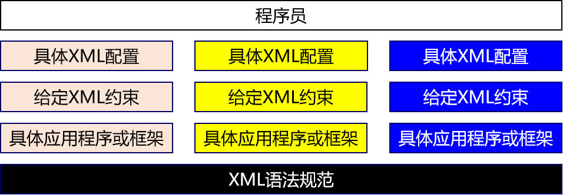
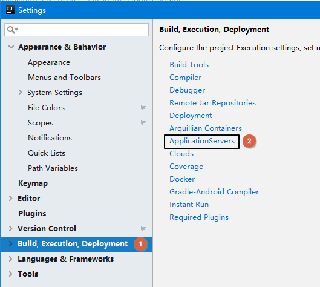
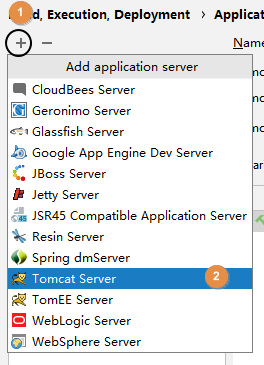
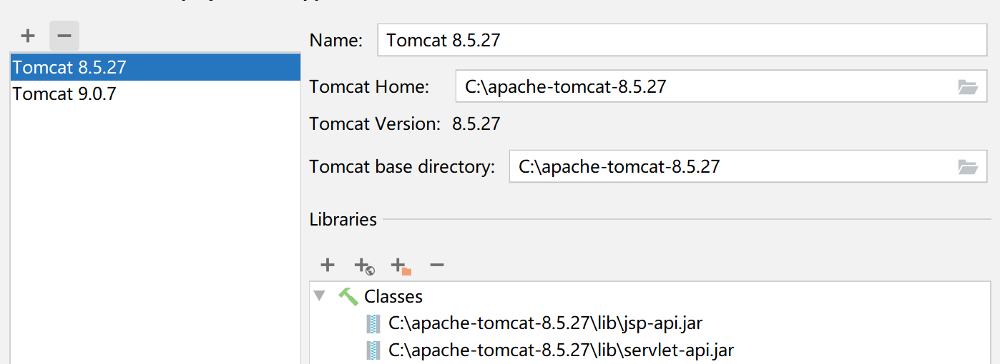
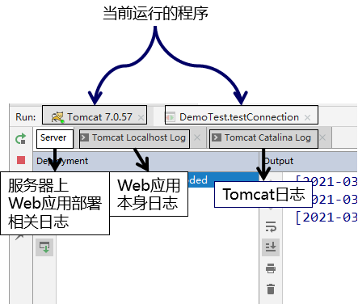
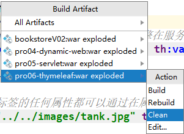
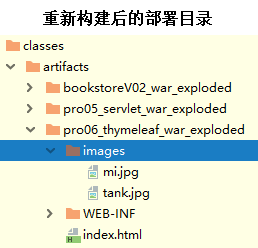
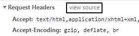
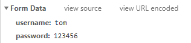

# day04 XML&Tomcat&Http协议

## 第一章 XML

### 1. 学习目标

* 了解配置文件的作用
* 了解常见的配置文件类型
* 掌握properties文件的编写规范
* 掌握xml文件的编写
* 了解xml文件的约束  
* 掌握xml文件的解析

### 2. 内容讲解

#### 2.1 配置文件

##### 2.1.1 配置文件的作用

配置文件是用于给应用程序提供配置参数以及初始化设置的一些有特殊格式的文件

##### 2.1.1 常见的配置文件类型

1. properties文件,例如druid连接池就是使用properties文件作为配置文件
2. XML文件,例如Tomcat就是使用XML文件作为配置文件
3. YAML文件,例如SpringBoot就是使用YAML作为配置文件
4. json文件,通常用来做文件传输，也可以用来做前端或者移动端的配置文件

#### 2.2 properties文件

##### 2.2.1 文件示例

```properties
atguigu.jdbc.url=jdbc:mysql://192.168.198.100:3306/mybatis1026
atguigu.jdbc.driver=com.mysql.jdbc.Driver
atguigu.jdbc.username=root
atguigu.jdbc.password=atguigu
```

##### 2.2.2 语法规范

- 由键值对组成
- 键和值之间的符号是等号
- 每一行都必须顶格写，前面不能有空格之类的其他符号

#### 2.3 XML文件

##### 2.3.1 文件示例

```xml
<?xml version="1.0" encoding="UTF-8"?>
<web-app xmlns="http://xmlns.jcp.org/xml/ns/javaee"
         xmlns:xsi="http://www.w3.org/2001/XMLSchema-instance"
         xsi:schemaLocation="http://xmlns.jcp.org/xml/ns/javaee http://xmlns.jcp.org/xml/ns/javaee/web-app_4_0.xsd"
         version="4.0">

    <!-- 配置SpringMVC前端控制器 -->
    <servlet>
        <servlet-name>dispatcherServlet</servlet-name>
        <servlet-class>org.springframework.web.servlet.DispatcherServlet</servlet-class>

        <!-- 在初始化参数中指定SpringMVC配置文件位置 -->
        <init-param>
            <param-name>contextConfigLocation</param-name>
            <param-value>classpath:spring-mvc.xml</param-value>
        </init-param>

        <!-- 设置当前Servlet创建对象的时机是在Web应用启动时 -->
        <load-on-startup>1</load-on-startup>

    </servlet>
    <servlet-mapping>
        <servlet-name>dispatcherServlet</servlet-name>

        <!-- url-pattern配置斜杠表示匹配所有请求 -->
        <!-- 两种可选的配置方式：
                1、斜杠开头：/
                2、包含星号：*.atguigu
             不允许的配置方式：前面有斜杠，中间有星号
                /*.app
         -->
        <url-pattern>/</url-pattern>
    </servlet-mapping>
</web-app>
```

##### 2.3.2 概念介绍

XML是e<span style="color:blue;font-weight:bold;">X</span>tensible <span style="color:blue;font-weight:bold;">M</span>arkup <span style="color:blue;font-weight:bold;">L</span>anguage的缩写，翻译过来就是<span style="color:blue;font-weight:bold;">可扩展标记语言</span>。所以很明显，XML和HTML一样都是标记语言，也就是说它们的基本语法都是标签。

**可扩展**

<span style="color:blue;font-weight:bold;">可扩展</span>三个字<span style="color:blue;font-weight:bold;">表面上</span>的意思是XML允许<span style="color:blue;font-weight:bold;">自定义格式</span>。但是别美，这<span style="color:blue;font-weight:bold;">不代表</span>你<span style="color:blue;font-weight:bold;">可以随便写</span>。



在XML基本语法规范的基础上，你使用的那些第三方应用程序、框架会通过设计<span style="color:blue;font-weight:bold;">『XML约束』</span>的方式<span style="color:blue;font-weight:bold;">『强制规定』</span>配置文件中可以写什么和怎么写，规定之外的都不可以写。

XML基本语法这个知识点的定位是：我们不需要从零开始，从头到尾的一行一行编写XML文档，而是在第三方应用程序、框架<span style="color:blue;font-weight:bold;">已提供的配置文件</span>的基础上<span style="color:blue;font-weight:bold;">修改</span>。要改成什么样取决于你的需求，而怎么改取决于<span style="color:blue;font-weight:bold;">XML基本语法</span>和<span style="color:blue;font-weight:bold;">具体的XML约束</span>。

##### 2.3.3 XML的基本语法

- XML文档声明

这部分基本上就是固定格式，要注意的是文档声明一定要从第一行第一列开始写

```xml
<?xml version="1.0" encoding="UTF-8"?>
```

- 根标签

根标签有且只能有一个。

- 标签闭合
  - 双标签：开始标签和结束标签必须成对出现。
  - 单标签：单标签在标签内关闭。
- 标签嵌套
  - 可以嵌套，但是不能交叉嵌套。
- 注释不能嵌套
- 标签名、属性名建议使用小写字母
- 属性
  - 属性必须有值
  - 属性值必须加引号，单双都行

看到这里大家一定会发现XML的基本语法和HTML的基本语法简直如出一辙。其实这不是偶然的，XML基本语法+HTML约束=HTML语法。在逻辑上HTML确实是XML的子集。

```html
<!DOCTYPE HTML PUBLIC "-//W3C//DTD HTML 4.01 Transitional//EN"
"http://www.w3.org/TR/html4/loose.dtd">
```

从HTML4.01版本的文档类型声明中可以看出，这里使用的DTD类型的XML约束。也就是说http://www.w3.org/TR/html4/loose.dtd这个文件定义了HTML文档中可以写哪些标签，标签内可以写哪些属性，某个标签可以有什么样的子标签。

##### 2.3.4 XML的约束(稍微了解)

将来我们主要就是根据XML约束中的规定来编写XML配置文件，而且会在我们编写XML的时候根据约束来提示我们编写, 而XML约束主要包括DTD和Schema两种。

- DTD

将来在IDEA中有代码提示的协助，在DTD文档的约束下进行配置非常简单。

```dtd
<!ENTITY % fontstyle
 "TT | I | B | U | S | STRIKE | BIG | SMALL">

<!ENTITY % phrase "EM | STRONG | DFN | CODE |
                   SAMP | KBD | VAR | CITE | ABBR | ACRONYM" >

<!ENTITY % special
   "A | IMG | APPLET | OBJECT | FONT | BASEFONT | BR | SCRIPT |
    MAP | Q | SUB | SUP | SPAN | BDO | IFRAME">

<!ENTITY % formctrl "INPUT | SELECT | TEXTAREA | LABEL | BUTTON">

<!-- %inline; covers inline or "text-level" elements -->
<!ENTITY % inline "#PCDATA | %fontstyle; | %phrase; | %special; | %formctrl;">

<!ELEMENT (%fontstyle;|%phrase;) - - (%inline;)*>
<!ATTLIST (%fontstyle;|%phrase;)
  %attrs;                              -- %coreattrs, %i18n, %events --
  >
```

- Schema

我们将来使用SSM框架中的Spring、SpringMVC框架时，会涉及到一点点对Schema约束的设置。不过不必紧张，有IDEA的支持操作会非常简单，我们现在只需要理解基本概念即可。

首先我们要理解一个概念：<span style="color:blue;font-weight:bold;">『名称空间』</span>，英文：name space


Schema约束要求我们一个XML文档中，所有标签，所有属性都必须在约束中有明确的定义。

下面我们以web.xml的约束声明为例来做个说明：

```xml
<web-app xmlns="http://xmlns.jcp.org/xml/ns/javaee"
         xmlns:xsi="http://www.w3.org/2001/XMLSchema-instance"
         xsi:schemaLocation="http://xmlns.jcp.org/xml/ns/javaee http://xmlns.jcp.org/xml/ns/javaee/web-app_4_0.xsd"
         version="4.0">
```

| 属性名             | 作用                                                         |
| ------------------ | ------------------------------------------------------------ |
| xmlns              | 指出当前XML文档约束规则的名称空间在哪里<br />我们就是通过这个属性来引用一个具体的名称空间 |
| xmlns:xsi          | 指出xmlns这个属性是在哪个约束文档中被定义的                  |
| xsi:schemaLocation | 语法格式：在xsi名称空间下引用schemaLocation属性<br />配置含义：指定当前XML文档中所用到的约束文档本身的文件的地址 |

xmlns和xsi:schemaLocation对应关系如下图：


引入多个名称空间的例子如下：

```xml
<?xml version="1.0" encoding="UTF-8"?>
<beans xmlns="http://www.springframework.org/schema/beans"
	xmlns:xsi="http://www.w3.org/2001/XMLSchema-instance"
	xmlns:context="http://www.springframework.org/schema/context"
	xmlns:mvc="http://www.springframework.org/schema/mvc"
	xsi:schemaLocation="http://www.springframework.org/schema/mvc http://www.springframework.org/schema/mvc/spring-mvc-4.0.xsd
		http://www.springframework.org/schema/beans http://www.springframework.org/schema/beans/spring-beans.xsd
		http://www.springframework.org/schema/context http://www.springframework.org/schema/context/spring-context-4.0.xsd">

	<context:component-scan base-package="com.atguigu.crud.component"/>
	
	<bean id="viewResolver" class="org.springframework.web.servlet.view.InternalResourceViewResolver">
		<property name="prefix" value="/WEB-INF/pages/"/>
		<property name="suffix" value=".jsp"/>
	</bean>
	
	<mvc:default-servlet-handler/>
	<mvc:annotation-driven/>

</beans>
```


看到这么复杂，这么长的名称空间字符串，我们会觉得很担心，根本记不住。但是其实不需要记，在IDEA中编写配置文件时，IDEA会协助我们导入，会有提示。我们<span style="color:blue;font-weight:bold;">理解各个部分的含义能够调整</span>即可。

##### 2.3.5 XML解析(重点)

###### 2.3.5.1 XML解析的作用

用Java代码读取xml中的数据

###### 2.3.5.2 XML的两种解析方式

1. DOM解析:将文档加载进内存，形成一颗dom树(document对象)，将文档的各个组成部分封装为一些对象。
   * 优点:因为在内存中会形成dom树，程序员可以以面向对象的方式操作XML文件，写代码就非常方便，可以对dom树进行增删改查。
   * 缺点:dom树非常占内存，解析速度慢。所以一般解析体积较大的XML文件的时候不会采用DOM解析
2. SAX解析:逐行读取，基于事件驱动，解析一行释放一行，内存占用非常小

**建议:一般会采用DOM解析方式来解析XML，除非是解析体积很大的XML文件才会采用SAX解析**

###### 2.3.5.3 常见的XML解析器
在使用Java代码解析XML的时候，我们通常不会直接使用JDK内置的原生的DOM或者SAX解析XML，因为代码实在是太复杂了。一些公司和组织已经封装好了优秀的XML解析器，我们通常会使用第三方XML解析器来解析XML

1. JAXP: sun公司提供的解析。支持dom和sax。（不常用）

2. JDOM

3. DOM4J（常用） 

###### 2.3.5.4 DOM4J的使用步骤

1. 导入jar包 dom4j.jar
2. 创建解析器对象(SAXReader)
3. 解析xml 获得Document对象
4. 获取根节点RootElement
5. 获取根节点下的子节点

###### 2.3.5.5 DOM4J的API介绍

1. 创建SAXReader对象

```java
SAXReader saxReader = new SAXReader();
```

2. 解析XML获取Document对象: 需要传入要解析的XML文件的字节输入流

```java
Document document = reader.read(inputStream);
```

3. 获取文档的根标签

```java
Element rootElement = documen.getRootElement()
```

4. 获取标签的子标签

```java
//获取所有子标签
List<Element> sonElementList = rootElement.elements();
//获取指定标签名的子标签
List<Element> sonElementList = rootElement.elements("标签名");
```

5. 获取标签体内的文本

```java
String text = element.getText();
```

6. 获取标签的某个属性的值

```java
String value = element.AttributeValue("属性名");
```

###### 2.3.5.6 XPATH的使用介绍

1. XPATH的作用: 使用规则匹配直接查找xml文件中的指定节点
2. XPATH的使用步骤:
   1. 引入dom4j和xpath的jar包
   2. 创建解析器对象
   3. 解析xml 获得document对象
   4. 使用document对象调用方法，根据路径规则查找节点
3. XPATH的API:
   * selectSingleNode("路径规则"): 根据路径规则，查找满足条件的第一个节点
   * selectNodes("路径规则"): 根据路径规则，查找满足条件的所有节点
4. XPATH的路径规则的编写: 见附件资料

#### 2.4 YAML配置文件(暂时了解)

YAML配置文件会在我们以后学习的SpringBoot框架中使用

##### 2.4.1 文件示例

```yaml
spring:
  profiles:
    active: fc
  datasource:
    name: mydb
    type: com.alibaba.druid.pool.DruidDataSource
    url: jdbc:mysql://192.168.41.100:3306/spring_boot?serverTimezone=UTC
    username: root
    password: atguigu
    driver-class-name: com.mysql.cj.jdbc.Driver
mybatis:
  mapper-locations: classpath*:/mybatis-mapper/*Mapper.xml
logging:
  level:
    com.atguigu.function.compute.mapper: debug
```

#### 2.5 Json配置文件

json配置文件一般使用在前端或者移动端

##### 2.5.1 文件示例

```json
{
    "username":"aobama",
    "password":"123456",
    "nickname":"圣枪游侠"
}
```

## 第二章 Tomcat(最重要)

### 1. 学习目标

* 了解Tomcat的作用
* 掌握Tomcat的安装
* 掌握使用Tomcat部署项目
* 掌握使用Idea集成Tomcat

* 掌握使用Idea创建动态Web工程并部署
* 掌握导入Web工程

### 2. 内容讲解

#### 2.1 Tomcat的介绍

##### 2.1.1 Tomcat的简介

Tomcat 服务器是一个开源的轻量级Web应用服务器，在中小型系统和并发量小的场合下被普遍使用，是开发和调试Servlet、JSP 程序的首选。也是绝大多数JavaEE开发工程师所必用的

##### 2.1.2 Tomcat的作用

Tomcat的作用是作为Web服务器部署Web项目，从而让客户端能够访问，在这个过程中它扮演者两个角色: Web服务器和Servlet容器

###### 2.1.2.1 Web服务器


###### 2.1.2.2 Servlet容器


#### 2.2 Tomcat的安装和启动

1. 配置JAVA_HOME和java环境变量: 因为Tomcat是Java代码编写的，所以必须要配置JAVA_HOME和java环境变量之后才能运行，我们可以通过下面的命令检测：

   > C:\Users\Administrator><span style="color:blue;font-weight:bold;">java -version</span>
   > java version "1.8.0_141"
   > Java(TM) SE Runtime Environment (build 1.8.0_141-b15)
   > Java HotSpot(TM) 64-Bit Server VM (build 25.141-b15, mixed mode)
   >
   > C:\Users\Administrator><span style="color:blue;font-weight:bold;">echo %JAVA_HOME%</span>
   > D:\software\Java
   >
   > C:\Users\Administrator><span style="color:blue;font-weight:bold;">echo %PATH%</span>
   > D:\software\xftp\;C:\WINDOWS\system32;C:\WINDOWS;C:\WINDOWS\System32\Wbem;C:\WINDOWS\System32\WindowsPowerShell\v1.0\;D:\software\Java\bin;D:\software\apache-maven-3.5.4\bin;C:\Users\Administrator\AppData\Local\Microsoft\WindowsApps;

2. 将Tomcat压缩包解压到一个<span style="color:blue;font-weight:bold;">非中文无空格</span>的目录下


3. 启动Tomcat并访问首页

   运行Tomcat解压后根目录下\bin\startup.bat即可启动Tomcat服务器，然后打开谷歌浏览器，在地址栏输入“http://localhost:8080”就可以访问Tomcat了


#### 2.3 Tomcat的目录结构


#### 2.4 Tomcat部署Web项目

我们编写完Web项目之后，通常是将Web项目打包成war包，然后将war包放入Tomcat的webapps目录中即可。

**注意:怎么将Web项目打包成war包，我们以后的内容中会讲**

在Tomcat启动过程中，会将war包进行解压，然后运行解压后的项目

在浏览器访问我们刚刚部署的项目"http://localhost:8080/项目文件夹名/要访问的文件名"

#### 2.5 Tomcat的端口

在Tomcat安装目录下的conf目录中，可以看到一个server.xml文件，这个xml文件中就配置了Tomcat的端口号

```xml
……
<!-- 第22行 -->
<Server port="8005" shutdown="SHUTDOWN">
……
<Connector port="8080" protocol="HTTP/1.1"
		   connectionTimeout="20000"
		   redirectPort="8443" />
……
<Connector port="8009" protocol="AJP/1.3" redirectPort="8443" />
```

三个位置共定义了3个端口号，Tomcat启动后，这个三个端口号都会被占用。

#### 2.6 在Idea中集成Tomcat









#### 2.7 创建动态Web工程(服务器端应用程序)

**1. 第一步:**创建Empty Project

**2. 第二步:**创建动态Web的Module


**创建好的工程目录结构:**


#### 2.8 动态工程目录结构

| 目录或文件名            | 功能                                                         |
| ----------------------- | ------------------------------------------------------------ |
| src目录                 | 存放Java源文件                                               |
| web目录                 | 存放Web开发相关资源                                          |
| web/WEB-INF目录         | 存放web.xml文件、classes目录、lib目录                        |
| web/WEB-INF/web.xml文件 | 别名：部署描述符deployment descriptor<br />作用：Web工程的核心配置文件 |
| web/WEB-INF/classes目录 | 存放编译得到的*.class字节码文件                              |
| web/WEB-INF/lib目录     | 存放第三方jar包                                              |

#### 2.9 创建用来部署Web工程的Tomcat实例

##### 2.9.1 编辑Tomcat实例


##### 2.9.2 配置Tomcat实例


##### 2.9.3 部署项目


##### 2.9.4 部署好之后的效果


##### 2.9.5 启动服务器


##### 2.9.6 Idea运行时的界面布局



#### 2.10 在IDEA中重新部署运行

##### 2.10.1 为什么需要重新部署？

对于已经运行过的Web项目，如果我们增加了目录和文件，那么部署目录有可能不会自动同步过来，从而造成实际运行的效果和我们期望的不同。

如下图中，我们在工程目录已经新增了images目录和两个图片：


但是在部署目录并没有出现：


哪怕我们执行了重新部署也没有起作用。

##### 2.10.2 怎么重新部署

###### 2.10.2.1 清理部署目录




###### 2.10.2.2 构建


###### 2.10.2.3 效果



## 第三章 HTTP协议

### 1. 学习目标

* 了解HTTP协议的概念
* 了解请求报文的组成
* 了解响应报文的组成

### 2. 内容讲解

#### 2.1 HTTP协议概念

##### 2.1.1 什么是HTTP协议

HTTP：<span style="color:blue;font-weight:bold;">H</span>yper <span style="color:blue;font-weight:bold;">T</span>ext <span style="color:blue;font-weight:bold;">T</span>ransfer <span style="color:blue;font-weight:bold;">P</span>rotocol 超文本传输协议。

##### 2.1.2 HTTP协议的作用

HTTP最大的作用就是确定了请求和响应数据的格式。浏览器发送给服务器的数据：请求报文；服务器返回给浏览器的数据：响应报文。

##### 2.1.3 HTTP协议的组成

HTTP协议由请求和响应两部分构成，请求是由客户端往服务器传输数据，响应是由服务器往客户端传输数据。

#### 2.2 请求报文

##### 2.2.1 在开发者工具中浏览报文源码



##### 2.2.2 请求报文的三个部分


##### 2.2.2.1 请求行

作用: 展示当前请求的最基本信息

> POST /dynamic/target.jsp HTTP/1.1

- 请求方式
- 访问地址
- HTTP协议的版本

##### 2.2.2.2 请求消息头

作用: 通过具体的参数对本次请求进行详细的说明

格式: 键值对，键和值之间使用冒号隔开

相对比较重要的请求消息头：

| 名称           | 功能                                                 |
| -------------- | ---------------------------------------------------- |
| Host           | 服务器的主机地址                                     |
| Accept         | 声明当前请求能够接受的『媒体类型』                   |
| Referer        | 当前请求来源页面的地址                               |
| Content-Length | 请求体内容的长度                                     |
| Content-Type   | 请求体的内容类型，这一项的具体值是媒体类型中的某一种 |
| Cookie         | 浏览器访问服务器时携带的Cookie数据                   |

##### 2.2.2.3 请求体

作用：作为请求的主体，发送数据给服务器。具体来说其实就是POST请求方式下的请求参数。

格式：

**1. form data(表单提交数据)**

含义：当前请求体是一个表单提交的请求参数。



查看源码后，发现格式如下：

> username=tom&password=123456

- 每一组请求参数是一个键值对
- 键和值中间是等号
- 键值对之间是&号

**2.Request Payload(在异步请求中会学习到)**

含义：整个请求体以某种特定格式来组织数据，例如JSON格式。


#### 2.3 请求方式

##### 2.3.1 HTTP协议已定义的请求方式

HTTP1.1中共定义了八种请求方式：

- <span style="color:red;font-weight:bold;">GET</span>：从服务器端获取数据
- <span style="color:red;font-weight:bold;">POST</span>：将数据保存到服务器端
- <span style="color:blue;font-weight:bold;">PUT</span>：命令服务器对数据执行更新
- <span style="color:blue;font-weight:bold;">DELETE</span>：命令服务器删除数据
- HEAD
- CONNECT
- OPTIONS
- TRACE

##### 2.3.2 GET请求

- 特征1：没有请求体
- 特征2：请求参数附着在URL地址后面
- 特征3：请求参数在浏览器地址栏能够直接被看到，存在安全隐患
- 特征4：在URL地址后面携带请求参数，数据容量非常有限。如果数据量大，那么超出容量的数据会丢失
- 特征5：从报文角度分析，请求参数是在请求行中携带的，因为访问地址在请求行

##### 2.3.3 POST请求

- 特征1：有请求体
- 特征2：请求参数放在请求体中
- 特征3：请求体发送数据的大小没有限制
- 特征4：可以发送各种不同类型的数据
- 特征5：从报文角度分析，请求参数是在请求体中携带的
- 特征6：由于请求参数是放在请求体中，所以浏览器地址栏看不到

#### 2.4 媒体类型

##### 2.4.1 HTTP协议中的MIME类型

Multipurpose Internet Mail Extensions

##### 2.4.2 用途

为了让用户通过浏览器和服务器端交互的过程中有更好、更丰富的体验，HTTP协议需要支持丰富的数据类型。

##### 2.4.3 MIME类型定义参考

我们可以通过查看Tomcat解压目录下conf/web.xml配置文件，了解HTTP协议中定义的MIME类型。

```xml
<mime-mapping>
	<extension>mp4</extension>
	<mime-type>video/mp4</mime-type>
</mime-mapping>
<mime-mapping>
	<extension>doc</extension>
	<mime-type>application/msword</mime-type>
</mime-mapping>
<mime-mapping>
	<extension>json</extension>
	<mime-type>application/json</mime-type>
</mime-mapping>
<mime-mapping>
	<extension>html</extension>
	<mime-type>text/html</mime-type>
</mime-mapping>
```

从上面的例子中可以看出：MIME的基本格式是

> 大类/具体类型

MIME类型在HTTP报文中对应的是内容类型：Content-type

#### 2.5 响应报文


##### 2.5.1 响应状态行

> HTTP/1.1 200 OK

- HTTP协议版本
- <span style="color:blue;font-weight:bold;">响应状态码</span>
- 响应状态的说明文字

##### 2.5.2 响应消息头

- 响应体的说明书。
- 服务器端对浏览器端设置数据，例如：服务器端返回Cookie信息。

| 名称           | 功能                                                         |
| -------------- | ------------------------------------------------------------ |
| Content-Type   | 响应体的内容类型                                             |
| Content-Length | 响应体的内容长度                                             |
| Set-Cookie     | 服务器返回新的Cookie信息给浏览器                             |
| location       | 在<span style="color:blue;font-weight:bold;">重定向</span>的情况下，告诉浏览器访问下一个资源的地址 |

##### 2.5.3 响应体

服务器返回的数据主体，有可能是各种数据类型。

- HTML页面
- 图片
- 视频
- 以下载形式返回的文件
- CSS文件
- JavaScript文件

##### 2.5.4 响应状态码

作用：以编码的形式告诉浏览器当前请求处理的结果

| 状态码 | 含义                                                      |
| ------ | --------------------------------------------------------- |
| 200    | 服务器成功处理了当前请求，成功返回响应                    |
| 302    | 重定向                                                    |
| 400    | [SpringMVC特定环境]请求参数问题                           |
| 403    | 没有权限                                                  |
| 404    | 找不到目标资源                                            |
| 405    | 请求方式和服务器端对应的处理方式不一致                    |
| 406    | [SpringMVC特定环境]请求扩展名和实际返回的响应体类型不一致 |
| 50X    | 服务器端内部错误，通常都是服务器端抛异常了                |

404产生的具体原因：

- 访问地址写错了，确实是没有这个资源
- 访问了WEB-INF目录下的资源
- Web应用启动的时候，控制台已经抛出异常，导致整个Web应用不可用，访问任何资源都是404

