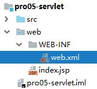
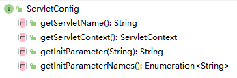
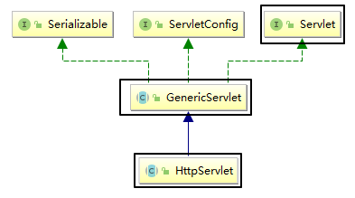
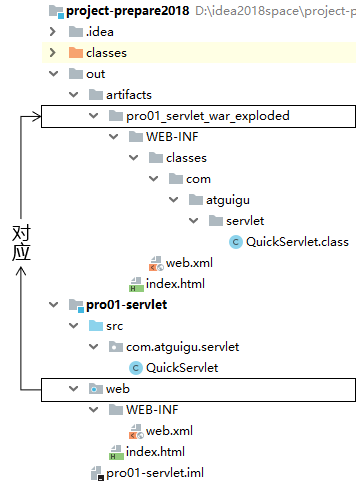

# day05 Servlet

## 第一章 Servlet的入门

### 1. 学习目标

* 了解Web资源

* 了解Servlet的概念
* 掌握Servlet的作用
* 掌握Servlet的XML方式配置
* 了解Servlet的注解方式配置

### 2. 内容讲解

#### 2.1 Web资源的概念

Web资源就是运行在服务器上的资源，它一共分为两类: 静态资源以及动态资源

##### 2.1.1 静态资源
静态资源就是web页面中供人们浏览的数据始终是不变，例如我们之前所学习的html、css、js、图片、音视频等等都属于静态资源
##### 2.1.2 动态资源
动态资源就是web页面中供人们浏览的数据是由程序产生的，不同的用户或者不同时间点访问web页面看到的内容各不相同，例如我们后续要学习的Servlet、JSP(不学)、Thymeleaf等等都是动态资源

#### 2.2 Servlet的概念

##### 2.2.1 什么是Servlet

Servlet 是运行在服务端(tomcat)的Java小程序，是sun公司提供一套定义动态资源规范; 从代码层面上来讲Servlet就是一个接口

##### 2.2.2 Servlet的作用

用来接收、处理客户端请求、响应给浏览器的动态资源。在整个Web应用中，Servlet主要负责接收处理请求、协同调度功能。我们可以把Servlet称为Web应用中的<span style="color:blue;font-weight:bold;">『控制器』</span>

##### 2.2.2 Servlet的作用的图示

**要实现的效果**


#### 2.3 Servlet的入门案例

##### 2.3.1 目标

在页面上点击超链接，由Servlet处理这个请求，并返回一个响应字符串：Hello,I am Servlet

##### 2.3.2 思路


##### 2.3.3 实现步骤

###### 第一步: 创建动态Web module

###### 第二步：创建html页面

```html
<!--
	使用绝对路径: /部署的项目名/要访问的资源路径
-->
<a href="/webday05/hello">访问HelloServlet</a>
```

###### 第三步：创建HelloServlet类

```java
package com.atguigu.servlet;

import javax.servlet.*;
import java.io.IOException;

/**
 * 包名:com.atguigu.servlet
 *
 * @author Leevi
 * 日期2021-06-07  09:03
 * 编写Servlet的步骤:
 * 1. 编写一个类实现Servlet接口,并且重写里面的方法: 主要是要重写service方法
 * 2. 重写service方法,service方法中就是接收、处理请求，并且将信息响应给客户端
 * 3. 配置Servlet的映射路径(供客户端访问的路径):在web/WEB-INF/web.xml中配置
 */
public class HelloServlet implements Servlet {

    @Override
    public void init(ServletConfig config) throws ServletException {

    }

    @Override
    public ServletConfig getServletConfig() {
        return null;
    }

    @Override
    public void service(ServletRequest req, ServletResponse res) throws ServletException, IOException {
        //使用响应输出流向浏览器输出: Hello,I am Servlet
        res.getWriter().write("Hello,I am Servlet");
    }

    @Override
    public String getServletInfo() {
        return null;
    }

    @Override
    public void destroy() {

    }
}
```

###### 第四步：在web.xml中配置HelloServlet

配置文件位置：WEB-INF/web.xml



```xml
<!--
        配置HelloServlet的映射路径
    -->
<servlet>
    <!--
            相当于给该Servlet取个名，我们可以就使用Servlet的类名/类名首字母改小写
        -->
    <servlet-name>helloServlet</servlet-name>
    <!--
            你要配置的那个Servlet的全限定名
        -->
    <servlet-class>com.atguigu.servlet.HelloServlet</servlet-class>
</servlet>

<servlet-mapping>
    <!--
            和servlet标签中的servlet-name保持一致
        -->
    <servlet-name>helloServlet</servlet-name>
    <!--
            这就是要给HelloServlet配置的映射路径，以/开头
        -->
    <url-pattern>/hello</url-pattern>
</servlet-mapping>
```

<span style="color:blue;font-weight:bold;">『映射路径』</span>：Servlet并<span style="color:blue;font-weight:bold;">不是</span>文件系统中<span style="color:blue;font-weight:bold;">实际存在</span>的<span style="color:blue;font-weight:bold;">目录或文件</span>，所以为了方便浏览器访问，我们创建了<span style="color:blue;font-weight:bold;">映射路径</span>来访问它。

##### 2.3.4 小结

需求：在浏览器上点超链接能够访问Java程序


#### 2.4 概念梳理

##### 2.4.1 原生Tomcat

安装在电脑上的实实在在的Tomcat软件

##### 2.4.2 IDEA中的Tomcat实例

通过idea的配置在idea上集成的Tomcat实例，其实还是使用的原生的Tomcat软件

##### 2.4.3 IDEA中的Web工程
程序员使用IDEA编写的动态Web工程，该工程只是用于程序员编码，实际上部署运行在Tomcat服务器中的并不是这个工程
##### 2.4.4 根据Web工程生成的war包
根据程序员创建的动态Web工程，IDEA会将其打包成一个war包，而真正部署运行在Tomcat服务器中的其实是war包

##### 2.4.5 访问资源的地址

###### 2.4.5.1 访问静态资源

/Web应用名称/静态资源本身的路径

###### 2.4.5.2 访问动态资源

/Web应用名称/映射路径

##### 2.4.6 Web应用名称(项目名)

注意Web应用名不是你工程或者Module的名字，而是你在部署时候的ApplicationContext的内容


##### 2.4.7 总体的逻辑结构


#### 2.5 Servlet的注解方式配置(了解即可)

注意: 一个Servlet要么使用配置文件方式配置，要么使用注解方式配置，不能两者都使用

使用注解方式配置的优势: 代码更加简单

使用注解方式配置的劣势: 耦合度高

我们一般更推荐使用配置文件方式配置Servlet，尤其是配置第三方框架中的Servlet:例如SpringMVC中的DispatcherServlet，我们只能够使用配置文件方式进行配置

##### 2.5.1 使用注解方式配置的代码实现

```java
在要进行配置的Servlet类上添加注解@WebServlet("/映射路径")
```

## 第二章 Servlet的进阶

### 1. 学习目标

* 掌握Servlet的生命周期和生命周期方法
* 掌握ServletConfig的使用
* 掌握Servlet的体系结构
* 掌握Servlet的映射路径的编写方式
* 掌握创建Servlet最常用的方法

### 2. 内容讲解

#### 2.1 Servlet的生命周期和生命周期方法

##### 2.1.1 什么是Servlet的生命周期

Servlet的生命周期就是servlet从创建到销毁的过程，我们所要去探讨的就是Servlet对象在什么时候创建出来以及在什么时候销毁。当然创建和销毁Servlet对象的工作是不需要我们去做的
##### 2.1.2 Servlet对象什么时候创建
默认情况下是在第一次有请求访问该Servlet实例的时候才会创建该Servlet对象
##### 2.1.3 Servlet对象什么时候销毁
在服务器关闭，或者当前项目从服务器中移除的时候会销毁当前项目中的所有Servlet对象
#### 2.2 Servlet的生命周期方法

##### 2.2.1 什么是Servlet的生命周期方法

在Servlet的生命周期中必然会经历的方法我们称之为Servlet的生命周期方法，总共包含三个方法:init、service、destroy

##### 2.2.2 init方法

该方法会在Servlet实例对象被创建出来之后执行，我们可以在该方法中获取当前Servlet的初始化参数，以及进行一些读取配置文件之类的操作

##### 2.2.3 service方法

该方法会在Servlet实例对象每次接收到请求的时候均执行，我们可以在该方法中接收、处理请求，以及将客户端需要的数据响应给客户端

##### 2.2.4 destroy方法

该方法会在Servlet实例对象销毁之前执行，我们可以在该方法中做一些资源回收、释放、关闭等等操作

#### 2.3 配置Servlet提前创建

有时候我们需要在Servlet创建的时候做一些资源加载等等耗时操作，所以如果Servlet在第一次接收请求的时候才创建的话必然会影响用户的访问速度，所以此时我们需要让Servlet提前创建，将Servlet的创建提前到服务器启动的时候。

通过修改web.xml中Servlet的配置可以实现:

```xml
<!-- 配置Servlet本身 -->
<servlet>
    <!-- 全类名太长，给Servlet设置一个简短名称 -->
    <servlet-name>HelloServlet</servlet-name>

    <!-- 配置Servlet的全类名 -->
    <servlet-class>com.atguigu.servlet.HelloServlet</servlet-class>

    <!-- 配置Servlet启动顺序 -->
    <load-on-startup>1</load-on-startup>
</servlet>
```

#### 2.4 ServletConfig的介绍(了解)

##### 2.4.1 接口概览



##### 2.4.2 接口方法介绍

| 方法名                  | 作用                                                         |
| ----------------------- | ------------------------------------------------------------ |
| getServletName()        | 获取&lt;servlet-name&gt;HelloServlet&lt;/servlet-name&gt;定义的Servlet名称 |
| getServletContext()     | 获取ServletContext对象                                       |
| **getInitParameter()**  | 获取配置Servlet时设置的『初始化参数』，根据名字获取值        |
| getInitParameterNames() | 获取所有初始化参数名组成的Enumeration对象                    |

##### 2.4.3 获取Servlet的初始化参数

我们可以在web.xml中对Servlet配置初始化参数，接下来可以在Servlet的init方法中获取配置的初始化参数的值

**web.xml代码**

```xml
<!--
        配置DispatcherServlet
    -->
<servlet>
    <servlet-name>dispatcherServlet</servlet-name>
    <servlet-class>com.atguigu.servlet.DispatcherServlet</servlet-class>

    <!--配置当前Servlet的初始化参数-->
    <init-param>
        <param-name>configLocation</param-name>
        <param-value>springMVC.xml</param-value>
    </init-param>
</servlet>
<servlet-mapping>
    <servlet-name>dispatcherServlet</servlet-name>
    <url-pattern>/dispatcher</url-pattern>
</servlet-mapping>
```

**HelloServlet代码**

```java
package com.atguigu.servlet;

import javax.servlet.*;
import java.io.IOException;
import java.io.InputStream;

/**
 * 包名:com.atguigu.servlet
 *
 * @author Leevi
 * 日期2021-06-07  10:41
 * 模拟它是SpringMVC中的一个类
 */
public class DispatcherServlet implements Servlet {
    private String filePath;
    @Override
    public void init(ServletConfig config) throws ServletException {
        //使用ServletConfig对象读取初始化参数
        filePath = config.getInitParameter("configLocation");
    }

    @Override
    public ServletConfig getServletConfig() {
        return null;
    }

    @Override
    public void service(ServletRequest req, ServletResponse res) throws ServletException, IOException {
        //目标:读取使用的springMVC的配置文件----->InputStream
        InputStream is = DispatcherServlet.class.getClassLoader().getResourceAsStream(filePath);
        System.out.println(is);
    }

    @Override
    public String getServletInfo() {
        return null;
    }

    @Override
    public void destroy() {

    }
}
```

#### 2.5 Servlet的体系结构(了解)

##### 2.5.1 类型关系



Servlet接口有一个实现类是GenericServlet，而GenericServlet有一个子类是HttpServlet，我们创建Servlet的时候会选择继承HttpServlet，因为它里面相当于也实现了Servlet接口，并且对一些方法做了默认实现；而且子类的功能会比父类的更加强大

##### 2.5.2 方法关系


我们编写Servlet类继承HttpServlet的时候，只需要重写doGet()和doPost()方法就行了，因为HttpServlet重写了service()方法，在service()方法中判断请求方式，根据不同的请求方式执行doXXX()方法

#### 2.6 使用Idea直接创建Servlet

##### 2.6.1 创建步骤


##### 2.6.2 创建后的代码

**web.xml代码**

```xml
<!-- IDEA会自动生成servlet标签 -->
<servlet>
    <servlet-name>QuickServlet</servlet-name>
    <servlet-class>com.atguigu.servlet.QuickServlet</servlet-class>
</servlet>

<!-- 我们自己补充servlet-mapping标签 -->
<servlet-mapping>
    <servlet-name>QuickServlet</servlet-name>
    <url-pattern>/QuickServlet</url-pattern>
</servlet-mapping>
```

**Servlet代码**

```java
public class QuickServlet extends HttpServlet {
    protected void doPost(HttpServletRequest request, HttpServletResponse response) throws ServletException, IOException {
        //在doPost()方法中调用doGet(),这样的话就只需要重写doGet()方法就能处理post和get请求
		doGet(request,response);
    }

    protected void doGet(HttpServletRequest request, HttpServletResponse response) throws ServletException, IOException {
		
    }
}
```

#### 2.7 Servlet的三种映射路径的配置

##### 2.7.1 映射路径的作用

Servlet的映射路径是提供一个让别人能够访问该Servlet的路径，例如Servlet的映射路径是"/hello",那么在浏览器上访问该Servlet的路径是`http://localhost:8080/项目部署名/hello`

**注意:一个Servlet可以配置多个映射路径，但是多个Servlet不能配置相同的映射路径**

##### 2.7.2 映射路径的分类

###### 2.7.2.1 完全路径匹配

访问当前Servlet的路径需要和配置的映射路径完全一致，例如Servlet的配置是`/demo01`，那么访问该Servlet的时候的路径也必须是`http://localhost:8080/项目部署名/demo01`才可以访问到

###### 2.7.2.2 目录匹配

以 `/` 开始需要以 `*` 结束，**注**: Servlet里面用的不多, 但是过滤器里面通常就使用目录匹配

```
例如:  配置/* 访问的路径可写成/任意字符串,比方: /aa, /aaa; 配置 /aa/*  访问的路径可写成/aa/任意字符串,比方: /aa/b , /aa/cc
```

###### 2.7.2.3 扩展名匹配

以`*`开头，以`.扩展名`结束，能够匹配所有以`.相同扩展名`结尾的请求路径

```
例如:  *.action;  访问路径可以是 任意字符串.action,比方: aa.action, bb.action, c.action;
```

## 第三章 动态Web工程内编写路径

### 1. 学习目标

* 掌握开发工程目录结构和部署工程目录结构的对比
* 掌握url
* 掌握uri
* 掌握相对路径的写法
* 掌握绝对路径的写法
* 掌握动态获取上下文路径

### 2. 内容讲解

#### 2.1 为什么要写路径

- 整个系统要根据功能拆分成许许多多<span style="color:blue;font-weight:bold;">独立</span>的<span style="color:blue;font-weight:bold;">资源</span>
- 资源之间既要完成自身的功能又要和其他资源<span style="color:blue;font-weight:bold;">配合</span>
- 写路径就是为了从一个资源<span style="color:blue;font-weight:bold;">跳转</span>到下一个资源

#### 2.2 工程目录和部署目录的结构对比


##### 2.2.1 工程目录

我们写代码的地方，但是在服务器上运行的不是这个

##### 2.2.2 部署目录

经过Java源文件<span style="color:blue;font-weight:bold;">编译</span>和<span style="color:blue;font-weight:bold;">目录重组</span>后，IDEA就替我们准备好了可以在服务器上运行的部署目录

##### 2.2.3 编写路径的基准

用户通过浏览器访问服务器，而服务器上运行的是部署目录，所以写路径的时候<span style="color:blue;font-weight:bold;">参考部署目录</span>而不是工程目录

##### 2.2.4 工程目录和部署目录的对应关系

<span style="color:blue;font-weight:bold;">工程目录下的web目录对应部署目录的根目录</span>，同时部署目录的根目录也是路径中的<span style="color:blue;font-weight:bold;">Web应用根目录</span>



#### 2.3 url的介绍

##### 2.3.1 url的概念

url是`uniform Resource Locater`的简写，中文翻译为`统一资源定位符`，它是某个互联网资源的唯一访问地址，客户端可以通过url访问到具体的互联网资源

##### 2.3.2 url的组成


##### 2.3.3 url的使用场景

客户端访问服务器的资源，或者一台服务器中要访问另外一台服务器的资源都是通过url访问


#### 2.4 uri的介绍

##### 2.4.1 uri的概念

uri是`Uniform Resource Identifier`的缩写，中文翻译为`统一资源标识符`, 它是服务器中某个资源的唯一标识，通过uri可以实现同一项目中的某个资源中访问另一个资源


##### 2.4.2 uri的组成

uri的写法是`/项目部署名/资源路径`


##### 2.4.3 uri的使用场景

在同一个项目的某个资源中访问该项目中的另一个资源

#### 2.5 相对路径的使用(不建议使用)

##### 2.5.1 目标

目标: 在A资源中访问B资源

A资源的uri路径: `/app/pages/a.html`

B资源的uri路径:`/app/static/vue.js`

##### 2.5.2 相对路径的概念

相对路径是不以`/`开头的路径写法，编写相对路径的原则是以目标资源的uri路径相对当前资源的uri路径

##### 2.5.3 相对路径实例

那么要实现在A资源中访问B资源的相对路径写法是`../static/vue.js`,其中`../static`表示找到当前资源的上一级目录下的static目录

#### 2.6 绝对路径的使用(建议使用)

##### 2.6.1 目标

目标: 在A资源中访问B资源

A资源的uri路径: `/app/pages/a.html`

B资源的uri路径:`/app/static/vue.js`

##### 2.6.2 绝对路径的概念

绝对路径是以`/`开头的路径写法，编写绝对路径的原则是通过目标资源的uri访问目标资源，但是特殊情况是**请求转发**，如果是请求转发访问目标资源的话，那么绝对路径是在uri的基础之上省略`/项目部署名`

##### 2.6.3 绝对路径实例

那么要实现在A资源中访问B资源的绝对路径写法是`/app/static/vue.js`

##### 2.6.3 在请求转发的时候使用绝对路径

请求转发在后续内容中会讲解，现在我们只需要搞懂在请求转发的时候绝对路径的写法是`/资源名`，其实就是在uri的基础上省略`/项目部署名`

#### 2.7 动态获取上下文路径(项目部署路径)

##### 2.7.1 上下文路径的概念

上下文路径（context path）=/Web应用名称

##### 2.7.2 为什么要动态获取上下文路径

因为我们使用绝对路径的时候需要用到资源的uri路径，而uri路径中是包含上下文路径的，所以如果采用静态方式写绝对路径，那么就会将上下文路径写死在绝对路径中；而我们在部署项目的时候，上下文路径是可变的，所以这样就会因为部署时设置的上下文路径不同从而导致绝对路径出错的问题

##### 2.7.3 动态获取上下文路径的API

```java
request.getContextPath()
```

使用上述API可以动态获取项目的上下文路径，每一次获取的都是当前环境下实际的上下文路径的值


## 第四章 ServletContext

### 1. 学习目标

* 掌握ServletContext的概念
* 掌握在Servlet中获取ServletContext对象
* 掌握ServletContext获取全局的初始化参数
* 掌握ServletContext作为全局域对象
* 掌握ServletContext获取真实路径

### 2. 内容讲解

#### 2.1 ServletContext的概念

服务器为其部署的每一个应用(项目)都创建了一个ServletContext对象。ServletContext属于整个项目的，该项目中的所有Servlet都可以共享同一个ServletContext对象

#### 2.2 获取ServletContext的API

##### 2.2.1 调用Servlet自身的getServletContext方法获取

```
ServletContext ServletContext = getServletContext()
```

##### 2.2.2 调用ServletConfig接口的getServletContext方法

```java
ServletContext ServletContext = servletConfig.getServletContext();
//HttpServletRequest对象也实现了ServletConfig接口，所以也有getServletContext()方法
ServletContext ServletContext = request.getServletContext();
```

#### 2.3 ServletContext获取全局的初始化参数

##### 2.3.1 在web.xml中配置Web应用级别的初始化参数

```xml
<context-param>
    <param-name>username</param-name>
    <param-value>hahahaha</param-value>
</context-param>
```

##### 2.3.2 在Servlet的doGet方法中获取全局参数

```java
String username = servletContext.getInitParameter("username");
System.out.println("在ServletDemo04中获取全局的初始化参数username=" + username);
```

#### 2.4 ServletContext作为全局的域对象

##### 2.4.1 什么是域对象

域对象就是在一定的作用域范围内进行数据共享的对象，ServletContext作为全局域对象可以在整个项目的所有动态资源(包含所有Servlet)中进行数据共享

##### 2.4.2 ServletContext作为域对象的API

###### 2.4.2.1 往全局域对象中存入数据

```java
servletContext.setAttribute("key",value)
```

###### 2.4.2.2 从全局域对象中取出数据

```
Object value = ServletContext.getAttribute("key");
```

##### 2.4.3 案例

###### 2.4.3.1 目标

在ServletDemo01中往全局域对象中存入"username"为"aobama"的键值对，然后在ServletDemo02中从全局域对象中根据"username"获取对应的值

###### 2.4.3.2 代码

**ServletDemo01中的代码**

```java
//1. 获取ServletContext对象
ServletContext ServletContext = getServletContext();
//2. 存入数据
String str = "周杰棍";
//将str设置到servletContext里面
servletContext.setAttribute("str",str);
```

**ServletDemo02中的代码**

```java
//1. 获取ServletContext对象
ServletContext ServletContext = getServletContext();
//2. 取出数据
String str = (String) servletContext.getAttribute("str");
System.out.println("在ServletDemo02中获取ServletContext域对象中的str = " + str);
```

#### 2.5 获取资源的真实路径

##### 2.5.1 为什么需要用代码获取资源的真实路径

例如我们的目标是需要获取项目中某个静态资源的路径，不是工程目录中的路径，而是部署目录中的路径；我们如果直接拷贝其在我们电脑中的完整路径的话其实是有问题的，因为如果该项目以后部署到公司服务器上的话，路径肯定是会发生改变的，所以我们需要使用代码动态获取资源的真实路径


##### 2.5.2 获取资源真实路径的API

```java
String realPath = servletContext.getRealPath("资源在web目录中的路径");
```

##### 2.5.3 动态获取真实路径的优势

只要使用了servletContext动态获取资源的真实路径，那么无论项目的部署路径发生什么变化，都会动态获取项目运行时候的实际路径，所以就不会发生由于写死真实路径而导致项目部署位置改变引发的路径错误问题