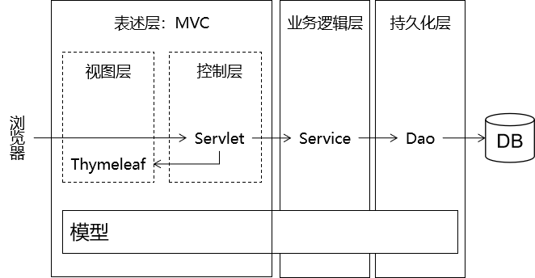
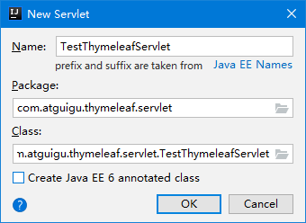
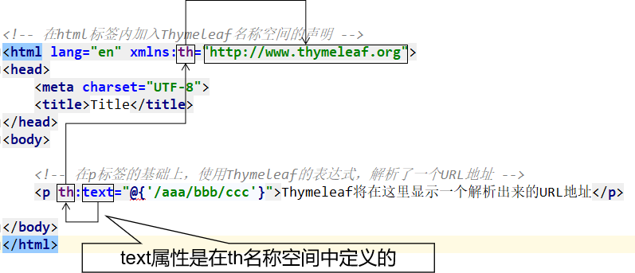
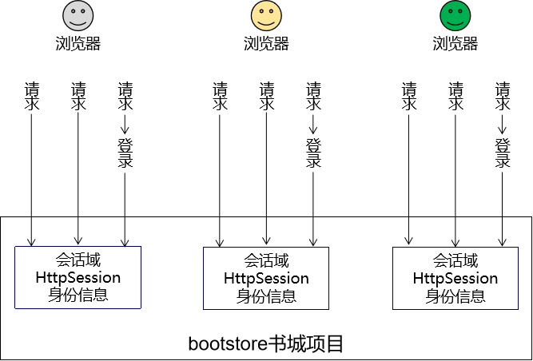
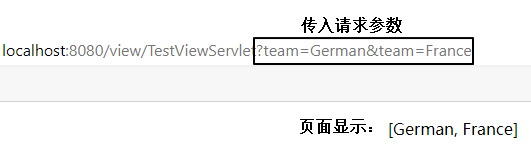
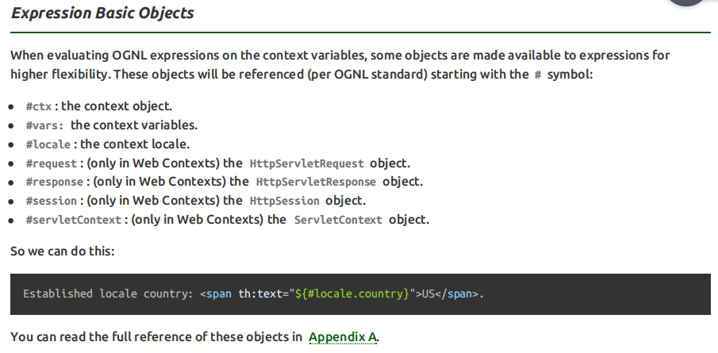
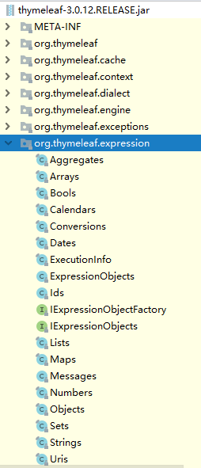
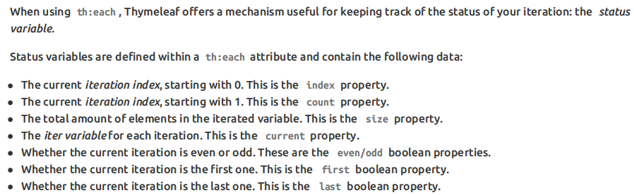
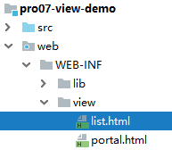

# day08 Thmeleaf

## 第一章 Thymeleaf入门

### 1. 学习目标

* 掌握MVC
* 了解Thymeleaf的简介
* 掌握引入Thymeleaf
* 掌握Thymeleaf的入门案例

### 2. 内容讲解

#### 2.1 MVC

##### 2.1.1 为什么需要MVC

我们之前在书城项目第二阶段做登录的时候，曾经提出过**优化登录失败后的处理**，曾经编写过下面这段代码


这段代码虽然说可以实现在登录失败之后跳转回到登录页面，并且展示失败信息，但是代码实在是太恶心了，根本没法维护，所以我们需要将视图展示抽取出来，单独作为一个View视图层

但是我们如果只使用HTML作为视图的话，它是无法展示动态数据的，所以我们对HTML的新的期待：既能够正常显示页面，又能在页面中包含动态数据部分。而动态数据单靠HTML本身是无法做到的，所以此时我们需要引入服务器端动态视图模板技术。

##### 2.1.2 MVC概念

M：Model模型，指项目中的实体类，用来存储数据

V：View视图，指项目中的html，用来展示数据

C：Controller控制器，指项目中的servlet，用来控制请求和响应

MVC是在表述层开发中运用的一种设计理念。主张把**封装数据的『模型』**、**显示用户界面的『视图』**、**协调调度的『控制器』**分开。

好处：

- 进一步实现各个组件之间的解耦
- 让各个组件可以单独维护
- 将视图分离出来以后，我们后端工程师和前端工程师的对接更方便

##### 2.1.3 MVC和三层架构之间关系



#### 2.2 Thymeleaf的简介

##### 2.2.1 Thymeleaf的概念

Thymeleaf是一款用于渲染XML/XHTML/HTML5内容的模板引擎。类似JSP，Velocity，FreeMaker等， 它也可以轻易的与Spring MVC等Web框架进行集成作为Web应用的模板引擎。它的主要作用是在静态页面上渲染显示动态数据

##### 2.2.2 Thymeleaf的优势

- SpringBoot官方推荐使用的视图模板技术，和SpringBoot完美整合。

- 不经过服务器运算仍然可以直接查看原始值，对前端工程师更友好。

```html
<!DOCTYPE html>
<html lang="en" xmlns:th="http://www.thymeleaf.org">
<head>
    <meta charset="UTF-8">
    <title>Title</title>
</head>
<body>

    <p th:text="${username}">Original Value</p>

</body>
</html>
```

##### 2.2.3 物理视图和逻辑视图

###### 2.2.3.1 物理视图

在Servlet中，将请求转发到一个HTML页面文件时，使用的完整的转发路径(绝对路径)就是<span style="color:blue;font-weight:bold;">物理视图</span>。

> /pages/user/login_success.html

如果我们把所有的HTML页面都放在某个统一的目录下，那么转发地址就会呈现出明显的规律：

> /pages/user/login.html
> /pages/user/login_success.html
> /pages/user/regist.html
> /pages/user/regist_success.html
>
> ……

路径的开头都是：/pages/user/

路径的结尾都是：.html

所以，路径开头的部分我们称之为<span style="color:blue;font-weight:bold;">视图前缀</span>，路径结尾的部分我们称之为<span style="color:blue;font-weight:bold;">视图后缀</span>。


###### 2.2.3.2 逻辑视图

### 逻辑视图

物理视图=视图前缀+逻辑视图+视图后缀

上面的例子中：

| 视图前缀     | 逻辑视图      | 视图后缀 | 物理视图                       |
| ------------ | ------------- | -------- | ------------------------------ |
| /pages/user/ | login         | .html    | /pages/user/login.html         |
| /pages/user/ | login_success | .html    | /pages/user/login_success.html |

#### 2.3 Thymeleaf的入门案例

##### 2.3.1 加入jar包


##### 2.3.2 配置上下文参数


物理视图=视图前缀+逻辑视图+视图后缀

```xml
<!-- 在上下文参数中配置视图前缀和视图后缀 -->
<context-param>
    <param-name>view-prefix</param-name>
    <param-value>/WEB-INF/view/</param-value>
</context-param>
<context-param>
    <param-name>view-suffix</param-name>
    <param-value>.html</param-value>
</context-param>
```

说明：param-value中设置的前缀、后缀的值不是必须叫这个名字，可以根据实际情况和需求进行修改。

> 为什么要放在WEB-INF目录下？
>
> 原因：WEB-INF目录不允许浏览器直接访问，所以我们的视图模板文件放在这个目录下，是一种保护。以免外界可以随意访问视图模板文件。
>
> 访问WEB-INF目录下的页面，都必须通过Servlet转发过来，简单说就是：不经过Servlet访问不了。
>
> 这样就方便我们在Servlet中检查当前用户是否有权限访问。
>
> 那放在WEB-INF目录下之后，重定向进不去怎么办？
>
> 重定向到Servlet，再通过Servlet转发到WEB-INF下。

##### 2.3.3 创建Servlet基类

这个类大家直接<span style="color:blue;font-weight:bold;">复制粘贴</span>即可，将来使用框架后，这些代码都将被取代。

```java
import org.thymeleaf.TemplateEngine;
import org.thymeleaf.context.WebContext;
import org.thymeleaf.templatemode.TemplateMode;
import org.thymeleaf.templateresolver.ServletContextTemplateResolver;

import javax.servlet.ServletContext;
import javax.servlet.ServletException;
import javax.servlet.http.HttpServlet;
import javax.servlet.http.HttpServletRequest;
import javax.servlet.http.HttpServletResponse;
import java.io.IOException;

public class ViewBaseServlet extends HttpServlet {

    private TemplateEngine templateEngine;

    @Override
    public void init() throws ServletException {

        // 1.获取ServletContext对象
        ServletContext servletContext = this.getServletContext();

        // 2.创建Thymeleaf解析器对象
        ServletContextTemplateResolver templateResolver = new ServletContextTemplateResolver(servletContext);

        // 3.给解析器对象设置参数
        // ①HTML是默认模式，明确设置是为了代码更容易理解
        templateResolver.setTemplateMode(TemplateMode.HTML);

        // ②设置前缀
        String viewPrefix = servletContext.getInitParameter("view-prefix");

        templateResolver.setPrefix(viewPrefix);

        // ③设置后缀
        String viewSuffix = servletContext.getInitParameter("view-suffix");

        templateResolver.setSuffix(viewSuffix);

        // ④设置缓存过期时间（毫秒）
        templateResolver.setCacheTTLMs(60000L);

        // ⑤设置是否缓存
        templateResolver.setCacheable(true);

        // ⑥设置服务器端编码方式
        templateResolver.setCharacterEncoding("utf-8");

        // 4.创建模板引擎对象
        templateEngine = new TemplateEngine();

        // 5.给模板引擎对象设置模板解析器
        templateEngine.setTemplateResolver(templateResolver);

    }

    protected void processTemplate(String templateName, HttpServletRequest req, HttpServletResponse resp) throws IOException {
        // 1.设置响应体内容类型和字符集
        resp.setContentType("text/html;charset=UTF-8");

        // 2.创建WebContext对象
        WebContext webContext = new WebContext(req, resp, getServletContext());

        // 3.处理模板数据
        templateEngine.process(templateName, webContext, resp.getWriter());
    }
}
```

##### 2.3.4 入门案例代码

###### 2.3.4.1 创建index.html文件


###### 2.3.4.2 index.html编写超链接访问Servlet

```html
<a href="/webday08/TestThymeleafServlet">初步测试Thymeleaf</a>
```

###### 2.3.4.2 创建Servlet



```xml
<servlet>
    <servlet-name>testThymeleafServlet</servlet-name>
    <servlet-class>com.atguigu.servlet.TestThymeleafServlet</servlet-class>
</servlet>
<servlet-mapping>
    <servlet-name>testThymeleafServlet</servlet-name>
    <url-pattern>/testThymeleaf</url-pattern>
</servlet-mapping>
```

###### 2.3.4.3 修改Servlet让其继承ViewBaseServlet


###### 2.3.4.4 在doPost()方法中跳转到Thymeleaf页面

```java
package com.atguigu.servlet;

import javax.servlet.ServletException;
import javax.servlet.http.HttpServletRequest;
import javax.servlet.http.HttpServletResponse;
import java.io.IOException;

/**
 * @author Leevi
 * 日期2021-05-13  09:15
 */
public class TestThymeleafServlet extends ViewBaseServlet {
    @Override
    protected void doPost(HttpServletRequest request, HttpServletResponse response) throws ServletException, IOException {
        doGet(request, response);
    }

    @Override
    protected void doGet(HttpServletRequest request, HttpServletResponse response) throws ServletException, IOException {
        request.setAttribute("username","奥巴马");
        //请求转发跳转到/WEB-INF/view/target.html
        processTemplate("target",request,response);
    }
}
```

###### 2.3.4.5 Thymeleaf页面代码

```html
<!DOCTYPE html>
<html lang="en" xmlns:th="http://www.thymeleaf.org">
    <head>
        <meta charset="UTF-8">
        <title>目标页面</title>
    </head>
    <body>
        <h1 th:text="${username}">这里要显示一个动态的username</h1>
    </body>
</html>
```

## 第二章 Thymeleaf的基本语法

### 1. 学习目标

* 掌握th名称空间
* 掌握表达式语法 
* 掌握访问域对象
* 获取请求参数
* 掌握内置对象
* 掌握OGNL表达式
* 掌握分支和迭代
* 掌握使用Thymeleaf包含其它文件
* 使用Thymeleaf练习CRUD

### 2. 内容讲解

#### 2.1 th名称空间



#### 2.2 表达式语法(重点)

##### 2.2.1 修改标签文本值

代码示例：

```html
<p th:text="标签体新值">标签体原始值</p>
```

###### 2.2.1.1 th:text作用

- 不经过服务器解析，直接用浏览器打开HTML文件，看到的是『标签体原始值』
- 经过服务器解析，Thymeleaf引擎根据th:text属性指定的『标签体新值』去<span style="color:blue;font-weight:bold;">替换</span>『标签体原始值』

###### 2.2.1.2 字面量和变量

『字面量』是一个经常会遇到的概念，我们可以对照『变量』来理解它的含义。

```java
// a是变量，100是字面量
int a = 100;
System.out.println("a = " + a);
```

- 变量：变量名字符串本身不是它的值，它指向的才是它的值
- 字面量：它就是字面上的含义，我们从『字面』上看到的直接就是它的值

现在我们在th:text属性中使用的就是『字面量』，它<span style="color:blue;font-weight:bold;">不指代任何其他值</span>。

##### 2.2.2 修改指定属性值

代码示例：

```html
<input type="text" name="username" th:value="文本框新值" value="文本框旧值" />
```

语法：任何HTML标签原有的属性，前面加上『th:』就都可以通过Thymeleaf来设定新值。

##### 2.2.3 解析URL地址

代码示例：

```html
<!--
使用Thymeleaf解析url地址
-->
<a th:href="@{/index.html}">访问index.html</a>
```

经过解析后得到：

> /webday08/index.html

所以@{/}的作用是<span style="color:blue;font-weight:bold;">在字符串前附加『上下文路径』</span>

>  这个语法的好处是：实际开发过程中，项目在不同环境部署时，Web应用的名字有可能发生变化。所以上下文路径不能写死。而通过@{/}动态获取上下文路径后，不管怎么变都不怕啦！

###### 2.2.3.1 首页使用URL地址解析


如果我们直接访问index.html本身，那么index.html是不需要通过Servlet，当然也不经过模板引擎，所以index.html上的Thymeleaf的任何表达式都不会被解析。

解决办法：通过Servlet访问index.html，这样就可以让模板引擎渲染页面了：


> 进一步的好处：
>
> 通过上面的例子我们看到，所有和业务功能相关的请求都能够确保它们通过Servlet来处理，这样就方便我们统一对这些请求进行特定规则的限定。

###### 2.2.3.2 给URL地址后面附加请求参数

参照官方文档说明：


#### 2.3 域对象在Thymeleaf中的使用(重点)

##### 2.3.1 回顾域对象

域对象是在服务器中有一定作用域范围的对象，在这个范围内的所有动态资源都能够共享域对象中保存的数据

##### 2.3.2 回顾域对象的类型

###### 2.3.2.1 请求域

在请求转发的场景下，我们可以借助HttpServletRequest对象内部给我们提供的存储空间，帮助我们携带数据，把数据发送给转发的目标资源。

请求域：HttpServletRequest对象内部给我们提供的存储空间


###### 2.3.2.2 会话域(还没学)

会话域的范围是一次会话



###### 2.3.2.3 应用域(全局域)

应用域的范围是整个项目全局


##### 2.3.3 在Thymeleaf中操作域对象

我们通常的做法是，在Servlet中将数据存储到域对象中，而在使用了Thymeleaf的前端页面中取出域对象中的数据并展示

###### 2.3.3.1 操作请求域

Servlet中代码：

```java
String requestAttrName = "helloRequestAttr";
String requestAttrValue = "helloRequestAttr-VALUE";

request.setAttribute(requestAttrName, requestAttrValue);
```

Thymeleaf表达式：

```html
<p th:text="${helloRequestAttr}">request field value</p>
```

###### 2.3.3.2 操作会话域

Servlet中代码：

```java
// ①通过request对象获取session对象
HttpSession session = request.getSession();

// ②存入数据
session.setAttribute("helloSessionAttr", "helloSessionAttr-VALUE");
```

Thymeleaf表达式：

```html
<p th:text="${session.helloSessionAttr}">这里显示会话域数据</p>
```

###### 2.3.3.3 操作应用域

Servlet中代码：

```java
// ①通过调用父类的方法获取ServletContext对象
ServletContext servletContext = getServletContext();

// ②存入数据
servletContext.setAttribute("helloAppAttr", "helloAppAttr-VALUE");
```

Thymeleaf表达式：

```html
<p th:text="${application.helloAppAttr}">这里显示应用域数据</p>
```

#### 2.4 获取请求参数(了解)

##### 2.4.1 获取请求参数的语法

```html
${param.参数名}
```

##### 2.4.2 根据一个参数名获取一个参数值

页面代码：

```html
<p th:text="${param.username}">这里替换为请求参数的值</p>
```

页面显示效果：


##### 2.4.3 根据一个参数名获取多个参数值

页面代码：

```html
<p th:text="${param.team}">这里替换为请求参数的值</p>
```

页面显示效果：



如果想要精确获取某一个值，可以使用数组下标。页面代码：

```html
<p th:text="${param.team[0]}">这里替换为请求参数的值</p>
<p th:text="${param.team[1]}">这里替换为请求参数的值</p>
```

页面显示效果：


#### 2.5 内置对象(了解)

##### 2.5.1 内置对象的概念

所谓内置对象其实就是在Thymeleaf的表达式中<span style="color:blue;font-weight:bold;">可以直接使用</span>的对象

##### 2.5.2 基本内置对象



用法举例：

```html
<h3>表达式的基本内置对象</h3>
<p th:text="${#request.getContextPath()}">调用#request对象的getContextPath()方法</p>
<p th:text="${#request.getAttribute('helloRequestAttr')}">调用#request对象的getAttribute()方法，读取属性域</p>
```

基本思路：

- 如果不清楚这个对象有哪些方法可以使用，那么就通过getClass().getName()获取全类名，再回到Java环境查看这个对象有哪些方法
- 内置对象的方法可以直接调用
- 调用方法时需要传参的也可以直接传入参数

##### 2.5.3 公共内置对象


Servlet中将List集合数据存入请求域：

```java
request.setAttribute("aNotEmptyList", Arrays.asList("aaa","bbb","ccc"));
request.setAttribute("anEmptyList", new ArrayList<>());
```

页面代码：

```html
<p>#list对象isEmpty方法判断集合整体是否为空aNotEmptyList：<span th:text="${#lists.isEmpty(aNotEmptyList)}">测试#lists</span></p>
<p>#list对象isEmpty方法判断集合整体是否为空anEmptyList：<span th:text="${#lists.isEmpty(anEmptyList)}">测试#lists</span></p>
```

公共内置对象对应的源码位置：



#### 2.6 OGNL

##### 2.6.1 OGNL的概念

OGNL：Object-Graph Navigation Language对象-图 导航语言

##### 2.6.2 对象图的概念

从根对象触发，通过特定的语法，逐层访问对象的各种属性。


##### 2.6.3 OGNL语法

###### 2.6.3.1 起点

在Thymeleaf环境下，${}中的表达式可以从下列元素开始：

- 访问属性域的起点(常用)
  - 请求域属性名
  - session
  - application
- param
- 内置对象
  - request
  - session
  - lists
  - strings

###### 2.6.3.2 属性访问语法

- 访问对象属性：使用getXxx()、setXxx()方法定义的属性
  - 对象.属性名
  - 对象['属性名']
- 访问List集合或数组
  - 集合或数组[下标]
- 访问Map集合
  - Map集合.key
  - Map集合['key']

#### 2.7 分支与迭代

##### 2.7.1 分支

###### 2.7.1.1 if和unless

让标记了th:if、th:unless的标签根据条件决定是否显示。

示例的Servlet代码：

```java
protected void doGet(HttpServletRequest request, HttpServletResponse response) throws ServletException, IOException {

    //往request域对象中存储List集合
    request.setAttribute("aNotEmptyList", Arrays.asList("aaa","bbb","ccc"));
    request.setAttribute("anEmptyList", new ArrayList<>());

    //调用方法渲染视图
    processTemplate("list", request, response);
}
```

示例的HTML代码：

```html
<!--
使用Thymeleaf的th:if和th:unless来控制标签的显示与否
-->
<p th:unless="${#lists.isEmpty(aNotEmptyList)}">anNotEmptyList中有数据</p>
<p th:if="${#lists.isEmpty(aNotEmptyList)}">anNotEmptyList中没有有数据</p>

<p th:unless="${#lists.isEmpty(anEmptyList)}">anEmptyList中有数据</p>
<p th:if="${#lists.isEmpty(anEmptyList)}">anEmptyList中没有有数据</p>
```

###### 2.7.1.2 switch(了解)

```html
<h3>测试switch</h3>
<div th:switch="${user.memberLevel}">
    <p th:case="level-1">银牌会员</p>
    <p th:case="level-2">金牌会员</p>
    <p th:case="level-3">白金会员</p>
    <p th:case="level-4">钻石会员</p>
</div>
```

##### 2.7.2 迭代

在迭代过程中，可以参考下面的说明使用迭代状态：



```html
<!DOCTYPE html>
<html lang="en" xmlns:th="http://www.thymeleaf.org">
<head>
    <meta charset="UTF-8">
    <title>用户列表展示页面</title>
</head>
<body>
    <!--
        获取域对象中的集合，并且遍历展示
    -->
    <table border="1" cellspacing="0" width="400" align="center">
        <thead>
            <tr>
                <th>下标</th>
                <th>计数</th>
                <th>用户名</th>
            </tr>
        </thead>
        <tbody th:if="${#lists.isEmpty(userList)}">
            <tr>
                <td colspan="3">用户信息为空，没法遍历展示数据</td>
            </tr>
        </tbody>
        <tbody th:unless="${#lists.isEmpty(userList)}">
            <!--
            使用th:each进行遍历迭代
                1. th:each写在哪? 每遍历出一条数据就要添加一个什么标签就写在什么标签上
                2. th:each="遍历出来的数据 : 要遍历的数据"
                3. 我们怎么使用遍历出来的数据: ${遍历出来的数据}

            我们怎么获取遍历出来的每一个数据的状态:th:each="遍历出来的数据,遍历出来的数据的状态 : 要遍历的数据"
                遍历出来的数据的状态又包含:
                    index表示下标,从0开始的索引
                    count表示计数,从1开始的索引
                    even表示是否是偶数,是偶数行显示true,否则显示false
                    odd表示是否是奇数,与even类似
                    current表示遍历出来的当前元素
                    first表示第一个元素
                    last表示最后一个元素
                例如: 下标
            -->
            <tr th:each="user,status : ${userList}">
                <td th:text="${status.index}"></td>
                <td th:text="${status.even}"></td>
                <td th:text="${status.current.username}"></td>
            </tr>
        </tbody>
    </table>
</body>
</html>
```

#### 2.8 Thymeleaf包含其他模板文件

##### 2.8.1 应用场景

抽取各个页面的公共部分：


##### 2.8.2 操作步骤

###### 2.8.2.1 创建页面的公共代码片段

使用th:fragment来给这个片段命名：

```html
<div th:fragment="header">
    <p>被抽取出来的头部内容</p>
</div>
```

###### 2.8.2.2 在需要的页面中进行包含

| 语法       | 效果                                                     | 特点                                       |
| ---------- | -------------------------------------------------------- | ------------------------------------------ |
| th:insert  | 把目标的代码片段整个插入到当前标签内部                   | 它会保留页面自身的标签                     |
| th:replace | 用目标的代码替换当前标签                                 | 它不会保留页面自身的标签                   |
| th:include | 把目标的代码片段去除最外层标签，然后再插入到当前标签内部 | 它会去掉片段外层标记，同时保留页面自身标记 |

页面代码举例：

```html
<!-- 代码片段所在页面的逻辑视图 :: 代码片段的名称 -->
<div id="badBoy" th:insert="segment :: header">
    div标签的原始内容
</div>

<div id="worseBoy" th:replace="segment :: header">
    div标签的原始内容
</div>

<div id="worstBoy" th:include="segment :: header">
    div标签的原始内容
</div>
```


## 第三章 CRUD练习

### 1. 数据建模

#### 1.1 物理建模

```sql
CREATE DATABASE `view-demo`CHARACTER SET utf8;
USE `view-demo`;
CREATE TABLE t_soldier(
    soldier_id INT PRIMARY KEY AUTO_INCREMENT,
    soldier_name CHAR(100),
    soldier_weapon CHAR(100)
);
```

#### 1.2 逻辑建模

```java
package com.atguigu.crud.bean;

/**
 * 包名:com.atguigu.crud.bean
 *
 * @author Leevi
 * 日期2021-06-10  15:20
 */
public class Soldier {
    private Integer soldierId;
    private String soldierName;
    private String soldierWeapon;

    @Override
    public String toString() {
        return "Soldier{" +
                "soldierId=" + soldierId +
                ", soldierName='" + soldierName + '\'' +
                ", soldierWeapon='" + soldierWeapon + '\'' +
                '}';
    }

    public Soldier() {
    }

    public Soldier(Integer soldierId, String soldierName, String soldierWeapon) {
        this.soldierId = soldierId;
        this.soldierName = soldierName;
        this.soldierWeapon = soldierWeapon;
    }

    public Integer getSoldierId() {
        return soldierId;
    }

    public void setSoldierId(Integer soldierId) {
        this.soldierId = soldierId;
    }

    public String getSoldierName() {
        return soldierName;
    }

    public void setSoldierName(String soldierName) {
        this.soldierName = soldierName;
    }

    public String getSoldierWeapon() {
        return soldierWeapon;
    }

    public void setSoldierWeapon(String soldierWeapon) {
        this.soldierWeapon = soldierWeapon;
    }
}
```

### 2. 总体架构


### 3. 搭建环境

#### 3.1 搭建持久层环境

1. 拷贝持久层的jar包: mysql驱动、druid、dbutils、junit、BeanUtils
2. 拷贝JDBCUtils工具类、jdbc.properties文件、BaseDao类

#### 3.2 搭建Thymeleaf环境

1. 拷贝Thymeleaf所需的jar包

2. 拷贝ViewBaseServlet类

3. 配置web.xml

   ```xml
   <!-- 在上下文参数中配置视图前缀和视图后缀 -->
   <context-param>
       <param-name>view-prefix</param-name>
       <param-value>/WEB-INF/view/</param-value>
   </context-param>
   <context-param>
       <param-name>view-suffix</param-name>
       <param-value>.html</param-value>
   </context-param>
   ```

4. 创建view目录

   

### 4. 需要实现的功能列表

- 显示首页：浏览器通过index.html访问首页Servlet，然后再解析对应的模板视图
- 显示列表：在首页点击超链接，跳转到目标页面把所有士兵的信息列表显示出来
- 删除信息：在列表上点击删除超链接，执行信息的删除操作
- 新增信息：
  - 在列表页面点击超链接跳转到新增士兵信息的表单页面
  - 在新增信息的表单页面点击提交按钮执行保存
- 更新信息：
  - 在列表上点击更新超链接，跳转到更新士兵信息的表单页面：表单回显
  - 在更新信息的表单页面点击提交按钮执行更新

### 5. 显示首页功能

#### 5.1 目标

浏览器访问index.html，通过首页Servlet，渲染视图，显示首页。

#### 5.2 思路


#### 5.3 代码

##### 5.3.1 创建PortalServlet

```xml
<servlet>
    <servlet-name>PortalServlet</servlet-name>
    <servlet-class>com.atguigu.crud.servlet.PortalServlet</servlet-class>
</servlet>
<servlet-mapping>
    <servlet-name>PortalServlet</servlet-name>
    <url-pattern>/index.html</url-pattern>
</servlet-mapping>
```

Servlet代码：

```java
package com.atguigu.servlet;

import javax.servlet.ServletException;
import javax.servlet.http.HttpServletRequest;
import javax.servlet.http.HttpServletResponse;
import java.io.IOException;

/**
 * @author Leevi
 * 日期2021-05-13  14:07
 */
public class PortalServlet extends ViewBaseServlet {
    @Override
    protected void doPost(HttpServletRequest request, HttpServletResponse response) throws ServletException, IOException {
        doGet(request, response);
    }

    @Override
    protected void doGet(HttpServletRequest request, HttpServletResponse response) throws ServletException, IOException {
        //跳转到首页
        processTemplate("index",request,response);
    }
}
```

#### [2]创建index.html

```html
<!DOCTYPE html>
<html lang="en" xmlns:th="http://www.thymeleaf.org">
    <head>
        <meta charset="UTF-8">
        <title>首页</title>
    </head>
    <body>
        <!--
查询士兵列表
-->
        <a th:href="@{/soldier(method='showAll')}">查看士兵列表</a>
    </body>
</html>
```

### 6. 使用一个Servlet处理多个请求

#### 6.1 封装ModelBaseServlet

创建这个基类的原因是：我们希望每一个模块能够对应同一个Servlet，这个模块所需要调用的所有方法都集中在同一个Servlet中。如果没有这个ModelBaseServlet基类，我们doGet()、doPost()方法可以用来处理请求，这样一来，每一个方法都需要专门创建一个Servlet（就好比咱们之前的LoginServlet、RegisterServlet其实都应该合并为UserServlet）。

```java
package com.atguigu.servlet;

import javax.servlet.ServletException;
import javax.servlet.http.HttpServletRequest;
import javax.servlet.http.HttpServletResponse;
import java.io.IOException;
import java.lang.reflect.Method;

/**
 * @author Leevi
 * 日期2021-05-13  16:31
 */
public class ModelBaseServlet extends ViewBaseServlet {
    @Override
    protected void doPost(HttpServletRequest request, HttpServletResponse response) throws ServletException, IOException {
        doGet(request, response);
    }

    @Override
    protected void doGet(HttpServletRequest request, HttpServletResponse response) throws ServletException, IOException {
        request.setCharacterEncoding("UTF-8");
        response.setContentType("text/html;charset=UTF-8");
        //获取请求参数method的值
        String method = request.getParameter("method");
        //method参数的值就是要调用的方法的方法名，那就是已知方法名要去查找调用本对象的方法
        try {
            Method declaredMethod = this.getClass().getDeclaredMethod(method, HttpServletRequest.class, HttpServletResponse.class);

            //暴力反射
            declaredMethod.setAccessible(true);
            //调用方法
            declaredMethod.invoke(this,request,response);
        } catch (Exception e) {
            e.printStackTrace();
        }
    }
}
```

#### 6.2 编写我们自己的Servlet

如果我们自己编写的Servlet需要处理多个请求的话，我们就不再继承HttpServlet了，而选择继承我们上面编写的ModelBaseServlet，然后在Servlet中编写处理请求的方法即可

对于那些方法的要求:

1. 方法的修饰符是public
2. 方法的参数列表必须是(HttpServletRequest request,HttpServletResponse response)
3. 方法名必须要和客户端发送请求时候的method参数的值保持一致

```java
public class SoldierServlet extends ModelBaseServlet{
    /**
     * 处理查询所有士兵信息的请求
     * @param request
     * @param response
     */
    public void showAll(HttpServletRequest request,HttpServletResponse response){
       
    }
    public void deleteSoldier(HttpServletRequest request,HttpServletResponse response){
       
    }
}
```


### 7. 显示列表

#### 7.1 目标

在目标页面显示所有士兵信息，士兵信息是从数据库查询出来的

#### 7.2 思路


#### 7.3 代码

##### 7.3.1 SoldierDao.selectSoldierList()


接口方法：

```java
public interface SoldierDao {
   /**
     * 查询所有士兵
     * @return
     */
    List<Soldier> findAll() throws SQLException;
}
```

实现类方法：

```java
public class SoldierDaoImpl extends BaseDao<Soldier> implements SoldierDao {
    @Override
    public List<Soldier> findAll() throws SQLException {
        String sql = "select soldier_id soldierId,soldier_name soldierName,soldier_weapon soldierWeapon from t_soldier";
        return getBeanList(Soldier.class,sql);
    }
}
```

##### 7.3.2 SoldierService.getSoldierList()


接口方法：

```java
public interface SoldierService {

    /**
     * 查询所有士兵信息
     * @return
     */
    List<Soldier> findAllSoldier() throws Exception;

}
```

实现类方法：

```java
public class SoldierServiceImpl implements SoldierService {

    private SoldierDao soldierDao = new SoldierDaoImpl();

    @Override
    public List<Soldier> findAllSoldier() throws Exception {
        return soldierDao.findAll();
    }
}
```

##### 7.3.3 SoldierServlet.showList()

```java
public void showAll(HttpServletRequest request, HttpServletResponse response) throws IOException {
    try {
        //1. 调用业务层的findAllSoldier()方法查询所有士兵信息
        List<Soldier> soldierList = soldierService.findAllSoldier();

        //2. 将soldierList存储到请求域对象中
        request.setAttribute("list",soldierList);

        //3. 跳转到list.html展示数据
        processTemplate("list",request,response);
    } catch (Exception e) {
        e.printStackTrace();
        //4. 跳转到统一的异常提示页面
        //往request域对象中存放异常信息
        request.setAttribute("errorMsg",e.getMessage());
        processTemplate("error",request,response);
    }
}
```

##### 7.3.4 显示士兵列表的list.html页面

```html
<!DOCTYPE html>
<html lang="en" xmlns:th="http://www.thymeleaf.org">
    <head>
        <meta charset="UTF-8">
        <title>展示士兵列表信息</title>
    </head>
    <body>
        <table border="1" cellspacing="0" width="800">
            <tr>
                <th>士兵的编号</th>
                <th>士兵的姓名</th>
                <th>士兵的武器</th>
                <th>删除信息</th>
                <th>修改信息</th>
            </tr>
            <!--
如果没有士兵信息，则显示没有士兵数据，请添加士兵
-->
            <tbody th:if="${#lists.isEmpty(list)}">
                <tr>
                    <td th:colspan="5">没有士兵数据，请添加士兵</td>
                </tr>
            </tbody>

            <!--
如果有士兵信息，则遍历展示士兵信息
-->
            <tbody th:unless="${#lists.isEmpty(list)}">
                <!--
使用th:each遍历域对象里面的集合
-->
                <tr th:each="soldier : ${list}">
                    <td th:text="${soldier.soldierId}">士兵的编号</td>
                    <td th:text="${soldier.oldierName}">士兵的姓名</td>
                    <td th:text="${soldier.soldierWeapon}">士兵的武器</td>
                    <td><a href="#">删除信息</a></td>
                    <td><a href="#">修改信息</a></td>
                </tr>
            </tbody>
            <tfoot>

                <!--
                添加士兵信息的超链接
                -->
                <tr>
                    <td th:colspan="5" align="center">
                        <a href="#">添加士兵信息</a>
                    </td>
                </tr>
            </tfoot>
        </table>
    </body>
</html>
```

### 8. 删除功能

#### 8.1 目标

点击页面上的超链接，把数据库表中的记录删除。

#### 8.2 思路


#### 8.3 代码

##### 8.3.1 完成删除超链接



```html
<td><a th:href="@{/soldier(method='deleteSoldier',id=${soldier.soldierId})}">删除信息</a></td>
```

关于@{地址}附加请求参数的语法格式：

- 只有一个请求参数：@{地址(请求参数名=普通字符串)}或@{地址(请求参数名=${需要解析的表达式})}
- 多个请求参数：@{地址(名=值,名=值)}

官方文档中的说明如下：


##### 8.3.2 Servlet方法

```java
/**
     * 删除士兵信息
     * @param request
     * @param response
     * @throws IOException
     */
public void deleteSoldier(HttpServletRequest request,HttpServletResponse response) throws IOException {
    //1. 获取请求参数：id
    Integer id = Integer.valueOf(request.getParameter("id"));
    //2. 调用业务层的方法，根据id删除士兵
    try {
        soldierService.deleteSoldierById(id);
        //3. 删除成功,重新查询所有
        response.sendRedirect(request.getContextPath()+"/soldier?method=showAll");
    } catch (Exception e) {
        e.printStackTrace();
    }
}
```

##### 8.3.3 Service方法

```java
@Override
public void deleteSoldierById(Integer id) throws Exception{
    soldierDao.deleteSoldierById(id);
}
```

##### 8.3.4 Dao方法

```java
@Override
public void deleteSoldierById(Integer id) throws SQLException {
    String sql = "delete from t_soldier where soldier_id=?";
    update(sql,id);
}
```

### 9. 前往新增信息的表单页面

#### 9.1 创建超链接

```html
<a th:href="@{/soldier(method='toAddPage')}">添加士兵信息</a>
```

#### 9.2 Servlet

```java
   /**
     * 跳转到添加页面
     * @param request
     * @param response
     */
public void toAddPage(HttpServletRequest request,HttpServletResponse response) throws IOException {
    processTemplate("add-page",request,response);
}
```

#### 9.3 创建表单页面


```html
<!DOCTYPE html>
<html lang="en" xmlns:th="http://www.thymeleaf.org">
    <head>
        <meta charset="UTF-8">
        <title>士兵信息添加页面</title>
        <base th:href="@{/}"/>
    </head>
    <body>
        <form action="soldier" method="post">
            <input type="hidden" name="method" value="addSoldier"/>
            士兵姓名<input type="text" name="soldierName"/><br/>
            士兵武器<input type="text" name="soldierWeapon"/><br/>
            <button type="submit">添加</button>
        </form>
    </body>
</html>
```

### 10. 执行保存

#### 10.1 目标

提交表单后，将表单数据封装为Soldier对象，然后将Soldier对象保存到数据库。

#### 10.2 思路


#### 10.3 代码

##### 10.3.1 Servlet方法

```java
/**
     * 添加士兵信息
     * @param request
     * @param response
     * @throws IOException
     */
public void addSoldier(HttpServletRequest request,HttpServletResponse response) throws IOException {
    //1. 获取请求参数
    Map<String, String[]> parameterMap = request.getParameterMap();
    //2. 将请求参数封装到Soldier对象
    Soldier soldier = new Soldier();
    try {
        BeanUtils.populate(soldier,parameterMap);
        //3. 调用业务层的方法处理添加士兵的功能
        soldierService.addSoldier(soldier);

        //4. 跳转到查看所有士兵信息列表
        response.sendRedirect(request.getContextPath()+"/soldier?method=showAll");
    } catch (Exception e) {
        e.printStackTrace();
    }
}
```

##### 10.3.2 Service方法

```java
@Override
public void addSoldier(Soldier soldier) throws Exception {
    soldierDao.addSoldier(soldier);
}
```

##### 10.3.3 Dao方法

```java
@Override
public void addSoldier(Soldier soldier) throws SQLException {
    String sql = "insert into t_soldier (soldier_name,soldier_weapon) values (?,?)";
    update(sql,soldier.getSoldierName(),soldier.getSoldierWeapon());
}
```

### 11. 前往修改信息的表单页面


#### 11.1 创建超链接

```html
<a th:href="@{/soldier(method='toUpdatePage',id=${soldier.soldierId})}">修改信息</a>
```

#### 11.2 Servlet方法

```java
/**
     * 跳转到修改页面
     * @param request
     * @param response
     * @throws IOException
     */
public void toUpdatePage(HttpServletRequest request,HttpServletResponse response) throws IOException {
    //获取要修改的士兵的id
    Integer id = Integer.valueOf(request.getParameter("id"));
    //查询出当前士兵的信息
    try {
        Soldier soldier = soldierService.findSoldierById(id);
        //将soldier存储到请求域中
        request.setAttribute("soldier",soldier);

        //跳转到修改页面
        processTemplate("update",request,response);
    } catch (Exception e) {
        e.printStackTrace();
    }
}
```

#### 11.3 Service方法

```java
@Override
public Soldier findSoldierById(Integer id) throws Exception {

    return soldierDao.findSoldierById(id);
}
```

#### 11.4 Dao方法

```java
@Override
public Soldier findSoldierById(Integer id) throws SQLException {
    String sql = "select soldier_id soldierId,soldier_name soldierName,soldier_weapon soldierWeapon from t_soldier where soldier_id=?";

    return getBean(Soldier.class,sql,id);
}
```

#### 11.5 表单页面

```html
<!DOCTYPE html>
<html lang="en" xmlns:th="http://www.thymeleaf.org">
    <head>
        <meta charset="UTF-8">
        <title>修改页面</title>
    </head>
    <body>
        <form th:action="@{/soldier(method='updateSoldier')}" method="post">
            <input type="hidden" name="soldierId" th:value="${soldier.soldierId}"/>
            士兵姓名<input type="text" th:value="${soldier.soldierName}" name="soldierName"/><br/>
            士兵武器<input type="text" th:value="${soldier.soldierWeapon}" name="soldierWeapon"/><br/>
            <input type="submit" value="修改"/>
        </form>
    </body>
</html>
```

### 12. 执行更新


#### 12.1 Servlet方法

```java
/**
     * 修改士兵信息
     * @param request
     * @param response
     * @throws IOException
     */
public void updateSoldier(HttpServletRequest request,HttpServletResponse response) throws IOException {
    //1. 获取请求参数
    Map<String, String[]> parameterMap = request.getParameterMap();
    //2. 将请求参数封装到Soldier对象
    Soldier soldier = new Soldier();
    try {
        BeanUtils.populate(soldier,parameterMap);
        //3. 调用业务层的方法执行修改
        soldierService.updateSoldier(soldier);
        //4. 修改成功之后重新查询所有
        response.sendRedirect(request.getContextPath()+"/soldier?method=showAll");
    } catch (Exception e) {
        e.printStackTrace();
    }
}
```

#### 12.2 Service方法

```java
@Override
public void updateSoldier(Soldier soldier) throws Exception {
    soldierDao.updateSoldier(soldier);
}
```

#### 12.3 Dao方法

```java
@Override
public void updateSoldier(Soldier soldier) throws SQLException {
    String sql = "update t_soldier set soldier_name=?, soldier_weapon=? where soldier_id=?";
    update(sql,soldier.getSoldierName(),soldier.getSoldierWeapon(),soldier.getSoldierId());
}
```
