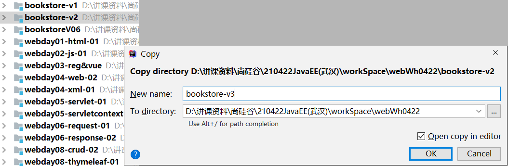
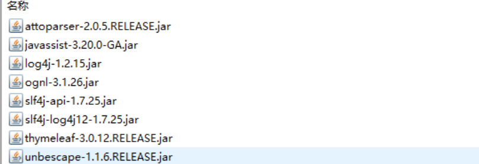
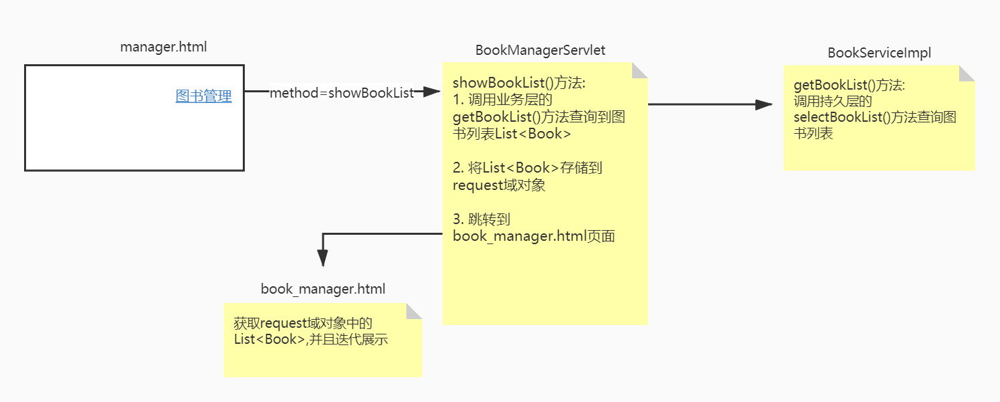
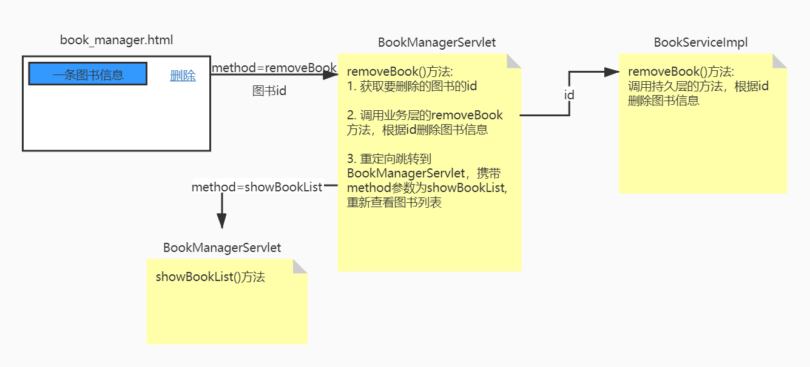
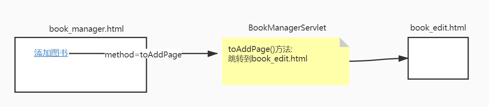
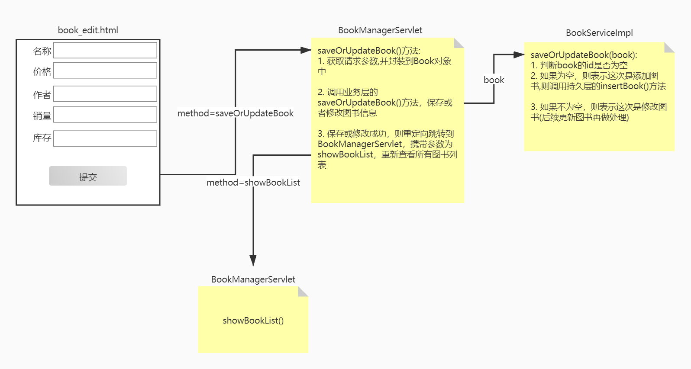
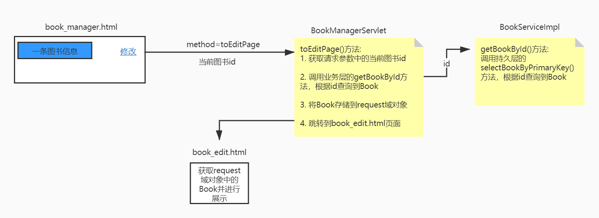
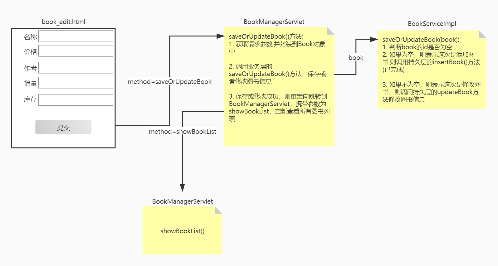

# day09 书城项目第三阶段

## 第一章 项目准备工作 

### 1. 将bookstore-v2项目复制一份改名为bookstore-v3

1. 选中bookstore-v2然后Ctrl+C复制
2. 然后Ctrl+V粘贴，粘贴的时候改名为bookstore-v3



3. 将刚刚复制粘贴的bookstore-v3这个Module导入到当前项目中(具体导入项目的流程之前已经讲过了)

### 2. 拷贝jar包

Thymeleaf的jar包



### 3. Java代码调整

- 创建两个子包
  - 存放Servlet基类：com.atguigu.bookstore.servlet.base
  - 存放Servlet子类：com.atguigu.bookstore.servlet.model
- 从资料中将两个基类拷贝过来，放置到com.atguigu.bookstore.servlet.base包里面
  - 视图基类：ViewBaseServlet
  - 方法分发基类：ModelBaseServlet

### 4 前端代码调整

- 将pages目录整体移动到WEB-INF目录下
- 将index.html移动到WEB-INF/pages目录下，将来通过Servlet访问

### 5. 显示首页

#### 5.1 修改web.xml

```xml
<!-- 在上下文参数中配置视图前缀和视图后缀 -->
<context-param>
    <param-name>view-prefix</param-name>
    <param-value>/WEB-INF/pages/</param-value>
</context-param>
<context-param>
    <param-name>view-suffix</param-name>
    <param-value>.html</param-value>
</context-param>
```

<span style="color:blue;font-weight:bold;">注意</span>：这里需要将WEB-INF下的view改成pages，和当前项目环境的目录结构一致。

#### 5.2 创建PortalServlet

<span style="color:blue;font-weight:bold;">注意</span>：这个PortalServlet映射的地址是/index.html，这样才能保证访问首页时访问它。

```xml
<servlet>
    <servlet-name>PortalServlet</servlet-name>
    <servlet-class>com.atguigu.bookstore.servlet.model.PortalServlet</servlet-class>
</servlet>
<servlet-mapping>
    <servlet-name>PortalServlet</servlet-name>
    <url-pattern>/index.html</url-pattern>
</servlet-mapping>
```

<span style="color:blue;font-weight:bold;">注意</span>：PortalServlet服务于首页的显示，为了降低用户访问首页的门槛，不能附加任何请求参数，所以不能继承ModelBaseServlet，只能继承ViewBaseServlet。

```java
package com.atguigu.servlet.model;

import com.atguigu.servlet.base.ViewBaseServlet;

import javax.servlet.ServletException;
import javax.servlet.http.HttpServletRequest;
import javax.servlet.http.HttpServletResponse;
import java.io.IOException;

/**
 * @author Leevi
 * 日期2021-05-14  09:03
 * 该Servlet只需要处理访问首页
 */
public class PortalServlet extends ViewBaseServlet {
    @Override
    protected void doPost(HttpServletRequest request, HttpServletResponse response) throws ServletException, IOException {
        doGet(request, response);
    }

    @Override
    protected void doGet(HttpServletRequest request, HttpServletResponse response) throws ServletException, IOException {
        processTemplate("index",request,response);
    }
}
```

#### 4.3 调整index.html

- 加入Thymeleaf名称空间

```html
<html lang="en" xmlns:th="http://www.thymeleaf.org">
```

- 修改base标签

```html
<base th:href="@{/}" href="/bookstore/"/>
```

## 第二章 完成用户模块

### 1. 重构登录功能

#### 1.1 思路


#### 1.2 代码

##### 1.2.1 创建UserServlet

web.xml中的配置：

```xml
<servlet>
    <servlet-name>UserServlet</servlet-name>
    <servlet-class>com.atguigu.servlet.model.UserServlet</servlet-class>
</servlet>

<servlet-mapping>
    <servlet-name>UserServlet</servlet-name>
    <url-pattern>/user</url-pattern>
</servlet-mapping>
```

Java代码：

```java
package com.atguigu.servlet.model;

import com.atguigu.bean.User;
import com.atguigu.service.UserService;
import com.atguigu.service.impl.UserServiceImpl;
import com.atguigu.servlet.base.ModelBaseServlet;
import org.apache.commons.beanutils.BeanUtils;

import javax.servlet.http.HttpServletRequest;
import javax.servlet.http.HttpServletResponse;
import java.io.IOException;
import java.util.Map;

/**
 * @author Leevi
 * 日期2021-05-14  09:07
 */
public class UserServlet extends ModelBaseServlet {
    private UserService userService = new UserServiceImpl();
    /**
     * 跳转到登录页面
     * @param request
     * @param response
     */
    public void toLoginPage(HttpServletRequest request, HttpServletResponse response) throws IOException {
    }
}
```

<span style="color:blue;font-weight:bold;">注意</span>：记得修改UserServlet继承的类ModelBaseServlet

##### 1.2.1 前往登录页面功能

###### 1.2.1.1 修改首页中登录超链接

```html
<a href="user?method=toLoginPage" class="login">登录</a>
```

###### 1.2.1.2 完成UserServlet.toLoginPage()方法

```java
/**
     * 跳转到登录页面
     * @param request
     * @param response
     */
public void toLoginPage(HttpServletRequest request, HttpServletResponse response) throws IOException {
    processTemplate("user/login",request,response);
}
```

###### 1.2.1.3 调整登录页面代码

- 加入Thymeleaf名称空间

```html
<html lang="en" xmlns:th="http://www.thymeleaf.org">
```

- 修改base标签

```html
<base th:href="@{/}" href="/bookstore/" />
```

- 修改form标签action属性

```html
<form id="loginForm" action="user" method="post">
```

- 增加method请求参数的表单隐藏域

```html
<input type="hidden" name="method" value="doLogin" />
```

- 根据条件显示登录失败消息

```javascript
"data":{
    "username":"",
    "pwd":"",
    "errorMessage":"[[${errorMsg}]]"
}
```

##### 1.2.3 登录校验功能

UserServlet.doLogin()

```java
/**
     * 处理登录校验
     * @param request
     * @param response
     * @throws IOException
     */
public void doLogin(HttpServletRequest request, HttpServletResponse response) throws IOException {
    //还是做原来的登录校验
    //1. 获取客户端传入的请求参数
    String username = request.getParameter("username");
    String password = request.getParameter("password");
    //2. 将username和password封装到User对象
    User user = new User(null,username,password,null);

    //3. 调用业务层的方法处理登录
    try {
        User loginUser = userService.doLogin(user);
        //没有出现异常，说明登录成功，那么跳转到登录成功页面
        processTemplate("user/login_success",request,response);
    } catch (Exception e) {
        e.printStackTrace();
        //出现异常表示登录失败，则往域对象中存储登录失败的信息
        request.setAttribute("errorMessage","登录失败,"+e.getMessage());
        //跳转到登录页面，显示登录失败的信息
        processTemplate("user/login",request,response);
    }
}
```

###### 1.2.3.1 登录失败后回显表单中的用户名

在login.html页面进行设置

遇到问题：使用th:value="${param.username}"确实实现了服务器端渲染，但是实际打开页面并没有看到。原因是页面渲染顺序：

- 服务器端渲染
- 服务器端将渲染结果作为响应数据返回给浏览器
- 浏览器加载HTML文档
- 读取到Vue代码后，执行Vue代码
- Vue又进行了一次浏览器端渲染，覆盖了服务器端渲染的值

解决办法：将服务器端渲染的结果设置到Vue对象的data属性中。

```javascript
new Vue({
	"el":"#loginForm",
	"data":{
		"username":"[[${param.username}]]",
		"password":""
	},
```

###### 1.2.3.2 修改login_success.html页面

login_success.html

```html
<html lang="en" xmlns:th="http://www.thymeleaf.org">
    ……
<base th:href="@{/}" href="/bookstore/"/>
```

### 2. 重构注册功能

### 2.1 思路


#### 2.2 代码

##### 2.2.1 前往注册页面功能

###### 2.2.1.1 修改首页中注册超链接

```html
<a href="user?method=toRegisterPage" class="register">注册</a>
```

###### 2.2.1.2 完成UserServlet.toRegisterPage()方法

```java
/**
     * 跳转到注册页面
     * @param request
     * @param response
     * @throws IOException
     */
public void toRegisterPage(HttpServletRequest request, HttpServletResponse response) throws IOException {
    processTemplate("user/regist",request,response);
}
```

###### 2.2.1.3 调整注册页面代码

```html
<html lang="en" xmlns:th="http://www.thymeleaf.org">
    ……
<base th:href="@{/}" href="/bookstore/"/>
    ……
    
    <form id="registerForm" action="UserServlet" method="post">
					<input type="hidden" name="method" value="doRegister" />
        ……
```

```javascript
//注册失败后回显数据
new Vue({
	"el":"#registerForm",
	"data":{
		"username":"[[${param.username}]]",
		"password":"",
		"passwordConfirm":"",
		"email":"[[${param.email}]]",
		"code":"",
		"usernameCheckMessage":""
	}
```

##### 2.2.2 注册功能

```java
/**
     * 处理注册请求
     * @param request
     * @param response
     * @throws IOException
     */
public void doRegister(HttpServletRequest request, HttpServletResponse response) throws IOException {
    //1. 获取请求参数
    Map<String, String[]> parameterMap = request.getParameterMap();
    //2. 使用BeanUtils将parameterMap中的数据封装到User对象
    User user = new User();
    try {
        BeanUtils.populate(user,parameterMap);
        //3. 调用业务层的方法处理注册业务
        userService.doRegister(user);

        //没有异常，就是注册成功
        //跳转到注册成功页面
        processTemplate("user/regist_success",request,response);
    } catch (Exception e) {
        e.printStackTrace();
        //有异常就注册失败,往域对象中存入失败信息
        request.setAttribute("errorMessage","注册失败,"+e.getMessage());
        //跳转回到注册页面
        processTemplate("user/regist",request,response);
    }
}
```

###### 2.2.2.1 修改regist_success.html页面

```html
<html lang="en" xmlns:th="http://www.thymeleaf.org">
    ……
<base th:href="@{/}" href="/bookstore/"/>
```

## 第三章 书城后台CRUD

### 1. 进入后台页面

#### 1.1 概念辨析


#### 1.2 访问后台首页

##### 1.2.1 思路

首页→后台系统超链接→AdminServlet.toManagerPage()→manager.html

##### 1.2.2 代码

###### 1.2.2.1 创建AdminServlet

web.xml

```xml
<servlet>
    <servlet-name>AdminServlet</servlet-name>
    <servlet-class>com.atguigu.bookstore.servlet.model.AdminServlet</servlet-class>
</servlet>
<servlet-mapping>
    <servlet-name>AdminServlet</servlet-name>
    <url-pattern>/admin</url-pattern>
</servlet-mapping>
```

Java代码：

```java
package com.atguigu.bookstore.servlet.model;

import com.atguigu.bookstore.servlet.base.ModelBaseServlet;

import javax.servlet.http.HttpServletRequest;
import javax.servlet.http.HttpServletResponse;
import java.io.IOException;

/**
 * @author Leevi
 * 日期2021-06-11  15:13
 */
public class AdminServlet extends ModelBaseServlet {

    public void toManagerPage(HttpServletRequest request, HttpServletResponse response) throws IOException {
        processTemplate("manager/manager",request,response);
    }
}
```

###### 1.2.2.2 调整manager.html

```html
<html lang="en" xmlns:th="http://www.thymeleaf.org">
<head>
    <base th:href="@{/}" href="/bookstore/"/>
```

然后去除页面上的所有“../”

###### 1.2.2.3 抽取页面公共部分

诸多后台管理页面都包含一个共有的内容,所以我们要将这块内容抽取城代码片段，包含到各个后台管理页面中


**具体步骤如下:**

1. 创建包含代码片段的页面


admin-navigator.html的代码

```html
<!DOCTYPE html>
<html lang="en" xmlns:th="http://www.thymeleaf.org">
<head>
    <meta charset="UTF-8">
    <title>Title</title>
</head>
<body>

    <!-- 使用th:fragment属性给代码片段命名 -->
    <div th:fragment="navigator">
        <a href="book_manager.html" class="order">图书管理</a>
        <a href="order_manager.html" class="destory">订单管理</a>
        <a href="index.html" class="gohome">返回商城</a>
    </div>
</body>
</html>
```

2. 在有需要的页面(book_edit.html、book_manager.html、order_manager.html)引入片段

```html
<div th:include="segment/admin-navigator :: navigator"></div>
```

### 2. 后台图书CRUD

#### 2.1 数据建模

##### 2.1.1 物理建模

执行资料中的sql脚本,一定要注意:之前执行过，已经创建了表那就不要重新创建了

##### 2.1.2 逻辑建模

```java
package com.atguigu.bean;

/**
 * 包名:com.atguigu.bean
 *
 * @author Leevi
 * 日期2021-05-14  10:22
 */
public class Book {
    private Integer bookId;
    private String bookName;
    private String author;
    private Double price;
    private Integer sales;
    private Integer stock;
    private String imgPath;

    public Book() {
    }

    public Book(Integer bookId, String bookName, String author, Double price, Integer sales, Integer stock, String imgPath) {
        this.bookId = bookId;
        this.bookName = bookName;
        this.author = author;
        this.price = price;
        this.sales = sales;
        this.stock = stock;
        this.imgPath = imgPath;
    }

    @Override
    public String toString() {
        return "Book{" +
                "bookId=" + bookId +
                ", bookName='" + bookName + '\'' +
                ", author='" + author + '\'' +
                ", price=" + price +
                ", sales=" + sales +
                ", stock=" + stock +
                ", imgPath='" + imgPath + '\'' +
                '}';
    }

    public Integer getBookId() {
        return bookId;
    }

    public void setBookId(Integer bookId) {
        this.bookId = bookId;
    }

    public String getBookName() {
        return bookName;
    }

    public void setBookName(String bookName) {
        this.bookName = bookName;
    }

    public String getAuthor() {
        return author;
    }

    public void setAuthor(String author) {
        this.author = author;
    }

    public Double getPrice() {
        return price;
    }

    public void setPrice(Double price) {
        this.price = price;
    }

    public Integer getSales() {
        return sales;
    }

    public void setSales(Integer sales) {
        this.sales = sales;
    }

    public Integer getStock() {
        return stock;
    }

    public void setStock(Integer stock) {
        this.stock = stock;
    }

    public String getImgPath() {
        return imgPath;
    }

    public void setImgPath(String imgPath) {
        this.imgPath = imgPath;
    }
}
```

#### 2.2 创建并组装组件

##### 2.2.1 创建Servlet

- 后台：BookManagerServlet

##### 2.2.2 创建BookService

- 接口：BookService
- 实现类：BookServiceImpl

##### 2.2.3 创建BookDao

- 接口：BookDao
- 实现类：BookDaoImpl

##### 2.2.4 组装

- 给BookManagerServlet组装BookService
- 给BookService组装BookDao

#### 2.3 图书列表显示功能

##### 2.3.1 思路



##### 2.3.2 修改图书管理超链接

超链接所在文件位置：

> WEB-INF/pages/segment/admin-navigator.html

```html
<a href="BookManagerServlet?method=showBookList" class="order">图书管理</a>
```

##### 2.3.3 BookManagerServlet.showBookList()

```java
/**
     * 跳转到图书管理页面
     * @param request
     * @param response
     */
public void showBookList(HttpServletRequest request, HttpServletResponse response) throws IOException {
    try {
        //查询出图书列表
        List<Book> bookList = bookService.getBookList();
        //将图书列表存储到请求域
        request.setAttribute("bookList",bookList);
        processTemplate("manager/book_manager",request,response);
    } catch (Exception e) {
        e.printStackTrace();
    }
}
```

##### 2.3.4 BookService.getBookList()

```java
@Override
public List<Book> getBookList() throws Exception{
    return bookDao.selectBookList();
}
```

##### 2.3.5 BookDao.selectBookList()

```java
@Override
public List<Book> selectBookList() throws SQLException{
    String sql = "select book_id bookId,book_name bookName,author,price,sales,stock,img_path imgPath from t_book";

    return getBeanList(Book.class,sql);
}
```

##### 2.3.6 调整book_manager.html

- Thymeleaf名称空间: `xmlns:th="http://www.thymeleaf.org"`
- base标签: `<base th:href="@{/}" href="/bookstore/"/>`
- 替换页面路径中的`../`
- 包含进来的代码片段: `<div th:include="segment/admin-navigator :: navigator"></div>`

##### 2.3.7 在book_manager.html中迭代显示图书列表

```html
<table>
    <thead>
        <tr>
            <th>图片</th>
            <th>商品名称</th>
            <th>价格</th>
            <th>作者</th>
            <th>销量</th>
            <th>库存</th>
            <th>操作</th>
        </tr>
    </thead>
    <tbody th:if="${#lists.isEmpty(bookList)}">
        <tr>
            <td colspan="7">图书列表为空，请先添加图书！！！</td>
        </tr>
    </tbody>
    <tbody th:unless="${#lists.isEmpty(bookList)}">
        <tr th:each="book : ${bookList}">
            <td>
                
            </td>
            <td th:text="${book.bookName}">活着</td>
            <td th:text="${book.price}">
                100.00
            </td>
            <td th:text="${book.author}">余华</td>
            <td th:text="${book.sales}">200</td>
            <td th:text="${book.stock}">400</td>
            <td>
                <a href="#">修改</a><a href="#" class="del">删除</a>
            </td>
        </tr>
    </tbody>
</table>
```

#### 2.4 图书删除功能

##### 2.4.1 思路



##### 2.4.2 删除超链接

```html
<a th:href="@{/bookManager(method='removeBook',id=${book.bookId})}" class="del">删除</a>
```

##### 2.4.3 BookManagerServlet.removeBook()

```java
/**
     * 删除图书
     * @param request
     * @param response
     * @throws IOException
     */
public void removeBook(HttpServletRequest request, HttpServletResponse response) throws IOException {
    //1. 获取要删除的图书的id
    Integer id = Integer.valueOf(request.getParameter("id"));
    //2. 调用业务层的方法根据id删除图书
    try {
        bookService.removeBook(id);
        //3. 删除成功，重新查询所有图书信息
        response.sendRedirect(request.getContextPath()+"/bookManager?method=showBookList");
    } catch (Exception e) {
        e.printStackTrace();
    }
}
```

##### 2.4.4 BookService.removeBook()

```java
@Override
public void removeBook(Integer bookId) throws Exception {
    bookDao.deleteBook(bookId);
}
```

##### 2.4.5 BookDao.deleteBook()

```java
@Override
public void deleteBook(Integer bookId) throws SQLException {
    String sql = "delete from t_book where book_id=?";
    update(sql,bookId);
}
```

#### 2.5 新增图书功能

##### 2.5.1 思路

###### 2.5.1.1 点击添加图书的超链接跳转到添加图书页面



###### 2.5.1.2 图书添加功能



##### 2.5.2 添加图书超链接

修改book_manager.html页面

```html
<a href="bookManager?method=toAddPage">添加图书</a>
```

##### 2.5.3 实现：BookManagerServlet.toAddPage()

```java
/**
* 跳转到添加图书页面
* @param request
* @param response
* @throws IOException
*/
public void toAddPage(HttpServletRequest request, HttpServletResponse response) throws IOException{
    processTemplate("manager/book_edit",request,response);
}
```

##### 2.5.4 book_edit.html

由book_edit.html复制出来，然后调整表单标签：

```html
<form action="bookManager?method=saveOrUpdateBook" method="post" th:unless="${book != null}">
    <div class="form-item">
        <div>
            <label>名称:</label>
            <input type="text" placeholder="请输入名称" name="bookName" />
        </div>
        <span class="errMess" style="visibility: hidden;">请输入正确的名称</span
            >
    </div>
    <div class="form-item">
        <div>
            <label>价格:</label>
            <input type="number" placeholder="请输入价格" name="price" />
        </div>
        <span class="errMess">请输入正确数字</span>
    </div>
    <div class="form-item">
        <div>
            <label>作者:</label>
            <input type="text" placeholder="请输入作者" name="author"/>
        </div>
        <span class="errMess">请输入正确作者</span>
    </div>
    <div class="form-item">
        <div>
            <label>销量:</label>
            <input type="number" placeholder="请输入销量" name="sales" />
        </div>
        <span class="errMess">请输入正确销量</span>
    </div>
    <div class="form-item">
        <div>
            <label>库存:</label>
            <input type="number" placeholder="请输入库存" name="stock"/>
        </div>
        <span class="errMess">请输入正确库存</span>
    </div>

    <button type="submit" class="btn">提交</button>
</form>
```

##### 2.5.5 BookManagerServlet.saveOrUpdateBook()

```java
/**
     * 添加或者图书信息
     * @param request
     * @param response
     * @throws IOException
     */
public void saveOrUpdateBook(HttpServletRequest request, HttpServletResponse response) throws IOException{
    //1. 获取请求参数
    Map<String, String[]> parameterMap = request.getParameterMap();
    //2. 将parameterMap中的数据封装到Book对象
    try {
        Book book = new Book();
        BeanUtils.populate(book,parameterMap);

        bookService.saveOrUpdateBook(book);

        //4. 保存成功，则重新查询所有图书
        response.sendRedirect(request.getContextPath()+"/bookManager?method=toBookManagerPage");
    } catch (Exception e) {
        e.printStackTrace();
    }
}
```

##### 2.5.6 BookService.saveOrUpdateBook()

```java
@Override
public void savOrUpdateBook(Book book) throws Exception {
    //1. 判断book中的bookId是否为空
    if (book.getBookId() == null || "".equals(book.getBookId()) || book.getBookId() == 0) {
        //说明bookId为空,那么就是添加图书信息

        //固定设置图书的图片路径
        book.setImgPath("static/uploads/jiaofu.jpg");
        //调用持久层的方法进行添加
        bookDao.insertBook(book);
    }else {
        //说明bookId不为空，那么就是修改图书信息
        //调用持久层的方法进行修改
        bookDao.updateBook(book);
    }
}
```

##### 2.5.7 BookDao.insertBook()

```java
@Override
public void insertBook(Book book) throws SQLException {
    String sql = "insert into t_book (book_name,author,price,sales,stock,img_path) values (?,?,?,?,?,?)";
    update(sql,book.getBookName(),book.getAuthor(),book.getPrice(),book.getSales(),book.getStock(),book.getImgPath());
}
```

#### 2.6 修改图书功能

##### 2.6.1 思路

###### 2.6.1.1 点击修改图书超链接跳转到修改页面回显图书信息



###### 2.6.1.2 提交表单修改图书信息



##### 2.6.2 修改图书超链接

```html
<a th:href="@{/bookManager(method='toEditPage',id=${book.bookId})}">修改</a>
```

##### 2.6.3 BookManagerServlet.toEditPage()

```java
/**
     * 跳转到修改页面
     * @param request
     * @param response
     * @throws IOException
     */
public void toEditPage(HttpServletRequest request, HttpServletResponse response) throws IOException{
    //获取客户端传入的id
    Integer id = Integer.valueOf(request.getParameter("id"));
    try {
        //根据id查询图书详情
        Book book = bookService.getBookById(id);
        //将图书信息存储到请求域
        request.setAttribute("book",book);
        processTemplate("manager/book_edit",request,response);
    } catch (Exception e) {
        e.printStackTrace();
    }
}
```

##### 2.6.4 BookService.getBookById()

```java
@Override
public Book getBookById(Integer bookId) throws Exception{

    return bookDao.selectBookByPrimaryKey(bookId);
}
```

##### 2.6.5 BookDao.selectBookByPrimaryKey()

```java
@Override
public Book selectBookByPrimaryKey(Integer bookId) throws SQLException {
    String sql = "select book_id bookId,book_name bookName,author,price,sales,stock,img_path imgPath from t_book where book_id=?";

    return getBean(Book.class,sql,bookId);
}
```

##### 2.6.6 book_edit.html（表单回显）

```html
<!--修改图书的表单-->
<form action="bookManager?method=saveOrUpdateBook" method="post" th:if="${book != null}">
    <div class="form-item">
        <!--使用隐藏域绑定bookId-->
        <input type="hidden" name="bookId" th:value="${book.bookId}"/>
        <div>
            <label>名称:</label>
            <input type="text" th:value="${book.bookName}" placeholder="请输入名称" name="bookName" />
        </div>
        <span class="errMess" style="visibility: hidden;">请输入正确的名称</span
            >
    </div>
    <div class="form-item">
        <div>
            <label>价格:</label>
            <input type="number" th:value="${book.price}" placeholder="请输入价格" name="price" />
        </div>
        <span class="errMess">请输入正确数字</span>
    </div>
    <div class="form-item">
        <div>
            <label>作者:</label>
            <input type="text" th:value="${book.author}" placeholder="请输入作者" name="author"/>
        </div>
        <span class="errMess">请输入正确作者</span>
    </div>
    <div class="form-item">
        <div>
            <label>销量:</label>
            <input type="number" th:value="${book.sales}" placeholder="请输入销量" name="sales" />
        </div>
        <span class="errMess">请输入正确销量</span>
    </div>
    <div class="form-item">
        <div>
            <label>库存:</label>
            <input type="number" th:value="${book.stock}" placeholder="请输入库存" name="stock"/>
        </div>
        <span class="errMess">请输入正确库存</span>
    </div>

    <button type="submit" class="btn">提交</button>
</form>

<!--这是添加图书的表单-->
<form action="bookManager?method=saveOrUpdateBook" method="post" th:unless="${book != null}">
    <div class="form-item">
        <div>
            <label>名称:</label>
            <input type="text" placeholder="请输入名称" name="bookName" />
        </div>
        <span class="errMess" style="visibility: hidden;">请输入正确的名称</span
            >
    </div>
    <div class="form-item">
        <div>
            <label>价格:</label>
            <input type="number" placeholder="请输入价格" name="price" />
        </div>
        <span class="errMess">请输入正确数字</span>
    </div>
    <div class="form-item">
        <div>
            <label>作者:</label>
            <input type="text" placeholder="请输入作者" name="author"/>
        </div>
        <span class="errMess">请输入正确作者</span>
    </div>
    <div class="form-item">
        <div>
            <label>销量:</label>
            <input type="number" placeholder="请输入销量" name="sales" />
        </div>
        <span class="errMess">请输入正确销量</span>
    </div>
    <div class="form-item">
        <div>
            <label>库存:</label>
            <input type="number" placeholder="请输入库存" name="stock"/>
        </div>
        <span class="errMess">请输入正确库存</span>
    </div>

    <button type="submit" class="btn">提交</button>
</form>
```

##### 2.6.7 BookManagerServlet.saveOrUpdateBook()

```java
/**
     * 添加或者图书信息
     * @param request
     * @param response
     * @throws IOException
     */
public void saveOrUpdateBook(HttpServletRequest request, HttpServletResponse response) throws IOException{
    //1. 获取请求参数
    Map<String, String[]> parameterMap = request.getParameterMap();
    //2. 将parameterMap中的数据封装到Book对象
    try {
        Book book = new Book();
        BeanUtils.populate(book,parameterMap);
		bookService.saveOrUpdateBook(book)
        //4. 保存或修改成功，则重新查询所有图书
        response.sendRedirect(request.getContextPath()+"/bookManager?method=toBookManagerPage");
    } catch (Exception e) {
        e.printStackTrace();
    }
}
```

##### 2.6.8 BookService.saveOrUpdateBook()

```java
@Override
public void saveOrUpdateBook(Book book) throws Exception {
    //判断到底是删除还是修改
    if (book.getBookId() != null && !"".equals(book.getBookId())) {
        //修改图书信息
        bookDao.updateBook(book);
    }else {
        //添加图书信息
        //设置一个固定的imgPath
        book.setImgPath("static/uploads/xiaowangzi.jpg");
        //3. 调用持久层的方法保存图书信息
        bookDao.insertBook(book);
    }
}
```

##### 2.6.9 BookDao.updateBook()

<span style="color:blue;font-weight:bold;">注意</span>：这里不修改imgPath字段

```java
@Override
public void updateBook(Book book) throws SQLException {
    //我们暂时不修改图片路径
    String sql = "update t_book set book_name=?,price=?,author=?,sales=?,stock=? where book_id=?";

    update(sql,book.getBookName(),book.getPrice(),book.getAuthor(),book.getSales(),book.getStock(),book.getBookId());
}
```

## 第四章 前台图书展示

### 1. 思路

index.html→PortalServlet.doPost()→把图书列表数据查询出来→渲染视图→页面迭代显示图书数据

### 2. 代码

#### 2.1 PortalServlet.doPost()

```java
package com.atguigu.servlet.model;

import com.atguigu.bean.Book;
import com.atguigu.service.BookService;
import com.atguigu.service.impl.BookServiceImpl;
import com.atguigu.servlet.base.ViewBaseServlet;

import javax.servlet.ServletException;
import javax.servlet.http.HttpServletRequest;
import javax.servlet.http.HttpServletResponse;
import java.io.IOException;
import java.util.List;

/**
 * @author Leevi
 * 日期2021-05-14  09:03
 * 该Servlet只需要处理访问首页
 */
public class PortalServlet extends ViewBaseServlet {
    private BookService bookService = new BookServiceImpl();
    @Override
    protected void doPost(HttpServletRequest request, HttpServletResponse response) throws ServletException, IOException {
        doGet(request, response);
    }

    @Override
    protected void doGet(HttpServletRequest request, HttpServletResponse response) throws ServletException, IOException {
        try {
            //查询动态数据
            List<Book> bookList = bookService.getBookList();
            //将动态数据存储到请求域
            request.setAttribute("bookList",bookList);
            processTemplate("index",request,response);
        } catch (Exception e) {
            e.printStackTrace();
        }
    }
}
```

#### 2.2 页面迭代显示图书数据

页面文件：index.html

```html
<div class="list-content" th:if="${#lists.isEmpty(bookList)}">
    <div class="list-item">
        图书列表空空如也!!!
    </div>
</div>
<div class="list-content" th:unless="${#lists.isEmpty(bookList)}">
    <div class="list-item" th:each="book : ${bookList}">
        
        <p>书名:<span th:text="${book.bookName}">活着</span></p>
        <p>作者:<span th:text="${book.author}">余华</span></p>
        <p>价格:<span th:text="${book.price}">￥66.6</span></p>
        <p>销量:<span th:text="${book.sales}">230</span></p>
        <p>库存:<span th:text="${book.stock}">1000</span></p>
        <button>加入购物车</button>
    </div>
</div>
```

