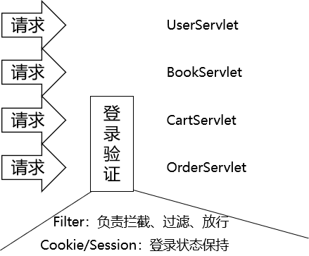
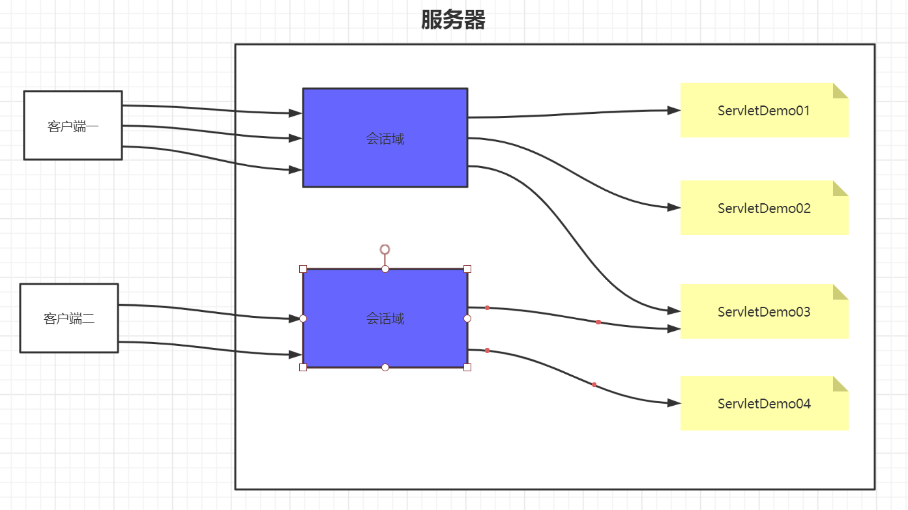
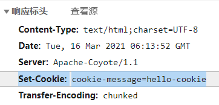
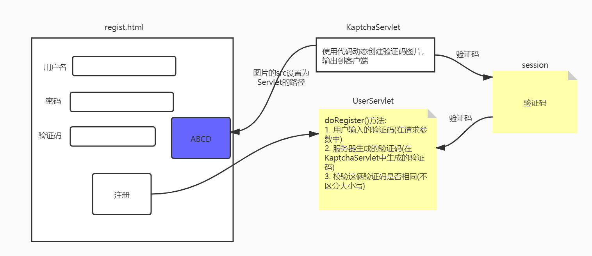
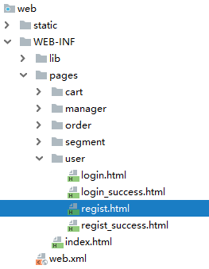
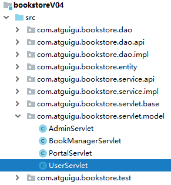
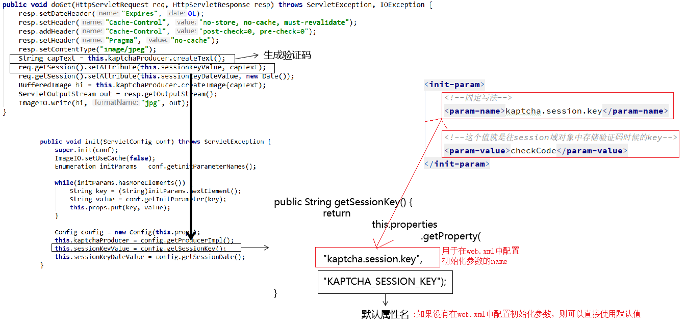

# day10 会话&书城项目第四阶段

## 第一章 会话

### 1. 学习目标

* 了解为什么需要会话控制
* 了解会话的范围
* 掌握使用Cookie
* 掌握使用Session

### 2. 内容讲解

#### 2.1 为什么需要会话控制



保持用户登录状态，就是当用户在登录之后，会在服务器中保存该用户的登录状态，当该用户后续访问该项目中的其它动态资源(Servlet或者Thymeleaf)的时候，能够判断当前是否是已经登录过的。而从用户登录到用户退出登录这个过程中所发生的所有请求，其实都是在一次会话范围之内

#### 2.2 域对象的范围

##### 2.2.1 应用域的范围


整个项目部署之后，只会有一个应用域对象，所有客户端都是共同访问同一个应用域对象，在该项目的所有动态资源中也是共用一个应用域对象

##### 2.2.2 请求域的范围

每一次请求都有一个请求域对象，当请求结束的时候对应的请求域对象也就销毁了

##### 2.3 会话域的范围



会话域是从客户端连接上服务器开始，一直到客户端关闭，这一整个过程中发生的所有请求都在同一个会话域中；而不同的客户端是不能共用会话域的

#### 2.3 Cookie技术

##### 2.3.1 Cookie的概念

Cookie是一种客户端的会话技术,它是服务器存放在浏览器的一小份数据,浏览器以后每次访问该服务器的时候都会将这小份数据携带到服务器去。


##### 2.3.2 Cookie的作用

1. 在浏览器中存放数据
2. 将浏览器中存放的数据携带到服务器

##### 2.3.3 Cookie的应用场景

1.记住用户名
当我们在用户名的输入框中输入完用户名后,浏览器记录用户名,下一次再访问登录页面时,用户名自动填充到用户名的输入框.

2.保存电影的播放进度  

在网页上播放电影的时候,如果中途退出浏览器了,下载再打开浏览器播放同一部电影的时候,会自动跳转到上次退出时候的进度,因为在播放的时候会将播放进度保存到cookie中

##### 2.3.4 Cookie的入门案例

###### 2.3.4.1 目标

实现在ServletDemo01和ServletDemo02之间共享数据，要求在会话域范围内共享

###### 2.3.4.2 Cookie相关的API

+ 创建一个Cookie对象(cookie只能保存字符串数据。且不能保存中文)

```java
new Cookie(String name,String value);
```

+  把cookie写回浏览器

```java
response.addCookie(cookie); 
```

+ 获得浏览器带过来的所有Cookie:

```java
request.getCookies() ; //得到所有的cookie对象。是一个数组，开发中根据key得到目标cookie
```

+ cookie的 API

```java
cookie.getName() ; //返回cookie中设置的key
cookie.getValue(); //返回cookie中设置的value
```

###### 2.3.4.2 ServletDemo01代码

在ServletDemo01中创建Cookie数据并响应给客户端

```java
public class ServletDemo01 extends HttpServlet {
    @Override
    protected void doPost(HttpServletRequest request, HttpServletResponse response) throws ServletException, IOException {
        doGet(request, response);
    }

    @Override
    protected void doGet(HttpServletRequest request, HttpServletResponse response) throws ServletException, IOException {
        //1. 创建一个cookie对象，用于存放键值对
        Cookie cookie = new Cookie("cookie-message","hello-cookie");

        //2. 将cookie添加到response中
        //底层是通过一个名为"Set-Cookie"的响应头携带到浏览器的
        response.addCookie(cookie);
    }
}
```



###### 2.3.4.2 浏览器发送请求携带Cookie

这里不需要我们操作，浏览器会在给服务器发送请求的时候，将cookie通过请求头自动携带到服务器


###### 2.3.4.3 ServletDemo02获取Cookie数据的代码

```java
public class ServletDemo02 extends HttpServlet {
    @Override
    protected void doPost(HttpServletRequest request, HttpServletResponse response) throws ServletException, IOException {
        doGet(request, response);
    }

    @Override
    protected void doGet(HttpServletRequest request, HttpServletResponse response) throws ServletException, IOException {
        //1. 从请求中取出cookie
        //底层是由名为"Cookie"的请求头携带的
        Cookie[] cookies = request.getCookies();

        //2. 遍历出每一个cookie
        if (cookies != null) {
            for (Cookie cookie : cookies) {
                //匹配cookie的name
                if (cookie.getName().equals("cookie-message")) {
                    //它就是我们想要的那个cookie
                    //我们就获取它的value
                    String value = cookie.getValue();
                    System.out.println("在ServletDemo02中获取str的值为：" + value);
                }
            }
        }
    }
}
```

##### 2.3.5 Cookie的时效性

如果我们不设置Cookie的时效性，默认情况下Cookie的有效期是一次会话范围内，我们可以通过cookie的setMaxAge()方法让Cookie持久化保存到浏览器上

- 会话级Cookie
  - 服务器端并没有明确指定Cookie的存在时间
  - 在浏览器端，Cookie数据存在于内存中
  - 只要浏览器还开着，Cookie数据就一直都在
  - 浏览器关闭，内存中的Cookie数据就会被释放
- 持久化Cookie
  - 服务器端明确设置了Cookie的存在时间
  - 在浏览器端，Cookie数据会被保存到硬盘上
  - Cookie在硬盘上存在的时间根据服务器端限定的时间来管控，不受浏览器关闭的影响
  - 持久化Cookie到达了预设的时间会被释放

`cookie.setMaxAge(int expiry)`参数单位是秒，表示cookie的持久化时间，如果设置参数为0，表示将浏览器中保存的该cookie删除

##### 2.3.6 Cookie的domain和path

上网时间长了，本地会保存很多Cookie。对浏览器来说，访问互联网资源时不能每次都把所有Cookie带上。浏览器会使用Cookie的domain和path属性值来和当前访问的地址进行比较，从而决定是否携带这个Cookie。

我们可以通过调用cookie的setPath()和setDomain()方法来设置cookie的domain和path


#### 2.4 Session技术

##### 2.4.1 session概述 

session是服务器端的技术。服务器为每一个浏览器开辟一块内存空间，即session对象。由于session对象是每一个浏览器特有的，所以用户的记录可以存放在session对象中

##### 2.4.2 Session的入门案例

###### 2.4.2.1 目标

实现在ServletDemo01和ServletDemo02之间共享数据，要求在会话域范围内共享

###### 2.4.2.2 Session的API介绍

- request.getSession(); 获得session(如果第一次调用的时候其实是创建session,第一次之后通过sessionId找到session进行使用)
- Object getAttribute(String name) ;获取值
- void setAttribute(String name, Object value) ;存储值
- void removeAttribute(String name)  ;移除值

###### 2.4.2.3 在ServletDemo01中往Session域对象存储数据

```java
public class ServletDemo01 extends HttpServlet {
    @Override
    protected void doPost(HttpServletRequest request, HttpServletResponse response) throws ServletException, IOException {
        doGet(request, response);
    }

    @Override
    protected void doGet(HttpServletRequest request, HttpServletResponse response) throws ServletException, IOException {
        //1. 获取Session对象
        HttpSession session = request.getSession();
        //2. 往Session对象中存入数据
        session.setAttribute("session-message","hello-session");
    }
}
```

###### 2.4.3.4 在ServletDemo02中从Session域对象中获取数据

```java
public class ServletDemo02 extends HttpServlet {
    @Override
    protected void doPost(HttpServletRequest request, HttpServletResponse response) throws ServletException, IOException {
        doGet(request, response);
    }

    @Override
    protected void doGet(HttpServletRequest request, HttpServletResponse response) throws ServletException, IOException {
        //1. 获取Session对象
        HttpSession session = request.getSession();
        //2. 往Session对象中存入数据
        String message = (String)session.getAttribute("session-message");
        System.out.println(message);
    }
}
```

##### 2.4.3 Session的工作机制

前提：浏览器正常访问服务器

- 服务器端没调用request.getSession()方法：什么都不会发生
- 服务器端调用了request.getSession()方法
  - 服务器端检查当前请求中是否携带了JSESSIONID的Cookie
    - 有：根据JSESSIONID在服务器端查找对应的HttpSession对象
      - 能找到：将找到的HttpSession对象作为request.getSession()方法的返回值返回
      - 找不到：服务器端新建一个HttpSession对象作为request.getSession()方法的返回值返回
    - 无：服务器端新建一个HttpSession对象作为request.getSession()方法的返回值返回


**代码验证**

```java
// 1.调用request对象的方法尝试获取HttpSession对象
HttpSession session = request.getSession();

// 2.调用HttpSession对象的isNew()方法
boolean wetherNew = session.isNew();

// 3.打印HttpSession对象是否为新对象
System.out.println("wetherNew = " + (wetherNew?"HttpSession对象是新的":"HttpSession对象是旧的"));

// 4.调用HttpSession对象的getId()方法
String id = session.getId();

// 5.打印JSESSIONID的值
System.out.println("JSESSIONID = " + id);
```

##### 2.4.4 Session的时效性

###### 2.4.4.1 为什么Session要设置时限

用户量很大之后，Session对象相应的也要创建很多。如果一味创建不释放，那么服务器端的内存迟早要被耗尽。

###### 2.4.4.2 设置时限的难点

从服务器端的角度，很难精确得知类似浏览器关闭的动作。而且即使浏览器一直没有关闭，也不代表用户仍然在使用。

###### 2.4.4.3 服务器端给Session对象设置最大闲置时间

- 默认值：1800秒


最大闲置时间生效的机制如下：


###### 2.4.4.4 代码验证

```java
// ※测试时效性
// 获取默认的最大闲置时间
int maxInactiveIntervalSecond = session.getMaxInactiveInterval();
System.out.println("maxInactiveIntervalSecond = " + maxInactiveIntervalSecond);

// 设置默认的最大闲置时间
session.setMaxInactiveInterval(15);
```

###### 2.4.4.5 强制Session立即失效

```java
session.invalidate();
```

## 第二章 书城项目第四阶段

### 1. 保持登录状态

#### 1.1 迁移项目

将bookstore-v03复制一份，并且重新导入

#### 1.2 将登录成功的User存入Session中


```java
public void doLogin(HttpServletRequest request, HttpServletResponse response) throws IOException {
    //1. 获取请求参数
    Map<String, String[]> parameterMap = request.getParameterMap();
    //2. 将请求参数封装到User对象中
    User parameterUser = new User();
    try {
        BeanUtils.populate(parameterUser,parameterMap);
        //3. 调用业务层的方法处理登录
        User loginUser = userService.doLogin(parameterUser);

        //想要在多个动态资源之间共享loginUser对象
        //将loginUser对象存储到session域对象中
        HttpSession session = request.getSession();
        session.setAttribute("loginUser",loginUser);

        //没有出现异常，则表示登录成功: 跳转到login_success.html
        processTemplate("user/login_success",request,response);
    } catch (Exception e) {
        e.printStackTrace();
        //出现异常，就表示登录失败
        //将失败信息存储到request域对象中
        request.setAttribute("errorMsg",e.getMessage());
        //跳转到login.html页面,并且在那个页面中获取域对象中的errorMsg显示
        processTemplate("user/login",request,response);
    }
}
```

#### 1.3 修改欢迎信息

##### 1.3.1 登录成功页面

```html
<span>欢迎<span class="um_span" th:text="${session.loginUser.userName}">张总</span>光临尚硅谷书城</span>
```

##### 1.3.2 首页

```html
<!--登录前的风格-->
<div class="topbar-right" th:if="${session.loginUser == null}">
    <a href="user?method=toLoginPage" class="login">登录</a>
    <a href="user?method=toRegisterPage" class="register">注册</a>
    <a
       href="cart/cart.html"
       class="cart iconfont icon-gouwuche
              "
       >
        购物车
        <div class="cart-num">3</div>
    </a>
    <a href="admin?method=toManagerPage" class="admin">后台管理</a>
</div>
<!--登录后风格-->
<div class="topbar-right" th:unless="${session.loginUser == null}">
    <span>欢迎你<b th:text="${session.loginUser.userName}">张总</b></span>
    <a href="user?method=logout" class="register">注销</a>
    <a
       href="pages/cart/cart.jsp"
       class="cart iconfont icon-gouwuche
              ">
        购物车
        <div class="cart-num">3</div>
    </a>
    <a href="pages/manager/book_manager.html" class="admin">后台管理</a>
</div>
```

### 2. 退出登录功能

#### 2.1 目标

用户退出登录的时候，清除会话域中保存的当前用户的所有信息

#### 2.2 页面超链接

```html
<a href="user?method=logout" class="register">注销</a>
```

#### 2.3 UserServlet.logout()

```java
/**
     * 退出登录
     * @param request
     * @param response
     * @throws IOException
     */
public void logout(HttpServletRequest request, HttpServletResponse response) throws IOException {
    //1. 立即让本次会话失效
    request.getSession().invalidate();

    //2. 跳转到PortalServlet访问首页
    response.sendRedirect(request.getContextPath()+"/index.html");
}
```

### 3. 验证码

#### 3.1 目标

通过让用户填写验证码并在服务器端检查，防止浏览器端使用程序恶意访问。

#### 3.2 思路



#### 3.3 操作

##### 3.3.1 导入jar包

kaptcha-2.3.2.jar

##### 3.3.2 配置KaptchaServlet

jar包中已经写好了Servlet的Java类，我们只需要在web.xml中配置这个Servlet即可。

```xml
<servlet>
    <servlet-name>kaptchaServlet</servlet-name>
    <servlet-class>com.google.code.kaptcha.servlet.KaptchaServlet</servlet-class>
</servlet>
<servlet-mapping>
    <servlet-name>kaptchaServlet</servlet-name>
    <url-pattern>/kaptcha</url-pattern>
</servlet-mapping>
```

##### 3.3.3 通过页面访问测试

> http://localhost:8080/bookstore/kaptcha

##### 3.3.4 在注册页面显示验证码图片



```html

```

##### 3.3.5 调整验证码图片的显示效果

###### 3.3.5.1 去掉边框

KaptchaServlet会在初始化时读取init-param，而它能够识别的init-param在下面类中：

> com.google.code.kaptcha.util.Config

web.xml中具体配置如下：

```xml
<servlet>
    <servlet-name>KaptchaServlet</servlet-name>
    <servlet-class>com.google.code.kaptcha.servlet.KaptchaServlet</servlet-class>

    <!-- 通过配置初始化参数影响KaptchaServlet的工作方式 -->
    <!-- 可以使用的配置项参考com.google.code.kaptcha.util.Config类 -->
    <!-- 配置kaptcha.border的值为no取消图片边框 -->
    <init-param>
        <param-name>kaptcha.border</param-name>
        <param-value>no</param-value>
    </init-param>
</servlet>
<servlet-mapping>
    <servlet-name>KaptchaServlet</servlet-name>
    <url-pattern>/KaptchaServlet</url-pattern>
</servlet-mapping>
```

> 开发过程中的工程化细节：
>
> no、false、none等等单词从含义上来说都表示『没有边框』这个意思，但是这里必须使用no。
>
> 参考的依据是下面的源码：

```java
public boolean getBoolean(String paramName, String paramValue, boolean defaultValue) {
	boolean booleanValue;
	if (!"yes".equals(paramValue) && !"".equals(paramValue) && paramValue != null) {
		if (!"no".equals(paramValue)) {
			throw new ConfigException(paramName, paramValue, "Value must be either yes or no.");
		}

		booleanValue = false;
	} else {
		booleanValue = defaultValue;
	}

	return booleanValue;
}
```

###### 3.3.5.2 设置图片大小

```html

```

##### 3.3.6 点击图片刷新

###### 3.3.6.1 目的

验证码图片都是经过刻意扭曲、添加了干扰、角度偏转，故意增加了识别的难度。所以必须允许用户在看不出来的时候点击图片刷新，生成新的图片重新辨认。

###### 3.3.6.2 实现的代码

修改图片的img标签：

```html

```

Vue代码:定义刷新验证码的函数

```javascript
changeCodeImg(){
    //切换验证码图片：重新设置当前图片的src
    //event.target就表示获取当前事件所在的标签
    event.target.src = "kaptcha"
}
```

##### 3.3.7 执行注册前检查验证码



###### 3.3.7.1 确认KaptchaServlet将验证码存入Session域时使用的属性名



通过查看源码，找到验证码存入Session域时使用的属性名是：

> KAPTCHA_SESSION_KEY

**当然我们也可以通过初始化参数配置验证码存入Session域时候使用的属性名**

如果配置了初始化参数指定了存入Session域时候使用的属性名，那么就不能使用默认的属性名"KAPTCHA_SESSION_KEY"了

```xml
<!--配置KaptchaServlet的映射路径-->
<servlet>
    <servlet-name>kaptchaServlet</servlet-name>
    <servlet-class>com.google.code.kaptcha.servlet.KaptchaServlet</servlet-class>

    <!--通过配置初始化参数去掉图片边框-->
    <init-param>
        <param-name>kaptcha.border</param-name>
        <param-value>no</param-value>
    </init-param>

    <!--在这里可以配置验证码存储进session时候的key-->
    <init-param>
        <param-name>kaptcha.session.key</param-name>
        <param-value>serverCode</param-value>
    </init-param>
</servlet>
<servlet-mapping>
    <servlet-name>kaptchaServlet</servlet-name>
    <url-pattern>/kaptcha</url-pattern>
</servlet-mapping>
```


###### 3.3.7.2 在执行注册的方法中添加新的代码

```java
public void doRegister(HttpServletRequest request, HttpServletResponse response) throws IOException {
    //1. 获取所有的请求参数
    Map<String, String[]> parameterMap = request.getParameterMap();
    //2. 将parameterMap中的数据封装到User对象中
    User parameterUser = new User();
    try {
        BeanUtils.populate(parameterUser,parameterMap);

        //3.校验验证码是否正确
        //3.1 获取用户输入的验证码
        String checkCode = parameterMap.get("checkCode")[0];
        //3.2 获取服务器生成的验证码
        //如果我们在KaptchaServlet的初始化参数中配置了session的key，那么我们从session中获取验证码就使用自己配置的key
        //如果我们没有在KaptchaServlet的初始化参数中配置session的key，那么我们就使用默认的key: KAPTCHA_SESSION_KEY来从session中获取验证码
        String serverCode = (String) request.getSession().getAttribute("serverCode");
        //3.3 校验俩验证码是否一致，并且不区分大小写
        if (serverCode.equalsIgnoreCase(checkCode)) {
            //验证码正确
            //4. 调用业务层的代码，处理注册业务逻辑:我怎么才能知道注册成功或者失败了呢?
            //如果注册失败了，那么业务层就会抛出异常
            userService.doRegister(parameterUser);

            //只要没有出现异常，那就说明注册成功:跳转到regist_success.html
            processTemplate("user/regist_success",request,response);

        }else {
            throw new RuntimeException("验证码错误");
        }
    } catch (Exception e) {
        e.printStackTrace();
        //如果出现异常，那就是注册失败
        request.setAttribute("errorMsg",e.getMessage());
        //跳转到regist.html
        processTemplate("user/regist",request,response);
    }
}
```

