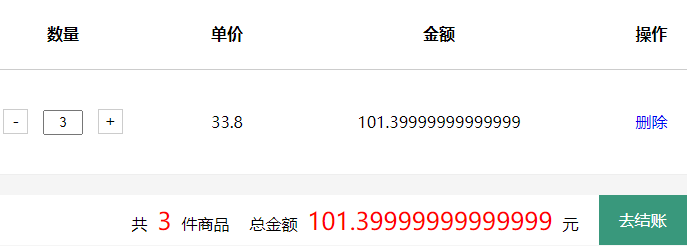

# day11 书城项目第五阶段

## 第一章 显示购物车页面

### 1目标

把购物车信息在专门的页面显示出来

### 2思路


### 3代码实现

#### 3.1 购物车超链接

登录状态和未登录状态

```html
<div class="topbar-right" th:if="${session.loginUser == null}">
    <a href="user?method=toLoginPage" class="login">登录</a>
    <a href="user?method=toRegisterPage" class="register">注册</a>
    <a
       href="cart?method=toCartPage"
       class="cart iconfont icon-gouwuche
              "
       >
        购物车
        <div class="cart-num" th:if="${session.cart != null}" th:text="${session.cart.totalCount}">3</div>
    </a>
    <a href="admin?method=toManagerPage" class="admin">后台管理</a>
</div>
<!--登录后风格-->
<div class="topbar-right" th:unless="${session.loginUser == null}">
    <span>欢迎你<b th:text="${session.loginUser.username}">张总</b></span>
    <a href="user?method=logout" class="register">注销</a>
    <a
       href="cart?method=toCartPage"
       class="cart iconfont icon-gouwuche
              ">
        购物车
        <div class="cart-num" th:if="${session.cart != null}" th:text="${session.cart.totalCount}">3</div>
    </a>
    <a href="admin?method=toManagerPage" class="admin">后台管理</a>
</div>
```

#### 3.2 CartServlet添加跳转到cart.html页面的代码

```java
/**
     * 跳转到显示购物车列表的页面
     * @param request
     * @param response
     */
public void toCartPage(HttpServletRequest request,HttpServletResponse response) throws IOException {
    processTemplate("cart/cart",request,response);
}
```

#### 3.3 cart.html

```html
<!--加入vue和axios-->
<script src="static/script/axios.js"></script>
<script src="static/script/vue.js"></script>

<!--vue数据绑定-->
<div class="list" id="app">
    <div class="w">
        <table>
            <thead>
                <tr>
                    <th>图片</th>
                    <th>商品名称</th>

                    <th>数量</th>
                    <th>单价</th>
                    <th>金额</th>
                    <th>操作</th>
                </tr>
            </thead>
            <tbody>
                <tr v-for="(cartItem,index) in cart.cartItemList">
                    <td>
                        
                        <input type="hidden" name="bookId" v-model="cartItem.bookId"/>
                    </td>
                    <td v-text="cartItem.bookName"></td>
                    <td>
                        <span class="count">-</span>
                        <input class="count-num" type="text" v-model="cartItem.count" />
                        <span class="count">+</span>
                    </td>
                    <td v-text="cartItem.price"></td>
                    <td v-text="cartItem.amount"></td>
                    <td><a href="">删除</a></td>
                </tr>
            </tbody>
        </table>
        <div class="footer">
            <div class="footer-left">
                <a href="#" class="clear-cart">清空购物车</a>
                <a href="#">继续购物</a>
            </div>
            <div class="footer-right">
                <div>共<span v-text="cart.totalCount"></span>件商品</div>
                <div class="total-price">总金额<span v-text="cart.totalAmount"></span>元</div>
                <a class="pay" href="checkout.html">去结账</a>
            </div>
        </div>
    </div>
</div>


<!--vue代码-->
<script>
    var vue = new Vue({
        "el":"#app",
        "data":{
            "cart":{
                "cartItemList":[
                    {
                        "imgPath":"static/uploads/huozhe.jpg",
                        "bookName":"活着",
                        "bookId":1,
                        "count":1,
                        "price":36.8,
                        "amount":36.8
                    },
                    {
                        "imgPath":"static/uploads/huozhe.jpg",
                        "bookName":"活着",
                        "bookId":1,
                        "count":1,
                        "price":36.8,
                        "amount":36.8
                    }
                ],
                "totalCount":2,
                "totalAmount":73.6
            }
        },
        "methods":{
            showCart(){
                //发送异步请求获取购物车的信息
                axios({
                    "method":"post",
                    "url":"cart",
                    "params":{
                        "method":"getCartJSON"
                    }
                }).then(response => {
                    this.cart = response.data.resultData
                } )
            }
        },
        created(){
            //钩子函数，在这个钩子函数中就能使用数据模型
            this.showCart()
        }
    });
</script>
```

#### 3.4 修改Cart类添加getCartItemList()方法

```java
/**
     * 获取购物项列表
     * @return
     */
public List<CartItem> getCartItemList(){
    List<CartItem> cartItemList = new ArrayList<>();
    for (CartItem cartItem : cartItemMap.values()) {
        cartItemList.add(cartItem);
    }
    return cartItemList;
}
```

#### 3.5 CartServlet中添加getCartJSON()方法

```java
/**
     * 获取购物车的数据
     * @param request
     * @param response
     */
public void getCartJSON(HttpServletRequest request, HttpServletResponse response) {
    CommonResult commonResult = null;
    try {
        //1. 获取购物车信息
        Cart cart = (Cart) request.getSession().getAttribute(BookStoreConstants.CARTSESSIONKEY);
        //2. 创建一个Map用于封装客户端需要的数据
        Map responseMap = new HashMap();
        if (cart != null){
            responseMap.put("totalCount",cart.getTotalCount());
            responseMap.put("totalAmount",cart.getTotalAmount());

            //3. 获取cart中的所有的购物项:返回一个List<CartItem>
            responseMap.put("cartItemList",cart.getCartItemList());
        }
        //4. 将responseMap存储到CommonResult对象中
        commonResult = CommonResult.ok().setResultData(responseMap);
    } catch (Exception e) {
        e.printStackTrace();
        commonResult = CommonResult.error().setMessage(e.getMessage());
    }

    //将commonResult对象转成Json字符串输出到客户端
    JsonUtils.writeResult(response,commonResult);
}
```

## 第二章 清空购物车

### 1 目标

当用户确定点击清空购物车，将Session域中的Cart对象移除。

### 2 思路

cart.html→清空购物车超链接→点击事件→confirm()确认→确定→CartServlet.clearCart()→从Session域移除Cart对象→跳转回到cart.html页面

### 3 代码实现

#### 3.1 前端页面代码

```html
<!DOCTYPE html>
<html lang="en" xmlns:th="http://www.thymeleaf.org">
    <head>
        <meta charset="UTF-8" />
        <meta name="viewport" content="width=device-width, initial-scale=1.0" />
        <title>Document</title>
        <base th:href="@{/}"/>
        <link rel="stylesheet" href="static/css/minireset.css" />
        <link rel="stylesheet" href="static/css/common.css" />
        <link rel="stylesheet" href="static/css/cart.css" />
        <script src="static/script/vue.js"></script>
        <script src="static/script/axios.min.js"></script>
    </head>
    <body>
        <div class="header">
            <div class="w">
                <div class="header-left">
                    <a href="index.html">
                        </a>
                    <h1>我的购物车</h1>
                </div>
                <div class="header-right">
                    <h3>欢迎<span th:text="${session.loginUser.userName}">张总</span>光临尚硅谷书城</h3>
                    <div class="order"><a href="../order/order.html">我的订单</a></div>
                    <div class="destory"><a href="user?method=logout">注销</a></div>
                    <div class="gohome">
                        <a href="index.html">返回</a>
                    </div>
                </div>
            </div>
        </div>
        <div class="list" id="app">
            <div class="w">
                <table>
                    <thead>
                        <tr>
                            <th>图片</th>
                            <th>商品名称</th>

                            <th>数量</th>
                            <th>单价</th>
                            <th>金额</th>
                            <th>操作</th>
                        </tr>
                    </thead>
                    <tbody v-if="cart.cartItemList == null">
                        <tr>
                            <td colspan="6">
                                购物车空空如也，请添加购物车信息
                            </td>
                        </tr>
                    </tbody>
                    <tbody v-if="cart.cartItemList != null">
                        <tr v-for="(cartItem,index) in cart.cartItemList">
                            <td>
                                
                                <input type="hidden" name="bookId" v-model="cartItem.bookId"/>
                            </td>
                            <td v-text="cartItem.bookName"></td>
                            <td>
                                <span class="count">-</span>
                                <input class="count-num" type="text" v-model="cartItem.count" />
                                <span class="count">+</span>
                            </td>
                            <td v-text="cartItem.price"></td>
                            <td v-text="cartItem.amount"></td>
                            <td><a href="">删除</a></td>
                        </tr>
                    </tbody>
                </table>
                <div class="footer">
                    <div class="footer-left">
                        <a href="cart?method=cleanCart" @click="cleanCart()" class="clear-cart">清空购物车</a>
                        <a href="#">继续购物</a>
                    </div>
                    <div class="footer-right" v-if="cart.cartItemList != null">
                        <div>共<span v-text="cart.totalCount"></span>件商品</div>
                        <div class="total-price">总金额<span v-text="cart.totalAmount"></span>元</div>
                        <a class="pay" href="checkout.html">去结账</a>
                    </div>
                </div>
            </div>
        </div>
        <div class="bottom">
            <div class="w">
                <div class="top">
                    <ul>
                        <li>
                            <a href="">
                                
                                <span>大咖级讲师亲自授课</span>
                            </a>
                        </li>
                        <li>
                            <a href="">
                                
                                <span>课程为学员成长持续赋能</span>
                            </a>
                        </li>
                        <li>
                            <a href="">
                                
                                <span>学员真是情况大公开</span>
                            </a>
                        </li>
                    </ul>
                </div>
                <div class="content">
                    <dl>
                        <dt>关于尚硅谷</dt>
                        <dd>教育理念</dd>
                        <!-- <dd>名师团队</dd>
<dd>学员心声</dd> -->
                    </dl>
                    <dl>
                        <dt>资源下载</dt>
                        <dd>视频下载</dd>
                        <!-- <dd>资料下载</dd>
<dd>工具下载</dd> -->
                    </dl>
                    <dl>
                        <dt>加入我们</dt>
                        <dd>招聘岗位</dd>
                        <!-- <dd>岗位介绍</dd>
<dd>招贤纳师</dd> -->
                    </dl>
                    <dl>
                        <dt>联系我们</dt>
                        <dd>http://www.atguigu.com</dd>
                        <dd></dd>
                    </dl>
                </div>
            </div>
            <div class="down">
                尚硅谷书城.Copyright ©2015
            </div>
        </div>
        <script>
            var vue = new Vue({
                "el":"#app",
                "data":{
                    "cart":{}
                },
                "methods":{
                    showCart(){
                        //发送异步请求获取购物车的信息
                        axios({
                            "method":"post",
                            "url":"cart",
                            "params":{
                                "method":"getCartJSON"
                            }
                        }).then(response => {
                            this.cart = response.data.resultData
                        } )
                    },
                    cleanCart(){
                        //弹出确认框，问是否真的要清空购物车
                        if (!confirm("你确定要清空购物车吗?")) {
                            //不想清空，点错了:要阻止a标签跳转
                            event.preventDefault()
                        }
                    }
                },
                created(){
                    //钩子函数，在这个钩子函数中就能使用数据模型
                    this.showCart()
                }
            });
        </script>
    </body>
</html>
```

#### 3.2 CartServlet.cleanCart()

```java
/**
     * 清空购物车
     * @param request
     * @param response
     */
public void cleanCart(HttpServletRequest request, HttpServletResponse response) throws IOException {
    //1. 将cart从session中移除
    request.getSession().removeAttribute(BookStoreConstants.CARTSESSIONKEY);
    //2. 跳转回到cart.html页面
    processTemplate("cart/cart",request,response);
}
```

## 第三章 减号

### 1. 目标

- 在大于1的数值基础上-1：执行-1的逻辑
- 在1的基础上-1：执行删除item的逻辑

### 2. 思路


### 3. 前端代码

#### 3.1 给减号绑定点击事件

```html
<a @click="cartItemCountDecrease(cartItem.count,cartItem.bookName,cartItem.bookId,index)" class="count" href="javascript:;">-</a>
```

#### 3.2 Vue代码

```javascript
countDecrease(count,bookName,bookId,index){
    //判断当前购物项的count是否为1
    if (count == 1) {
        //弹出一个确认框，询问是否真的要删除
        if (!confirm("你确定要删除这个"+bookName+"购物项吗?")) {
            return;
        }
    }
    //发送异步请求
    axios({
        "method":"post",
        "url":"cart",
        "params":{
            "method":"countDecrease",
            "id":bookId
        }
    }).then(response => {
        //判断count是否为1
        if (count == 1) {
            //1. 删除当前购物项:根据下标删除cart.cartItemList中的元素
            this.cart.cartItemList.splice(index,1)
            //2. 重新设置totalCount和totalAmount
            this.cart.totalCount = response.data.resultData.totalCount
            this.cart.totalAmount = response.data.resultData.totalAmount
        }else {
            //1. 重新设置当前购物项的count以及amount
            this.cart.cartItemList[index].count = response.data.resultData.count
            this.cart.cartItemList[index].amount = response.data.resultData.amount
            //2. 重新设置当前购物车的totalCount以及totalAmount
            this.cart.totalCount = response.data.resultData.totalCount
            this.cart.totalAmount = response.data.resultData.totalAmount
        }
    })
}
```

### 4 后端代码

CartServlet.countDecrease()方法

```java
/**
     * 购物项数量-1
     * @param request
     * @param response
     */
public void countDecrease(HttpServletRequest request, HttpServletResponse response) {
    CommonResult commonResult = null;
    try {
        //1. 获取id的值
        Integer id = Integer.valueOf(request.getParameter("id"));
        //2. 从session中获取购物车
        Cart cart = (Cart) request.getSession().getAttribute(BookStoreConstants.CARTSESSIONKEY);
        //3. 调用cart的itemCountDecrease(id)方法对某个购物项进行-1操作
        cart.itemCountDecrease(id);
        //4. 获取需要响应给客户端的数据:当前购物项的count、amount以及当前购物车的totalCount、totalAmount
        Map responseMap = getResponseMap(id, cart);
        //-1成功
        commonResult = CommonResult.ok().setResultData(responseMap);
    } catch (Exception e) {
        e.printStackTrace();
        commonResult = CommonResult.error().setMessage(e.getMessage());
    }

    //将commonResult对象转成Json响应给客户端
    JsonUtils.writeResult(response,commonResult);
}
```

CartServlet.getResponseMap()方法

```java
/**
     * 获取操作购物车之后的响应数据
     * @param id
     * @param cart
     * @return
     */
private Map getResponseMap(Integer id, Cart cart) {
    CartItem cartItem = cart.getCartItemMap().get(id);
    //将要响应到客户端的数据存储到Map中
    Map responseMap = new HashMap();
    if (cartItem != null) {
        Integer count = cartItem.getCount();
        responseMap.put("count",count);

        Double amount = cartItem.getAmount();
        responseMap.put("amount",amount);
    }

    Integer totalCount = cart.getTotalCount();
    responseMap.put("totalCount",totalCount);

    Double totalAmount = cart.getTotalAmount();
    responseMap.put("totalAmount",totalAmount);

    return responseMap;
}
```


## 第四章 加号

### 1. 目标

告诉Servlet将Session域中Cart对象里面对应的CartItem执行count+1操作

### 2. 思路


### 3. 代码实现

#### 3.1 前端代码

给加号绑定点击事件

```html
<span class="count" @click="countIncrease(cartItem.bookId,index)">+</span>
```

vue代码

```javascript
countIncrease(bookId,index){
    //发送异步请求
    axios({
        "method":"post",
        "url":"cart",
        "params":{
            "method":"countIncrease",
            "id":bookId
        }
    }).then(response => {
        //1. 重新设置当前购物项的count以及amount
        this.cart.cartItemList[index].count = response.data.resultData.count
        this.cart.cartItemList[index].amount = response.data.resultData.amount
        //2. 重新设置当前购物车的totalCount以及totalAmount
        this.cart.totalCount = response.data.resultData.totalCount
        this.cart.totalAmount = response.data.resultData.totalAmount
    })
}
```

#### 3.2 后端代码

CartServlet.countIncrease()

```java
/**
     * 购物项数量加一
     * @param request
     * @param response
     */
public void countIncrease(HttpServletRequest request, HttpServletResponse response) {
    CommonResult commonResult = null;
    try {
        //1. 获取要加一的购物项的id
        Integer id = Integer.valueOf(request.getParameter("id"));
        //2. 从session中获取购物车信息
        Cart cart = (Cart) request.getSession().getAttribute(BookStoreConstants.CARTSESSIONKEY);
        //3. 调用cart的itemCountIncrease(id)方法对购物项进行+1
        cart.itemCountIncrease(id);
        //4. 封装响应数据
        Map responseMap = getResponseMap(id, cart);

        commonResult = CommonResult.ok().setResultData(responseMap);
    } catch (Exception e) {
        e.printStackTrace();
        commonResult = CommonResult.error().setMessage(e.getMessage());
    }

    //将commonResult转成json响应给客户端
    JsonUtils.writeResult(response,commonResult);
}
```

## 第五章 删除

### 1. 目标

点击删除超链接后，把对应的CartItem从Cart中删除

### 2. 思路


### 3. 代码实现

#### 3.1 前端代码

给删除按钮绑定点击事件

```html
<a href="#" @click.prevent="removeCartItem(cartItem.bookName,cartItem.bookId,index)">删除</a>
```

vue和axios代码

```javascript
removeCartItem(bookName,bookId,index){
    if (confirm("你确定要删除" + bookName + "这个购物项吗？")) {
        axios({
            "method":"post",
            "url":"cart",
            "params":{
                "method":"removeCartItem",
                "id":bookId
            }
        }).then(response => {
            //1. 将当前购物项这行删除
            this.cart.cartItemList.splice(index,1)
            //2. 重新设置购物车的totalCount和totalAmount
            this.cart.totalCount = response.data.resultData.totalCount
            this.cart.totalAmount = response.data.resultData.totalAmount
        } )
    }
}
```

#### 3.2 后端代码

CartServlet.removeCartItem()

```java
/**
     * 删除购物项
     * @param request
     * @param response
     */
public void removeCartItem(HttpServletRequest request, HttpServletResponse response) {
    CommonResult commonResult = null;
    try {
        //1. 获取要删除的购物项的id
        Integer id = Integer.valueOf(request.getParameter("id"));
        //2. 从session中获取购物车
        Cart cart = (Cart) request.getSession().getAttribute(BookStoreConstants.CARTSESSIONKEY);
        //3. 调用cart的removeCartItem(id)删除购物项
        cart.removeCartItem(id);
        //4. 封装响应数据
        Map responseMap = getResponseMap(id, cart);

        commonResult = CommonResult.ok().setResultData(responseMap);
    } catch (Exception e) {
        e.printStackTrace();
        commonResult = CommonResult.error().setMessage(e.getMessage());
    }
    //将commonResult转成json响应给客户端
    JsonUtils.writeResult(response,commonResult);
}
```

## 第五章 文本框修改

### 1. 目标

用户在文本框输入新数据后，根据用户输入在Session中的Cart中修改CartItem中的count

### 2. 思路


### 3. 代码实现

#### 3.1 前端代码

绑定失去change事件

```html
<input class="count-num" type="text" v-model="cartItem.count" @change="updateCartItemCount(cartItem.count,cartItem.bookId,index)"/>
```

vue和axios代码

```javascript
updateCartItemCount(newCount,bookId,index){
    //判断新的数量是否符合规范
    var reg = /^[1-9][0-9]*$/

    if (reg.test(newCount)) {
        //符合规范，则发送异步请求
        axios({
            "method":"post",
            "url":"cart",
            "params":{
                "method":"updateCartItemCount",
                "id":bookId,
                "newCount":newCount
            }
        }).then(response => {
            //1. 重新渲染当前购物项的count、amount
            this.cart.cartItemList[index].count = response.data.resultData.count
            this.cart.cartItemList[index].amount = response.data.resultData.amount
            //2. 重新渲染当前购物车的totalCount、totalAmount
            this.cart.totalCount = response.data.resultData.totalCount
            this.cart.totalAmount = response.data.resultData.totalAmount
        })
    }
}
```

#### 3.2后端代码

CartServlet.updateCartItemCount()

```java
/**
     * 修改某个购物项的count
     * @param request
     * @param response
     */
public void updateCartItemCount(HttpServletRequest request, HttpServletResponse response) {
    CommonResult commonResult = null;
    try {
        //1. 获取要修改的购物项的id以及修改后的newCount
        Integer id = Integer.valueOf(request.getParameter("id"));
        Integer newCount = Integer.valueOf(request.getParameter("newCount"));
        //2. 从session中获取cart
        Cart cart = (Cart) request.getSession().getAttribute(BookStoreConstants.CARTSESSIONKEY);
        //3. 调用cart
        cart.updateItemCount(id,newCount);
        //4. 封装响应数据
        Map responseMap = getResponseMap(id, cart);
        commonResult = CommonResult.ok().setResultData(responseMap);
    } catch (Exception e) {
        e.printStackTrace();
        commonResult = CommonResult.error().setMessage(e.getMessage());
    }
    //将commonResult转成json响应给客户端
    JsonUtils.writeResult(response,commonResult);
}
```

## 第七章 Double数据运算过程中精度调整

### 1. 问题现象



### 2. 解决方案

- 使用BigDecimal类型来进行Double类型数据运算
- 创建BigDecimal类型对象时将Double类型的数据转换为字符串

Cart类：

```java
/**
     * 计算商品的总金额
     * @return
     */
public Double getTotalAmount() {
    BigDecimal bigDecimalTotalAmount = new BigDecimal("0.0");

    //累加
    Set<Map.Entry<Integer, CartItem>> entries = cartItemMap.entrySet();
    for (Map.Entry<Integer, CartItem> entry : entries) {
        CartItem cartItem = entry.getValue();
        Double amount = cartItem.getAmount();
        bigDecimalTotalAmount = bigDecimalTotalAmount.add(new BigDecimal(amount + ""));
    }
    //将bigDecimalTotalAmount转成double类型赋给this.totalAmount
    this.totalAmount = bigDecimalTotalAmount.doubleValue();
    return this.totalAmount;
}
```

CartItem类：

```java
/**
     * 这个方法获取总价:要通过计算才能获取
     * @return
     */
public Double getAmount() {
    //1. 将price和count封装成BigDecimal类型
    BigDecimal bigDecimalPrice = new BigDecimal(price + "");
    BigDecimal bigDecimalCount = new BigDecimal(count + "");
	
    //2. 使用bigDecimal的方法进行乘法
    this.amount = bigDecimalCount.multiply(bigDecimalPrice).doubleValue();
    return this.amount;
}
```
