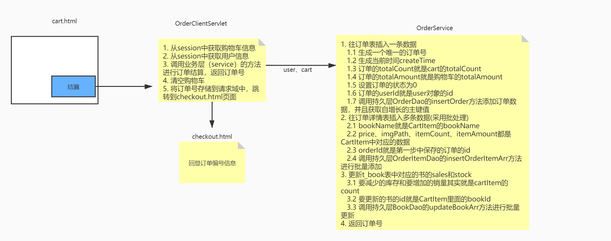
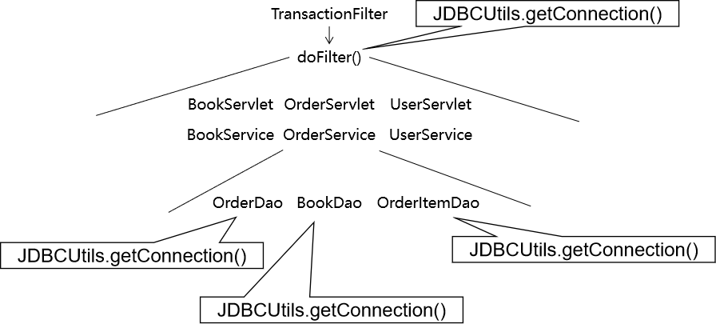

# day13 书城项目第六阶段

## 功能二 结账

### 1. 创建订单模型

#### 1.1 物理建模

##### 1.1.1 t_order表

```sql
CREATE TABLE t_order(
	order_id INT PRIMARY KEY AUTO_INCREMENT,
	order_sequence VARCHAR(200),
	create_time VARCHAR(100),
	total_count INT,
	total_amount DOUBLE,
	order_status INT,
	user_id INT
);
```

| 字段名         | 字段作用       |
| -------------- | -------------- |
| order_id       | 主键           |
| order_sequence | 订单号         |
| create_time    | 订单创建时间   |
| total_count    | 订单的总数量   |
| total_amount   | 订单的总金额   |
| order_status   | 订单的状态     |
| user_id        | 下单的用户的id |

- 虽然order_sequence也是一个不重复的数值，但是不使用它作为主键。数据库表的主键要使用没有业务功能的字段来担任。
- 订单的状态
  - 待支付（书城项目中暂不考虑）
  - 已支付，待发货：0
  - 已发货：1
  - 确认收货：2
  - 发起退款或退货（书城项目中暂不考虑）
- 用户id
  - 从逻辑和表结构的角度来说，这其实是一个外键。
  - 但是开发过程中建议先不要加外键约束：因为开发过程中数据尚不完整，加了外键约束开发过程中使用测试数据非常不方便，建议项目预发布时添加外键约束测试。


##### 1.1.2 t_order_item表

```sql
CREATE TABLE t_order_item(
	item_id INT PRIMARY KEY AUTO_INCREMENT,
	book_name VARCHAR(20),
	price DOUBLE,
	img_path VARCHAR(50),
	item_count INT,
	item_amount DOUBLE,
	order_id VARCHAR(20)
);
```

| 字段名称    | 字段作用                     |
| ----------- | ---------------------------- |
| item_id     | 主键                         |
| book_name   | 书名                         |
| price       | 单价                         |
| item_count  | 当前订单项的数量             |
| item_amount | 当前订单项的金额             |
| order_id    | 当前订单项关联的订单表的主键 |

说明：book_name、author、price这三个字段其实属于t_book表，我们把它们加入到t_order_item表中，其实并不符合数据库设计三大范式。这里做不符合规范的操作的原因是：将这几个字段加入当前表就不必在显示数据时和t_book表做关联查询，提高查询的效率，这是一种变通的做法。

#### 1.2 逻辑模型

##### 1.2.1 Order类

```java
package com.atguigu.bean;

/**
 * 包名:com.atguigu.bean
 *
 * @author Leevi
 * 日期2021-05-19  09:16
 */
public class Order {
    private Integer orderId;
    private String orderSequence;
    private String createTime;
    private Integer totalCount;
    private Double totalAmount;
    private Integer orderStatus;
    private Integer userId;

    @Override
    public String toString() {
        return "Order{" +
            "orderId=" + orderId +
            ", orderSequence='" + orderSequence + '\'' +
            ", createTime='" + createTime + '\'' +
            ", totalCount='" + totalCount + '\'' +
            ", totalAmount='" + totalAmount + '\'' +
            ", orderStatus=" + orderStatus +
            ", userId=" + userId +
            '}';
    }

    public Order() {
    }

    public Order(Integer orderId, String orderSequence, String createTime, Integer totalCount, Double totalAmount, Integer orderStatus, Integer userId) {
        this.orderId = orderId;
        this.orderSequence = orderSequence;
        this.createTime = createTime;
        this.totalCount = totalCount;
        this.totalAmount = totalAmount;
        this.orderStatus = orderStatus;
        this.userId = userId;
    }

    public Integer getOrderId() {
        return orderId;
    }

    public void setOrderId(Integer orderId) {
        this.orderId = orderId;
    }

    public String getOrderSequence() {
        return orderSequence;
    }

    public void setOrderSequence(String orderSequence) {
        this.orderSequence = orderSequence;
    }

    public String getCreateTime() {
        return createTime;
    }

    public void setCreateTime(String createTime) {
        this.createTime = createTime;
    }

    public Integer getTotalCount() {
        return totalCount;
    }

    public void setTotalCount(Integer totalCount) {
        this.totalCount = totalCount;
    }

    public Double getTotalAmount() {
        return totalAmount;
    }

    public void setTotalAmount(Double totalAmount) {
        this.totalAmount = totalAmount;
    }

    public Integer getOrderStatus() {
        return orderStatus;
    }

    public void setOrderStatus(Integer orderStatus) {
        this.orderStatus = orderStatus;
    }

    public Integer getUserId() {
        return userId;
    }

    public void setUserId(Integer userId) {
        this.userId = userId;
    }
}
```

##### 1.2.2 OrdrItem类

```java
package com.atguigu.bean;

/**
 * 包名:com.atguigu.bean
 *
 * @author Leevi
 * 日期2021-05-19  10:13
 */
public class OrderItem {
    private Integer itemId;
    private String bookName;
    private Double price;
    private String imgPath;
    private Integer itemCount;
    private Double itemAmount;
    private Integer orderId;

    @Override
    public String toString() {
        return "OrderItem{" +
                "itemId=" + itemId +
                ", bookName='" + bookName + '\'' +
                ", price=" + price +
                ", imgPath='" + imgPath + '\'' +
                ", itemCount=" + itemCount +
                ", itemAmount=" + itemAmount +
                ", orderId=" + orderId +
                '}';
    }

    public OrderItem() {
    }

    public OrderItem(Integer itemId, String bookName, Double price, String imgPath, Integer itemCount, Double itemAmount, Integer orderId) {
        this.itemId = itemId;
        this.bookName = bookName;
        this.price = price;
        this.imgPath = imgPath;
        this.itemCount = itemCount;
        this.itemAmount = itemAmount;
        this.orderId = orderId;
    }

    public Integer getItemId() {
        return itemId;
    }

    public void setItemId(Integer itemId) {
        this.itemId = itemId;
    }

    public String getBookName() {
        return bookName;
    }

    public void setBookName(String bookName) {
        this.bookName = bookName;
    }

    public Double getPrice() {
        return price;
    }

    public void setPrice(Double price) {
        this.price = price;
    }

    public String getImgPath() {
        return imgPath;
    }

    public void setImgPath(String imgPath) {
        this.imgPath = imgPath;
    }

    public Integer getItemCount() {
        return itemCount;
    }

    public void setItemCount(Integer itemCount) {
        this.itemCount = itemCount;
    }

    public Double getItemAmount() {
        return itemAmount;
    }

    public void setItemAmount(Double itemAmount) {
        this.itemAmount = itemAmount;
    }

    public Integer getOrderId() {
        return orderId;
    }

    public void setOrderId(Integer orderId) {
        this.orderId = orderId;
    }
}
```

### 2. 创建组件

#### 2.1 持久化层


#### 2.2 业务逻辑层


#### 2.3 表述层


### 3. 功能步骤

- 创建订单对象
- 给订单对象填充数据
  - 生成订单号
  - 生成订单的时间
  - 从购物车迁移总数量和总金额
  - 从已登录的User对象中获取userId并设置到订单对象中
- 将订单对象保存到数据库中
- 获取订单对象在数据库中自增主键的值
- 根据购物车中的CartItem集合逐个创建OrderItem对象
  - 每个OrderItem对象对应的orderId属性都使用前面获取的订单数据的自增主键的值
- 把OrderItem对象的集合保存到数据库
- 每一个item对应的图书增加销量、减少库存
- 清空购物车

### 4. 案例思路



### 5. 代码实现

#### 5.1 购物车页面结账超链接

cart.html

```html
<a class="pay" href="protected/orderClient?method=checkout">去结账</a>
```


#### 5.2 OrderClientServlet.checkout()

```java
package com.atguigu.bookstore.servlet.model;

import com.atguigu.bookstore.bean.Cart;
import com.atguigu.bookstore.constants.BookStoreConstants;
import com.atguigu.bookstore.entity.User;
import com.atguigu.bookstore.service.OrderService;
import com.atguigu.bookstore.service.impl.OrderServiceImpl;
import com.atguigu.bookstore.servlet.base.ModelBaseServlet;

import javax.servlet.http.HttpServletRequest;
import javax.servlet.http.HttpServletResponse;
import javax.servlet.http.HttpSession;

/**
 * @author Leevi
 * 日期2021-06-19  14:18
 */
public class OrderClientServlet extends ModelBaseServlet {
    private OrderService orderService = new OrderServiceImpl();

    /**
     * 订单结算
     * @param request
     * @param response
     */
    public void checkout(HttpServletRequest request, HttpServletResponse response){
        try {
            //1. 从session中获取购物车信息
            HttpSession session = request.getSession();
            Cart cart = (Cart) session.getAttribute(BookStoreConstants.CARTSESSIONKEY);
            //2. 从session中获取用户信息
            User user = (User) session.getAttribute(BookStoreConstants.USERSESSIONKEY);
            //3. 调用业务层的方法，进行订单结算，并且获取订单的序列号
            String orderSequence = orderService.checkout(cart,user);
            //4. 清空购物车
            session.removeAttribute(BookStoreConstants.CARTSESSIONKEY);
            //5. 将订单序列号存储到请求域对象中，并且跳转到checkout.html页面
            request.setAttribute("orderSequence",orderSequence);
            processTemplate("cart/checkout",request,response);
        } catch (Exception e) {
            e.printStackTrace();
        }
    }
}
```

#### 5.3 BaseDao.batchUpdate()

```java
/**
     * 批处理方法
     * @param sql
     * @param paramArr
     * @return
     */
public int[] batchUpdate(String sql,Object[][] paramArr){
    Connection conn = JDBCUtil.getConnection();
    try {
        return queryRunner.batch(conn,sql,paramArr);
    } catch (SQLException e) {
        e.printStackTrace();
        throw new RuntimeException(e.getMessage());
    }finnaly{
        JDBCUtil.releaseConnection(conn);
    }
}
```

#### 5.4 OrderService.checkout()

```java
package com.atguigu.bookstore.service.impl;

import com.atguigu.bookstore.bean.Cart;
import com.atguigu.bookstore.bean.CartItem;
import com.atguigu.bookstore.constants.BookStoreConstants;
import com.atguigu.bookstore.dao.BookDao;
import com.atguigu.bookstore.dao.OrderDao;
import com.atguigu.bookstore.dao.OrderItemDao;
import com.atguigu.bookstore.dao.impl.BookDaoImpl;
import com.atguigu.bookstore.dao.impl.OrderDaoImpl;
import com.atguigu.bookstore.dao.impl.OrderItemDaoImpl;
import com.atguigu.bookstore.entity.Order;
import com.atguigu.bookstore.entity.User;
import com.atguigu.bookstore.service.OrderService;

import java.text.SimpleDateFormat;
import java.util.Date;
import java.util.List;
import java.util.UUID;

/**
 * 包名:com.atguigu.bookstore.service.impl
 *
 * @author Leevi
 * 日期2021-06-19  14:19
 */
public class OrderServiceImpl implements OrderService {
    private OrderDao orderDao = new OrderDaoImpl();
    private OrderItemDao orderItemDao = new OrderItemDaoImpl();
    private BookDao bookDao = new BookDaoImpl();
    @Override
    public String checkout(Cart cart, User user) throws Exception {
        //1. 往订单表插入一条数据  
        //1.1 生成一个唯一的订单号(使用UUID)  
        String orderSequence = UUID.randomUUID().toString();
        //1.2 生成当前时间createTime
        String createTime = new SimpleDateFormat("dd-MM-yy:HH:mm:ss").format(new Date());
        //1.3 订单的totalCount就是cart的totalCount  
        Integer totalCount = cart.getTotalCount();
        //1.4 订单的totalAmount就是购物车的totalAmount
        Double totalAmount = cart.getTotalAmount();
        //1.5 设置订单的状态为0
        Integer status = BookStoreConstants.PAYED;
        //1.6 订单的userId就是user对象的id  
        Integer userId = user.getUserId();

        //将上述六个数据封装到一个Order对象中
        Order order = new Order(null,orderSequence,createTime,totalCount,totalAmount,status,userId);
        //1.7 调用持久层OrderDao的insertOrder方法添加订单数据，并且获取自增长的主键值
        Integer orderId = orderDao.insertOrder(order);

        //2. 往订单项表插入多条数据(采用批处理)
        //获取所有的购物项
        List<CartItem> cartItemList = cart.getCartItemList();
        //创建一个二维数组，用来做批量添加订单项的参数
        Object[][] orderItemArrParam = new Object[cartItemList.size()][6];

        //3. 更新t_book表中对应的书的sales和stock  
        //创建一个二维数组，用来做批量修改图书信息的参数
        Object[][] bookArrParam = new Object[cartItemList.size()][3];

        //遍历出每一个购物项
        for (int i=0;i<cartItemList.size();i++) {
            //封装批量添加订单项的二维数组参数
            //每一个购物项就对应一个订单项
            CartItem cartItem = cartItemList.get(i);
            //2.1 bookName就是CartItem的bookName
            //设置第i条SQL语句的第一个参数的值
            orderItemArrParam[i][0] = cartItem.getBookName();
            //2.2 price、imgPath、itemCount、itemAmount都是CartItem中对应的数据 
            //设置第i条SQL语句的第二个参数的值
            orderItemArrParam[i][1] = cartItem.getPrice();
            //设置第i条SQL语句的第三个参数的值
            orderItemArrParam[i][2] = cartItem.getImgPath();
            //设置第i条SQL语句的第四个参数的值
            orderItemArrParam[i][3] = cartItem.getCount();
            //设置第i条SQL语句的第五个参数的值
            orderItemArrParam[i][4] = cartItem.getAmount();
            //2.3 orderId就是第一步中保存的订单的id
            //设置第i条SQL语句的第六个参数的值
            orderItemArrParam[i][5] = orderId;

            //封装批量更新图书库存和销量的二维数组参数
            // 设置第i条SQL语句的第一个参数: 就是要增加的销量就是cartItem的count
            bookArrParam[i][0] = cartItem.getCount();
            // 设置第i条SQL语句的第二个参数: 就是要减少的库存就是cartItem的count
            bookArrParam[i][1] = cartItem.getCount();
            // 设置第i条SQL语句的第三个参数: 就是要修改的图书的bookId就是cartItem的bookId
            bookArrParam[i][2] = cartItem.getBookId();
        }
        //2.4 调用持久层OrderItemDao的insertOrderItemArr方法进行批量添加
        orderItemDao.insertOrderItemArr(orderItemArrParam);


        //3.1 调用持久层BookDao的updateBookArr方法进行批量更新
        bookDao.updateBookArr(bookArrParam);

        //4. 返回订单号
        return orderSequence;
    }
}
```


#### 5.5 orderDao.insertOrder(order)

```java
package com.atguigu.bookstore.dao.impl;

import com.atguigu.bookstore.dao.BaseDao;
import com.atguigu.bookstore.dao.OrderDao;
import com.atguigu.bookstore.entity.Order;
import com.atguigu.bookstore.utils.JDBCUtil;

import java.sql.Connection;
import java.sql.PreparedStatement;
import java.sql.ResultSet;
import java.sql.Statement;

/**
 * 包名:com.atguigu.bookstore.dao.impl
 *
 * @author Leevi
 * 日期2021-06-19  14:19
 */
public class OrderDaoImpl extends BaseDao<Order> implements OrderDao {
    @Override
    public Integer insertOrder(Order order) throws Exception {
        String sql = "insert into t_order (order_sequence,create_time,total_count,total_amount,order_status,user_id) values (?,?,?,?,?,?)";
        //因为使用DBUtils执行增删改的SQL语句没法获取自增长的id主键，所以我们只能使用原始的JDBC执行这个添加数据的SQL语句并且获取自增长的id
        //1. 获取连接
        Connection conn = JDBCUtil.getConnection();
        //2. 预编译SQL语句
        PreparedStatement preparedStatement = conn.prepareStatement(sql, Statement.RETURN_GENERATED_KEYS);
        //3. 设置问号处的参数
        preparedStatement.setObject(1, order.getOrderSequence());
        preparedStatement.setObject(2, order.getCreateTime());
        preparedStatement.setObject(3, order.getTotalCount());
        preparedStatement.setObject(4, order.getTotalAmount());
        preparedStatement.setObject(5, order.getOrderStatus());
        preparedStatement.setObject(6, order.getUserId());
        //4. 执行SQL语句
        preparedStatement.executeUpdate();
        //5. 获取自增长的主键值
        ResultSet rst = preparedStatement.getGeneratedKeys();
        //因为自增长的主键只有一个值，所以不需要while循环遍历
        int orderId = 0;
        if (rst.next()) {
            orderId = rst.getInt(1);
        }
        //关闭连接
        JDBCUtil.releaseConnection(conn);
        return orderId;
    }
}
```


#### 5.6 orderItemDao.insertOrderItemArr(insertOrderItemParamArr)

```java
package com.atguigu.bookstore.dao.impl;

import com.atguigu.bookstore.dao.BaseDao;
import com.atguigu.bookstore.dao.OrderItemDao;
import com.atguigu.bookstore.entity.OrderItem;

/**
 * 包名:com.atguigu.bookstore.dao.impl
 *
 * @author Leevi
 * 日期2021-06-19  14:19
 */
public class OrderItemDaoImpl extends BaseDao<OrderItem> implements OrderItemDao {
    @Override
    public void insertOrderItemArr(Object[][] paramArr) {
        String sql = "insert into t_order_item (book_name,price,img_path,item_count,item_amount,order_id) values (?,?,?,?,?,?)";
        batchUpdate(sql,paramArr);
    }
}
```


#### 5.7 bookDao.updateBookArr(updateBookParamArr)

```java
@Override
public void updateBookArr(Object[][] bookArrParam) throws Exception {
    String sql = "update t_book set sales=sales+?,stock=stock-? where book_id=?";
    batchUpdate(sql,bookArrParam);
}
```

## 功能三 结账过程中使用事务

### 1. 事务回顾

#### 1.1 ACID属性

- A：原子性 事务中包含的数据库操作缺一不可，整个事务是不可再分的。

- C：一致性 事务执行之前，数据库中的数据整体是正确的；事务执行之后，数据库中的数据整体仍然是正确的。
  - 事务执行成功：提交（commit）
  - 事务执行失败：回滚（rollback）

- I：隔离性 数据库系统同时执行很多事务时，各个事务之间基于不同隔离级别能够在一定程度上做到互不干扰。简单说就是：事务在并发执行过程中彼此隔离。

- D：持久性 事务一旦提交，就永久保存到数据库中，不可撤销。

#### 1.2 隔离级别

##### 1.2.1 并发问题

| 并发问题   | 问题描述                                                     |
| ---------- | ------------------------------------------------------------ |
| 脏读       | 当前事务读取了其他事务尚未提交的修改<br />如果那个事务回滚，那么当前事务读取到的修改就是错误的数据 |
| 不可重复读 | 当前事务中多次读取到的数据的内容不一致(数据行数一致，但是行中的具体内容不一致) |
| 幻读       | 当前事务中多次读取到的数据行数不一致                         |

##### 1.2.2 隔离级别

| 隔离级别 | 描述                                           | 能解决的并发问题       |
| -------- | ---------------------------------------------- | ---------------------- |
| 读未提交 | 允许当前事务读取其他事务尚未提交的修改         | 啥问题也解决不了       |
| 读已提交 | 允许当前事务读取其他事务已经提交的修改         | 脏读                   |
| 可重复读 | 当前事务执行时锁定当前记录，不允许其他事务操作 | 脏读、不可重复读       |
| 串行化   | 当前事务执行时锁定当前表，不允许其他事务操作   | 脏读、不可重复读、幻读 |

### 2. JDBC事务控制

#### 2.1 同一个数据库连接

只有当多次数据库操作是使用的同一个连接的时候，才能够保证这几次数据库操作在同一个事务中执行


#### 2.2 关闭事务的自动提交

```java
connection.setAutoCommit(false);
```


#### 2.3 提交事务

```java
connection.commit();
```


#### 2.4 回滚事务

```java
connection.rollBack();
```


#### 2.5 事务整体的代码块

```java
try{
    
    // 关闭事务的自动提交
    connection.setAutoCommit(false);
    
    // 事务中包含的所有数据库操作
    
    // 提交事务
    connection.commit();
}catch(Excetion e){
    
    // 回滚事务
    connection.rollBack();
    
}
```

### 3. 将事务对接到书城项目中

#### 3.1 三层架构中事务要对接的位置

从逻辑上来说，一个事务对应一个业务方法（Service层的一个方法）。


#### 3.2 假想

每一个Service方法内部，都套用了事务操作所需要的try...catch...finally块。

#### 3.3 假想代码的缺陷

- 会出现大量的冗余代码：我们希望能够抽取出来，只写一次
- 对核心业务功能是一种干扰：我们希望能够在编写业务逻辑代码时专注于业务本身，而不必为辅助性质的套路代码分心
- 将持久化层对数据库的操作写入业务逻辑层，是对业务逻辑层的一种污染，导致持久化层和业务逻辑层耦合在一起

#### 3.4 事务代码抽取

- 只要是Filter拦截到的请求都会从doFilter()方法经过
- chain.doFilter(req, resp);可以包裹住将来要执行的所有方法
- 事务操作的try...catch...finally块只要把chain.doFilter(req, resp)包住，就能够包住将来要执行的所有方法

#### 3.5 编写一个TransactionFilter来统一处理事务

```java
package com.atguigu.bookstore.filter;

import com.atguigu.bookstore.utils.JDBCUtil;

import javax.servlet.*;
import java.io.IOException;
import java.sql.Connection;
import java.sql.SQLException;

/**
 * @author Leevi
 * 日期2021-06-21  09:11
 */
public class TransactionFilter implements Filter {
    @Override
    public void destroy() {
    }

    @Override
    public void doFilter(ServletRequest req, ServletResponse resp, FilterChain chain) throws ServletException, IOException {
        Connection conn = null;
        try {
            //开启事务
            conn = JDBCUtil.getConnection();
            conn.setAutoCommit(false);
            chain.doFilter(req, resp);
            //没有出现异常，则提交事务
            conn.commit();
        } catch (Exception e) {
            e.printStackTrace();
            //出现异常,回滚事务
            try {
                conn.rollback();
                //
            } catch (SQLException ex) {
                ex.printStackTrace();
            }
            throw new RuntimeException(e.getMessage());
        }
    }

    @Override
    public void init(FilterConfig config) throws ServletException {

    }

}
```

#### 3.6 配置TransactionFilter指定其拦截要进行事务控制的请求

```xml
<filter>
    <filter-name>TransactionFilter</filter-name>
    <filter-class>com.atguigu.filter.TransactionFilter</filter-class>
</filter>
<filter-mapping>
    <filter-name>TransactionFilter</filter-name>
   	<!--
		哪些请求要使用TransactionFilter做事务控制，这里就配置哪些请求的地址
	-->
    <url-pattern>/protected/orderClient</url-pattern>
</filter-mapping>
```


#### 3.7 保证所有数据库操作使用同一个连接

<span style="color:blue;font-weight:bold;">『重要发现』</span>：在书城项目中所有执行SQL语句的代码都是通过<span style="color:blue;font-weight:bold;">JDBCUtils.getConnection()</span>方法获取数据库连接。所以我们可以通过<span style="color:blue;font-weight:bold;">重构JDBCUtils.getConnection()</span>方法实现：所有数据库操作使用同一个连接。



##### 3.6.1 从数据源中只拿出一个

为了保证各个需要Connection对象的地方使用的都是同一个对象，我们从数据源中只获取一个Connection。不是说整个项目只用一个Connection，而是说调用JDBCUtils.getConnection()方法时，只使用一个。所以落实到代码上就是：每次调用getConnection()方法时先检查是否已经拿过了，拿过就给旧的，没拿过给新的。

##### 3.6.2 公共区域

为了保证各个方法中需要Connection对象时都能拿到同一个对象，需要做到：将唯一的对象存入一个大家都能接触到的地方。


<span style="color:blue;font-weight:bold;">结论</span>：使用<span style="color:blue;font-weight:bold;">线程本地化</span>技术实现Connection对象从上到下传递。

#### 3.7 线程本地化

##### 3.7.1 确认同一个线程

在从Filter、Servlet、Service一直到Dao运行的过程中，我们始终都没有做类似new Thread().start()这样开启新线程的操作，所以整个过程在同一个线程中。

##### 3.7.2 一条小河


##### 3.7.3 一个线程


##### 3.7.4 ThreadLocal的API

1. set(T t)方法：在当前线程中，往ThreadLocal对象中存入一个数据

2. get()方法：在当前线程中，从ThreadLocal对象中取出数据
3. remove()方法: 移除ThreadLocal中保存的当前线程的数据

##### 3.7.5 结论

TheadLocal的基本结论: 一个ThreadLocal对象，在一个线程中只能存储一个数据，在该线程的任何地方调用get()方法获取到的都是同一个数据

### 4. 代码实现

#### 4.1 重构JDBCUtil类

- 要点1：将ThreadLocal对象声明为静态成员变量
- 要点2：重构获取数据库连接的方法
- 要点3：重构释放数据库连接的方法

```java
package com.atguigu.bookstore.utils;

import com.alibaba.druid.pool.DruidDataSourceFactory;

import javax.sql.DataSource;
import java.io.InputStream;
import java.sql.Connection;
import java.sql.SQLException;
import java.util.Properties;

/**
 * 包名:com.atguigu.jdbc.utils
 *
 * @author Leevi
 * 日期2021-04-29  15:15
 * 这个工具类中会提供仨方法:
 * 1. 获取连接池对象
 * 2. 从连接池中获取连接
 * 3. 将链接归还到连接池
 */
public class JDBCUtil {
    private static DataSource dataSource;
    private static ThreadLocal<Connection> threadLocal = new ThreadLocal<>();
    static {
        try {
            //1. 使用类加载器读取配置文件，转成字节输入流
            InputStream is = JDBCUtil.class.getClassLoader().getResourceAsStream("druid.properties");
            //2. 使用Properties对象加载字节输入流
            Properties properties = new Properties();
            properties.load(is);
            //3. 使用DruidDataSourceFactory创建连接池对象
            dataSource = DruidDataSourceFactory.createDataSource(properties);
        } catch (Exception e) {
            e.printStackTrace();
        }
    }

    /**
     * 获取连接池对象
     * @return
     */
    public static DataSource getDataSource(){

        return dataSource;
    }

    /**
     * 获取连接
     * @return
     */
    public static Connection getConnection() {
        try {
            Connection conn = threadLocal.get();
            if (conn == null) {
                //说明此时ThreadLocal中没有连接
                //从连接池中获取一个连接
                conn = dataSource.getConnection();
                //将连接存储到ThreadLocal中
                threadLocal.set(conn);
            }
            return conn;
        } catch (SQLException e) {
            e.printStackTrace();
            throw new RuntimeException(e.getMessage());
        }
    }

    /**
     * 释放连接
     */
    public static void releaseConnection(){
        try {
            //这里是获取要被关闭的连接
            Connection conn = JDBCUtil.getConnection();
            //1. 先将conn的AutoCommit设置为true
            conn.setAutoCommit(true);
            //2. 将conn从ThreadLocal中移除掉
            threadLocal.remove();
            //3. 将conn归还到连接池
            conn.close();
        } catch (SQLException e) {
            e.printStackTrace();
            throw new RuntimeException(e.getMessage());
        }
    }
}
```

#### 4.2 重构BaseDao

- 要点：去除释放数据库连接的操作（转移到过滤器中）

```java
package com.atguigu.dao;

import com.atguigu.utils.JDBCUtil;
import org.apache.commons.dbutils.QueryRunner;
import org.apache.commons.dbutils.handlers.BeanHandler;
import org.apache.commons.dbutils.handlers.BeanListHandler;

import java.sql.Connection;
import java.sql.SQLException;
import java.util.List;

/**
 * 包名:com.atguigu.dao
 *
 * @author Leevi
 * 日期2021-05-12  11:00
 */
public class BaseDao<T> {
    private QueryRunner queryRunner = new QueryRunner();

    /**
     * 批处理方法
     * @param sql
     * @param paramArr
     * @return
     */
    public int[] batchUpdate(String sql,Object[][] paramArr){
        Connection conn = JDBCUtil.getConnection();
        try {
            return queryRunner.batch(conn,sql,paramArr);
        } catch (SQLException e) {
            e.printStackTrace();
            throw new RuntimeException(e.getMessage());
        }
    }
    /**
     * 执行增删改的sql语句
     * @param sql
     * @param params
     * @return
     */
    public int update(String sql,Object... params){
        Connection conn = JDBCUtil.getConnection();
        try {
            //执行增删改的sql语句，返回受到影响的行数
            return queryRunner.update(conn,sql,params);
        } catch (SQLException e) {
            e.printStackTrace();
            throw new RuntimeException(e.getMessage());
        }
    }

    /**
     * 执行查询一行数据的sql语句，将结果集封装到JavaBean对象中
     * @param clazz
     * @param sql
     * @param params
     * @return
     */
    public T getBean(Class<T> clazz,String sql,Object... params){
        Connection conn = JDBCUtil.getConnection();
        try {
            return queryRunner.query(conn,sql,new BeanHandler<>(clazz),params);
        } catch (SQLException e) {
            e.printStackTrace();
            throw new RuntimeException(e.getMessage());
        }
    }

    /**
     * 执行查询多行数据的sql语句，并且将结果集封装到List<JavaBean>
     * @param clazz
     * @param sql
     * @param params
     * @return
     */
    public List<T> getBeanList(Class<T> clazz, String sql, Object... params){
        Connection conn = JDBCUtil.getConnection();
        try {
            return queryRunner.query(conn,sql,new BeanListHandler<>(clazz),params);
        } catch (SQLException e) {
            e.printStackTrace();
            throw new RuntimeException(e.getMessage());
        }
    }
}
```

<span style="color:blue;font-weight:bold;">注意</span>：OrderDao中insertOrder()方法也要去掉关闭数据库连接的操作。

```java
@Override
public void insertOrder(Order order) throws Exception{
    ResultSet resultSet = null;
    Connection conn = null;
    try {
        //往t_order表中插入一条订单信息
        //使用DBUtils没法获取自增长的主键值，所以我们只能使用原始的JDBC执行SQL语句，获取自增长的主键
        String sql = "insert into t_order (order_sequence,create_time,total_count,total_amount,order_status,user_id) values (?,?,?,?,?,?)";
        conn = JDBCUtil.getConnection();

        //预编译，并且指定获取自增长主键
        PreparedStatement preparedStatement = conn.prepareStatement(sql, PreparedStatement.RETURN_GENERATED_KEYS);

        //设置参数
        preparedStatement.setObject(1, order.getOrderSequence());
        preparedStatement.setObject(2, order.getCreateTime());
        preparedStatement.setObject(3, order.getTotalCount());
        preparedStatement.setObject(4, order.getTotalAmount());
        preparedStatement.setObject(5, order.getOrderStatus());
        preparedStatement.setObject(6, order.getUserId());

        //执行sql语句
        preparedStatement.executeUpdate();

        //获取自增长主键值
        resultSet = preparedStatement.getGeneratedKeys();
        if (resultSet.next()) {
            int orderId = resultSet.getInt(1);
            //将orderId存入到order对象中
            order.setOrderId(orderId);
        }
    } catch (SQLException e) {
        e.printStackTrace();
        throw new RuntimeException(e.getMessage());
    }
}
```

#### 4.3 创建CloseConnectionFilter用于统一关闭连接

```xml
<!--注意:这个过滤器要配置在TransactionFilter之前-->
<filter>
    <filter-name>CloseConnectionFilter</filter-name>
    <filter-class>com.atguigu.filter.CloseConnectionFilter</filter-class>
</filter>

<filter-mapping>
    <filter-name>CloseConnectionFilter</filter-name>
    <!--
            需要关闭连接的请求都需要经过过滤器过滤
        -->
    <url-pattern>/bookManager</url-pattern>
    <url-pattern>/protected/order</url-pattern>
    <url-pattern>/index.html</url-pattern>
    <url-pattern>/user</url-pattern>
    <url-pattern>/protected/cart</url-pattern>
</filter-mapping>
```

Java代码如下：

```java
package com.atguigu.bookstore.filter;

import com.atguigu.bookstore.utils.JDBCUtil;

import javax.servlet.*;
import java.io.IOException;

/**
 * @author Leevi
 * 日期2021-06-21  10:15
 */
public class CloseConnectionFilter implements Filter {
    @Override
    public void destroy() {
    }

    @Override
    public void doFilter(ServletRequest req, ServletResponse resp, FilterChain chain) throws ServletException, IOException {
        try {
            chain.doFilter(req, resp);
        } catch (Exception e) {
            e.printStackTrace();
            throw new RuntimeException(e.getMessage());
        } finally {
            JDBCUtil.releaseConnection();
        }
    }

    @Override
    public void init(FilterConfig config) throws ServletException {

    }

}
```

#### 4.4 全局统一的异常处理

1. 所有的Dao和Service的方法都抛最大的异常

2. 在Servlet中对异常进行try......catch，在catch中做相应的处理(例如跳转到错误页面)，然后在当前方法中throw new RuntimeException(e.getMessage());

3. 在ModelBaseServlet的catch块里面throw new RuntimeException(e.getMessage())

4. 在LoginFilter、TransactionFilter、CloseConnectionFilter中都需要对异常进行try...catch,然后在catch块中

   throw new RuntimeException(e.getMessage());

5. 创建一个ShowErrorFilter，该Filter要配置在所有的Filter之前，用来统一处理异常

   ```java
   package com.atguigu.bookstore.filter;
   
   import javax.servlet.*;
   import javax.servlet.http.HttpServletRequest;
   import javax.servlet.http.HttpServletResponse;
   import java.io.IOException;
   
   /**
    * @author Leevi
    * 日期2021-06-21  10:50
    */
   public class ShowErrorFilter implements Filter {
       @Override
       public void destroy() {
       }
   
       @Override
       public void doFilter(ServletRequest req, ServletResponse resp, FilterChain chain) throws ServletException, IOException {
           HttpServletResponse response = (HttpServletResponse) resp;
           HttpServletRequest request = (HttpServletRequest) req;
           try {
               chain.doFilter(req, resp);
           } catch (Exception e) {
               e.printStackTrace();
               request.setAttribute("errorMessage",e.getMessage());
               //表示操作出现需要我处理的异常:跳转到error.html页面，并且在页面提示错误信息
               request.getRequestDispatcher("/admin?method=toErrorPage").forward(request, response);
           }
       }
   
       @Override
       public void init(FilterConfig config) throws ServletException {
   
       }
   }
   ```

   ```xml
   <filter>
       <filter-name>ShowErrorFilter</filter-name>
       <filter-class>com.atguigu.bookstore.filter.ShowErrorFilter</filter-class>
   </filter>
   <filter-mapping>
       <filter-name>ShowErrorFilter</filter-name>
       <url-pattern>/*</url-pattern>
   </filter-mapping>
   ```

   在pages文件夹中创建error.html，然后在AdminServlet中添加一个toErrorPage方法，跳转到error.html页面